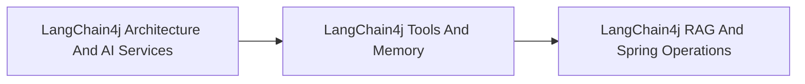

<!-- split-guide-index -->
# LangChain4j Deep Dive

<DocLabels items={[{label: 'Focused guides', tone: 'advanced'}, {label: 'Shopverse', tone: 'shopverse'}, {label: 'Architect route', tone: 'production'}]} />

A focused route through LangChain4j architecture, AI services, tools, memory, and RAG. The original long-form material is preserved without duplication across the focused pages below.

<TopicCards items={[
  {title: 'LangChain4j Architecture And AI Services', href: '/ai/LANGCHAIN4J-ARCHITECTURE-AI-SERVICES', description: 'Part 1 of the focused LangChain4j Deep Dive learning route.', icon: 'route', tags: ['Focused', 'Advanced']},
  {title: 'LangChain4j Tools And Memory', href: '/ai/LANGCHAIN4J-TOOLS-MEMORY', description: 'Part 2 of the focused LangChain4j Deep Dive learning route.', icon: 'layers', tags: ['Focused', 'Advanced']},
  {title: 'LangChain4j RAG And Spring Operations', href: '/ai/LANGCHAIN4J-RAG-SPRING-OPERATIONS', description: 'Part 3 of the focused LangChain4j Deep Dive learning route.', icon: 'security', tags: ['Focused', 'Advanced']},
]} />

<DocCallout type="tip" title="Use the index as the stable entry point">

Each focused page owns one concern. Cross-links point to the canonical explanation instead of repeating the same material.

</DocCallout>

## Recommended Learning Order

1. [LangChain4j Architecture And AI Services](./LANGCHAIN4J-ARCHITECTURE-AI-SERVICES.md)
2. [LangChain4j Tools And Memory](./LANGCHAIN4J-TOOLS-MEMORY.md)
3. [LangChain4j RAG And Spring Operations](./LANGCHAIN4J-RAG-SPRING-OPERATIONS.md)

## Reading Strategy

Use **LangChain4j Deep Dive** as a decision and verification guide inside **LangChain4j Deep Dive**. Start by naming the invariant or operational outcome, then follow the runtime flow and identify the owning component. For every example, record the expected success evidence, the most important failure mode, and the metric or test that proves recovery. This keeps the material useful for implementation reviews, production incidents, and architect interviews instead of treating it as isolated syntax.

Within **LangChain4j Deep Dive**, apply the Shopverse guidance incrementally: verify the current behavior, introduce one bounded change, test the unhappy path, and preserve a rollback or reconciliation route. Follow links to canonical pages when a concept belongs to another track; do not copy that explanation into this page. This ownership rule keeps the focused guides short while retaining technical depth and traceability.

## Official References

- [LangChain4j documentation](https://docs.langchain4j.dev/)
- [Spring AI reference](https://docs.spring.io/spring-ai/reference/)
