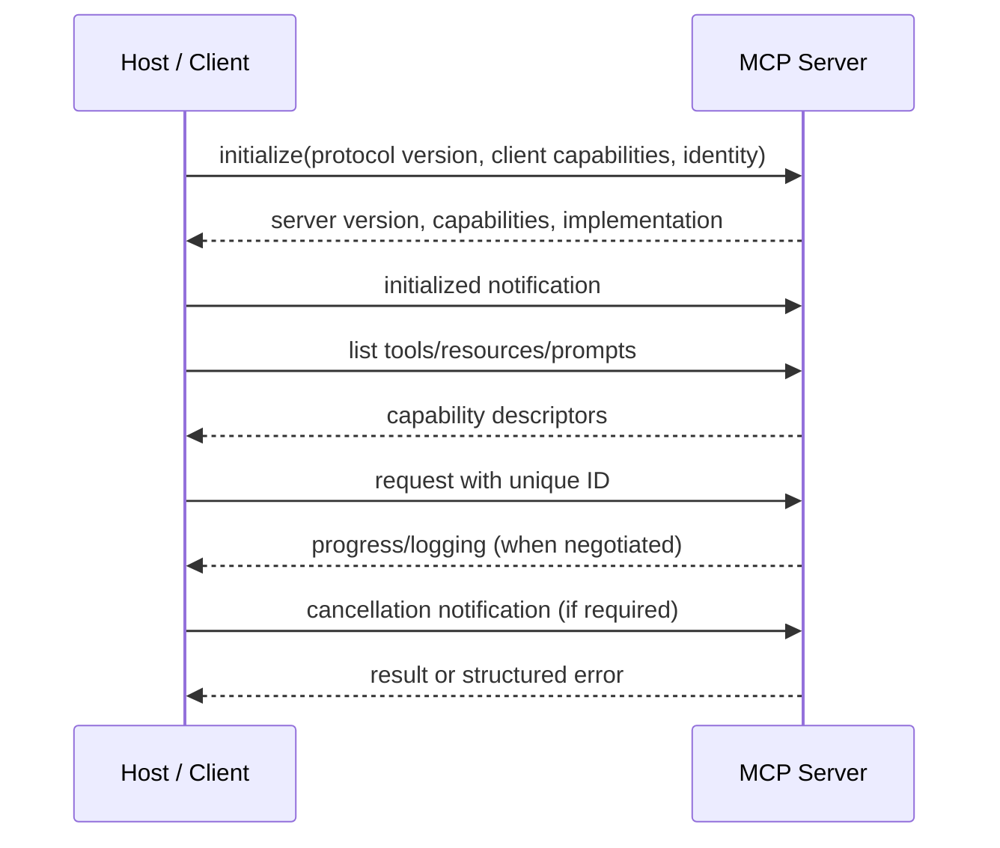

# MCP Protocol Lifecycle And Architecture

Initialization negotiates a compatible protocol version and declares capabilities.
Do not invoke an optional feature merely because one server version once supported
it. Cache discovery with a bounded lifetime and refresh safely when capabilities
change.

Requests have correlation identity and can execute concurrently. The client must
match responses, bound in-flight work and define deadline/cancellation behavior.
Cancellation is cooperative: the server should stop avoidable work, but callers
must still reconcile an external side effect that may already have occurred.

## Host, Client And Server

- **Host:** owns model, user interaction, approval, server trust and conversation.
- **Client:** owns one protocol connection/session, discovery and request mapping.
- **Server:** exposes bounded capabilities and enforces authorization independently.

A local STDIO server has a different trust/deployment boundary from a remote HTTP
server. Local does not mean safe: spawned binaries, file access and inherited
environment credentials require provenance and sandboxing.

## Compatibility

Version capability schemas, tool semantics and error contracts. Prefer additive
changes and new tool names for changed meaning. Clients should tolerate unknown
optional fields while rejecting unsupported required semantics. Test old/new
client-server combinations and graceful shutdown.

## Failure Model

Expect partial writes, disconnects, duplicate retries, malformed responses, server
restart, discovery drift, slow tools and oversized results. Bound message/result
size, concurrency, time and retries. A request timeout is not proof of non-execution.

## Official References

- [MCP lifecycle](https://modelcontextprotocol.io/specification/2025-11-25/basic/lifecycle)
- [MCP architecture](https://modelcontextprotocol.io/docs/learn/architecture)
- [JSON-RPC 2.0 specification](https://www.jsonrpc.org/specification)

## Recommended Next Page

Continue with [MCP Primitives, Transports, And Sessions](./MCP-PRIMITIVES-TRANSPORTS.md).
