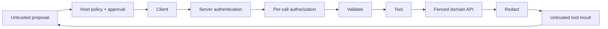

# MCP Security And Production Operations

MCP connects probabilistic model decisions to deterministic capabilities. Treat the
host, server, resources, tools, model and downstream systems as separate trust zones.

## Threats And Controls

| Threat | Required controls |
|---|---|
| malicious/compromised server | allowlist, provenance, TLS identity, sandbox, egress limits |
| prompt/tool-result injection | isolate content, preserve host policy, validate result, approval |
| confused deputy | propagate initiating subject, audience and tenant; authorize at server |
| SSRF/path/command/SQL injection | typed allowlists, canonicalization, no raw interpreter tools |
| excessive agency | read-only default, narrow tools, step/cost/rate limits, approval |
| cross-tenant leakage | tenant-bound credentials, filters, tests, redaction and audit |
| replay/duplicate mutation | idempotency key, timestamp/state checks, conditional transition |
| data exfiltration | result limits, classification, DLP/redaction, network and scope controls |

Never expose general `run_sql`, `execute_shell`, arbitrary URL fetch or unrestricted
filesystem tools to a model. Wrap bounded business capabilities.

## Authentication And Authorization

Remote servers use TLS and an authorization model appropriate to the MCP specification
and deployment. Scope credentials to server/audience and minimal capabilities. Do not
forward a provider token blindly to downstream services. Exchange/delegate identity
explicitly and keep server-side ownership checks.

## Operations

Record server/protocol/tool versions, subject/tenant, tool name, normalized nonsecret
arguments, policy/approval, result category, latency, cancellation, downstream ID and
cost. Avoid full prompt/resource/result logging by default.

Metrics include session/in-flight counts, discovery failure, calls by tool/result,
authorization denial, timeout/cancel, result size, downstream error, retry, saturation
and oldest long-running operation. Alert on destructive-tool spikes, cross-tenant
denials, new server identity and audit pipeline loss.

Incident response can disable a server/tool, revoke credentials, terminate sessions,
block egress, preserve safe audit metadata, identify effects and reconcile mutations.

## Official References

- [MCP authorization](https://modelcontextprotocol.io/specification/2025-11-25/basic/authorization)
- [MCP security best practices](https://modelcontextprotocol.io/specification/2025-11-25/basic/security_best_practices)
- [OAuth 2.0 Security BCP](https://www.rfc-editor.org/rfc/rfc9700)
- [OWASP GenAI Security](https://genai.owasp.org/)

## Recommended Next Page

Continue with [Spring AI MCP And Shopverse Lab](./MCP-SPRING-SHOPVERSE-LAB.md).
