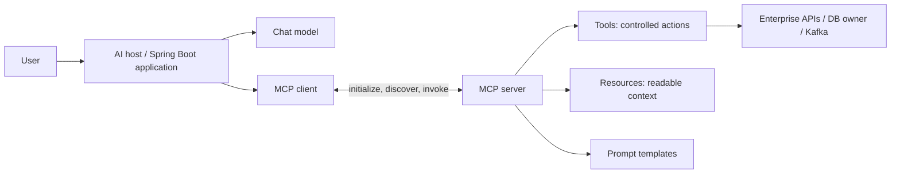

# MCP With Spring AI

Model Context Protocol (MCP) standardizes how an AI host discovers and uses
external tools, resources, and prompt templates. MCP does not make a model
trustworthy, authorize business actions, or replace an application's domain API.


*Visual summary supplied by the project owner. Source inspiration:
[LinkedIn MCP overview](https://www.linkedin.com/posts/laxmanrthagan_java-springboot-springai-activity-7480381163635621888-f2L_/).*

## Architecture



| Component | Responsibility |
|---|---|
| host | owns the conversation, model selection, user identity, approval, and policy |
| MCP client | negotiates capabilities and calls one or more MCP servers |
| MCP server | exposes a bounded domain through protocol capabilities |
| tool | performs an action or computed lookup from validated arguments |
| resource | exposes readable context addressed by URI/template |
| prompt | exposes a reusable prompt/message template |
| transport | carries protocol messages, commonly STDIO or Streamable HTTP |

The model proposes tool arguments; trusted application code validates,
authorizes, executes, and audits them. Never let generated text become raw SQL,
shell commands, URLs, or privileged API parameters without strict controls.

## MCP Versus REST And Tool Calling

| Concern | REST/domain API | local tool calling | MCP |
|---|---|---|---|
| purpose | service contract for applications | expose application methods to one model integration | standard discovery/invocation across compatible AI hosts and servers |
| discovery | OpenAPI/docs or client knowledge | code/configuration | protocol capability and tool/resource/prompt listing |
| reuse | broad application ecosystem | normally one application | multiple MCP-capable hosts |
| security | mature gateway/service patterns | in-process application policy | still requires transport identity plus per-capability authorization |

MCP commonly wraps or delegates to existing domain services. It should not
bypass the API/service that owns transactions and authorization.

## Spring AI Roles

Spring AI provides MCP client and server starters, synchronous/asynchronous
models, tool integration, and transports including STDIO and Streamable HTTP.
Use the exact starter and properties documented for the Spring AI version in
the project; MCP APIs and older SSE guidance have evolved.

### Client

A Spring AI MCP client connects to servers, discovers capabilities, and can
adapt server tools into Spring AI tool callbacks for a `ChatClient`.

Conceptual configuration:

```yaml
spring:
  ai:
    mcp:
      client:
        enabled: true
        name: shopverse-ai
        request-timeout: 10s
```

Choose STDIO for a locally spawned, tightly controlled process. Choose
Streamable HTTP for independently deployed services, then add TLS, workload/user
identity, timeouts, rate limits, and network policy.

### Server

A Spring Boot MCP server exposes deliberately small capabilities. Annotation
support includes concepts such as `@McpTool`, `@McpResource`, and `@McpPrompt`
in current Spring AI MCP documentation.

```java
@Component
class InventoryMcpTools {

    private final InventoryQueryService inventory;

    InventoryMcpTools(InventoryQueryService inventory) {
        this.inventory = inventory;
    }

    @McpTool(name = "get_inventory", description = "Read stock for one product")
    InventoryView getInventory(String productId) {
        return inventory.getAuthorizedView(productId);
    }
}
```

Treat this as illustrative: package names and annotations must match the pinned
Spring AI version. The tool calls a domain service rather than querying tables directly.

## Production Security

1. Authenticate the client and propagate the initiating user/workload identity.
2. Authorize every tool and resource call from server-side policy.
3. Default to read-only, narrow tools; separate read and mutation capabilities.
4. Use typed schemas, allowlists, size/range checks, and safe error responses.
5. Require user confirmation for payments, deletion, external messages, or privilege changes.
6. Add timeouts, concurrency limits, rate limits, circuit breakers, and output limits.
7. Prevent SSRF, arbitrary file access, path traversal, SQL injection, and command execution.
8. Audit subject, tool, normalized arguments, result category, policy decision,
   correlation ID, latency, and downstream effect—without logging secrets.
9. Treat MCP server output and retrieved resources as untrusted prompt content;
   defend against indirect prompt injection.
10. Version tools and preserve compatibility so old clients cannot invoke changed semantics.

## ShopVerse Example

Safe first tools are read-only:

- `get_order_status(orderId)` after ownership authorization;
- `find_products(query, category, limit)` with bounded filters;
- `get_inventory(productId)` without exposing internal reservation data;
- `explain_payment_status(orderId)` with sensitive fields redacted.

Avoid an unrestricted `run_sql`, `call_url`, or `execute_command` tool. A mutation
such as `cancel_order` needs idempotency, current-state validation, authorization,
confirmation, audit, and the same domain transaction used by the normal API.

## Official References

- [Spring AI API overview](https://docs.spring.io/spring-ai/reference/api/)
- [Spring AI MCP client starter](https://docs.spring.io/spring-ai/reference/api/mcp/mcp-client-boot-starter-docs.html)
- [Spring AI MCP server starter](https://docs.spring.io/spring-ai/reference/api/mcp/mcp-server-boot-starter-docs.html)
- [Java and Spring MCP reference](https://docs.spring.io/spring-ai-mcp/reference/overview.html)
