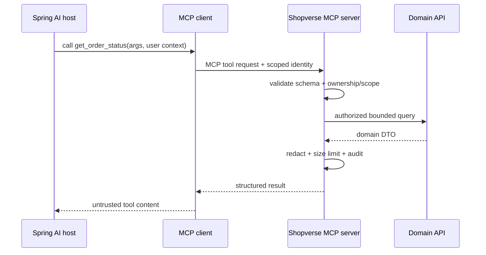

# Spring AI MCP And Shopverse Lab

Build the first Shopverse MCP boundary as read-only. Annotation and starter names
must match the Spring AI version pinned by the project; verify current reference
documentation before copying examples.

## Capabilities

| Capability | Input | Server-side policy |
|---|---|---|
| `get_order_status` | order number | owner or support/admin scope |
| `get_order_timeline` | order number | same ownership, redacted events |
| `check_inventory` | product ID | authenticated catalog access |
| `search_catalog` | bounded query/filter/limit | allowlisted filters and result cap |
| `get_payment_status` | order number | owner/admin, no provider secrets |
| `get_service_health` | service allowlist | operations role |

Resources may use `shopverse://orders/{orderNumber}` and bounded templates, but
must not reveal whether another tenant/user's object exists.



## Spring Structure

Keep adapters thin:

```java
record OrderStatusInput(String orderNumber) {}
record OrderStatusResult(String orderNumber, String status, Instant updatedAt) {}

@Component
final class OrderMcpTools {
    private final AuthorizedOrderQuery query;

    OrderStatusResult getOrderStatus(OrderStatusInput input, Caller caller) {
        return query.getOwnedStatus(caller.subject(), input.orderNumber());
    }
}
```

The MCP method delegates to a domain query service. The domain service enforces
ownership even when the host says the user is authorized.

## Test Matrix

1. initialize and capability negotiation;
2. valid owner and operations-role calls;
3. cross-user/tenant denial without existence disclosure;
4. invalid/oversized arguments and result limits;
5. indirect injection inside catalog/order text;
6. timeout, cancellation and server disconnect;
7. duplicate request identity for any future mutation;
8. audit redaction, metric tags and trace propagation;
9. old/new client-server compatibility;
10. rate, concurrency and cost limits.

Use stub domain adapters in protocol tests and Testcontainers for integration. Do
not run model evaluations against mutating production capabilities.

## Mutation Gate

Do not add cancel/refund/stock-adjustment tools until authorization, explicit human
approval, idempotency, conditional domain transitions, reconciliation, audit and
incident disablement have executable tests.

## Official References

- [Spring AI MCP client starter](https://docs.spring.io/spring-ai/reference/api/mcp/mcp-client-boot-starter-docs.html)
- [Spring AI MCP server starter](https://docs.spring.io/spring-ai/reference/api/mcp/mcp-server-boot-starter-docs.html)
- [Spring AI MCP annotations](https://docs.spring.io/spring-ai/reference/api/mcp/mcp-annotations-overview.html)

## Recommended Next Page

Continue with [AI Hands-On Labs](./HANDS-ON-LABS.md).
