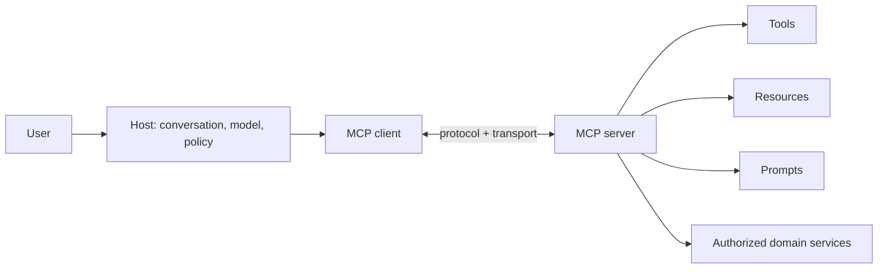

# Model Context Protocol

MCP standardizes discovery and invocation of tools, resources and prompts between
AI hosts and servers. It does not replace domain APIs, authorization, idempotency,
business validation or human approval.

## Learn In This Order

1. [Protocol Lifecycle And Architecture](./MCP-PROTOCOL-LIFECYCLE.md)
2. [Primitives, Transports, And Sessions](./MCP-PRIMITIVES-TRANSPORTS.md)
3. [Security And Production Operations](./MCP-SECURITY-OPERATIONS.md)
4. [Spring AI MCP Implementation And Shopverse Lab](./MCP-SPRING-SHOPVERSE-LAB.md)
5. [MCP With Spring AI](./MCP-SPRING-AI.md) for the existing concise practical guide

## MCP Compared

| Mechanism | Primary role |
|---|---|
| REST/gRPC | application service contract |
| OpenAPI | HTTP contract description/discovery |
| model tool calling | provider/application-specific model-to-function interface |
| MCP | host/client/server protocol for reusable AI capabilities |
| agent framework | planning, memory and orchestration policy |

An MCP server should normally delegate to the same domain service/API that owns
transactions and authorization instead of reading tables or calling infrastructure
directly.

## Official References

- [MCP specification](https://modelcontextprotocol.io/specification/2025-11-25)
- [Spring AI MCP reference](https://docs.spring.io/spring-ai/reference/api/mcp/)
- [Java MCP SDK](https://github.com/modelcontextprotocol/java-sdk)

## Recommended Next Page

Continue with [MCP Protocol Lifecycle And Architecture](./MCP-PROTOCOL-LIFECYCLE.md).
