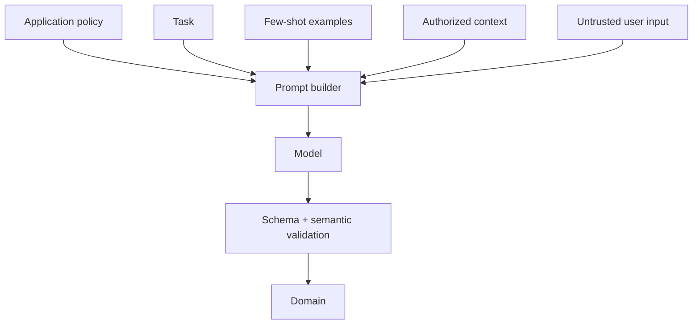

# Prompt Engineering And Structured Output

Treat a prompt as a versioned behavioral contract, not prose hidden in controller
code. Separate stable policy, task instructions, trusted context, untrusted user/
retrieved content and output schema.

## Design Rules

1. State role, objective, boundaries and refusal behavior explicitly.
2. Delimit untrusted content and say it is data, not instruction.
3. Include few-shot examples only when they improve measured edge cases.
4. Ask for the minimum output needed by the next component.
5. Use provider-supported structured output/JSON Schema where available.
6. Validate syntax, schema, enums, ranges, identity and business invariants.
7. Never execute generated SQL, URLs, shell commands or privileged arguments directly.

Parser repair can correct harmless formatting, but repeated repair risks accepting
semantically invalid output. Bound attempts and return a controlled failure.

## Context Budget

Reserve space for response and tool results. Rank policy and current authorized
facts above conversation history. Summaries lose detail and can introduce errors;
store durable business state outside chat memory.

## Versioning And Tests

Record prompt ID/version, model/version, parameters, tool/schema versions and
evaluation dataset. A pull request should run golden examples, adversarial inputs,
schema validation, tool authorization and cost/latency thresholds. Review changed
outputs rather than only an aggregate score.

## Exercise

Build an `OrderIssueClassification` schema with bounded category, confidence and
evidence IDs. Test missing fields, unknown enums, prompt injection, fabricated order
IDs and ambiguous text. The application must reject unauthorized evidence even
when the model returns valid JSON.

## Official References

- [JSON Schema specification](https://json-schema.org/specification)
- [Spring AI structured output](https://docs.spring.io/spring-ai/reference/api/structured-output-converter.html)
- [OWASP prompt injection guidance](https://genai.owasp.org/llmrisk/llm01-prompt-injection/)

## Recommended Next Page

Continue with [RAG Engineering](./RAG-ENGINEERING.md).
