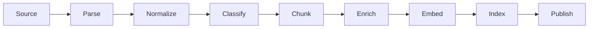

# Retrieval-Augmented Generation Engineering

RAG is two independently recoverable systems: an ingestion/index pipeline and an
authorized query/generation pipeline.

## Ingestion

Track source ID/version, parser, classification, tenant/ACL, chunk strategy,
embedding model/version and index publication. Write idempotently, quarantine
failures, reconcile counts/checksums and make deletion/re-embedding replayable.

Chunking choices include fixed tokens, headings, semantic boundaries, parent-child
and domain records. Optimize for answer evidence, not uniform chunk size. Preserve
source offsets and parent identity for citations and authorization.

## Retrieval

Exact search maximizes recall at cost. ANN structures such as HNSW trade recall,
latency, memory and update behavior. IVF narrows candidates through coarse clusters;
product quantization compresses vectors with accuracy cost. Benchmark filtered,
multi-tenant production distributions.

Hybrid retrieval combines lexical exactness with semantic similarity. Rerank a
bounded candidate set using a cross-encoder/model or business signals. Query
rewriting, decomposition, HyDE and multi-hop retrieval must be evaluated because
they can amplify cost and drift.

## Context And Answer

Deduplicate evidence, diversify sources, allocate tokens, preserve citations and
separate instructions from retrieved text. Verify that cited source IDs actually
support claims. When evidence is missing or unauthorized, refuse or ask a clarifying
question instead of filling gaps from model memory.

## Security And Operations

- authorize before retrieval and again before returning current source records;
- isolate tenant indexes/filters and test adversarial cross-tenant queries;
- treat documents as untrusted prompt content;
- monitor ingestion freshness, failed documents, recall, empty retrieval, rerank
  latency, answer faithfulness, citation validity, tokens and cost;
- version indexes and switch aliases only after validation;
- propagate deletion to chunks, vectors, caches, traces and derived answers.

## Advanced Patterns

Parent-child retrieval returns focused matches plus bounded parent context. Graph
RAG traverses modeled relations but adds extraction and graph-quality risk. Agentic,
corrective and self-reflective RAG add loops; require step/cost bounds and evidence
that the loop improves results.

## Hands-On Exercise

Compare lexical, pgvector and hybrid retrieval on a labeled Shopverse operations
dataset. Measure Recall@5, MRR, p95 latency and cost before/after reranking. Include
tenant-denial, deleted-document and prompt-injection cases.

## Official References

- [Spring AI Retrieval Augmented Generation](https://docs.spring.io/spring-ai/reference/api/retrieval-augmented-generation.html)
- [pgvector indexing](https://github.com/pgvector/pgvector#indexing)
- [OpenSearch vector search](https://docs.opensearch.org/latest/vector-search/)

## Recommended Next Page

Continue with [Agents And Tool Calling](./AGENTS-TOOL-CALLING.md).
