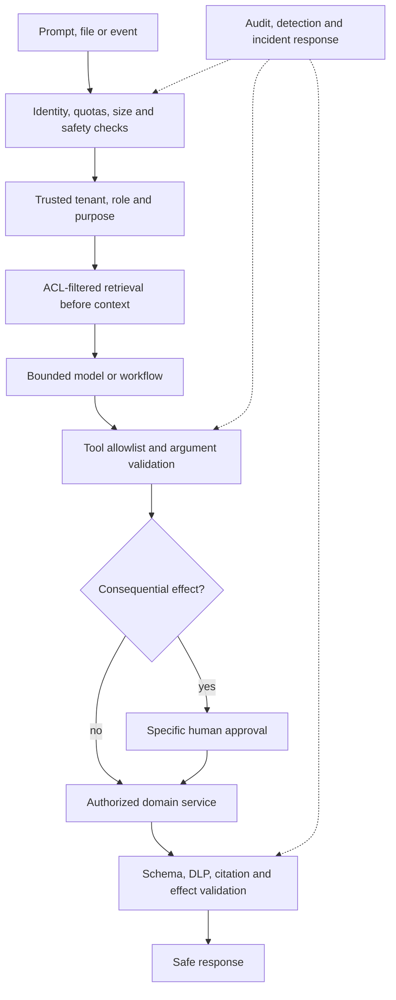
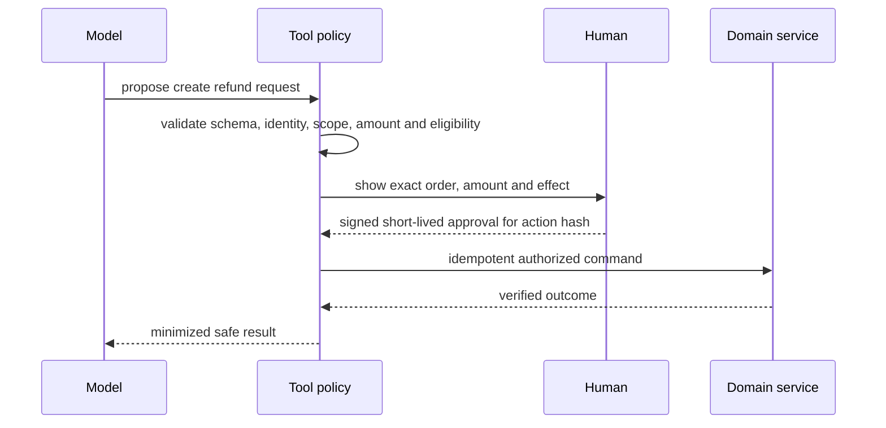

# Secure AI Agents, Data And Fast Accurate Delivery

The model is an untrusted decision suggester. It can misunderstand, hallucinate,
be manipulated, choose the wrong tool or reveal context. The application must
authenticate, authorize, minimize, validate, execute and audit.


## Threat Surface

Attacks can arrive through a direct prompt, uploaded file, email, support ticket,
RAG chunk, website, tool result, MCP server, tool description, conversation
memory or poisoned knowledge base. Treat all externally controlled text as data,
including text stored in an internal system.



## Prevent Abusive Agent Behaviour

Give every agent a narrow purpose and a small capability set. Separate
read-only investigation from write execution. Enforce maximum iterations,
tool calls, parallelism, wall-clock time, input/output tokens and estimated
cost in code. A prompt asking the model to stop is not a budget.

| Risk | Hard control |
|---|---|
| runaway loop | max steps plus deadline |
| tool spam | per-tool and per-user rate limits |
| destructive action | tool absent or approval-gated |
| excessive cost | token and currency budget |
| harmful response | input/output safety classification |
| repeated mutation | idempotency key and reconciliation |

For critical production changes, the agent may investigate and propose; a
privileged human-controlled workflow executes.

## Prevent Cross-Tenant Data Leakage

The model must never supply the acting tenant, user, role or scope. Derive them
from authenticated credentials and carry them in trusted execution context.

```java
record TrustedIdentity(String userId, String tenantId, Set<String> scopes) {}

OrderView getOrder(String orderId, TrustedIdentity identity) {
    authorization.requireScope(identity, "orders.read");
    return repository.findByTenantIdAndOrderId(
            identity.tenantId(), orderId)
        .filter(order -> authorization.canRead(identity, order))
        .orElseThrow(AccessDeniedException::new);
}
```

Enforce tenant and owner predicates inside the repository query. Where the risk
justifies it, add database row-level security and tenant-separated vector
collections. Namespace memory and safe caches by tenant, user, permission set,
purpose and relevant data/model version.

## Secure RAG

Authorization must happen before a chunk enters model context.

```text
authenticated identity
  -> mandatory tenant/role/owner metadata filter
  -> vector or hybrid retrieval
  -> document ACL recheck
  -> field minimization and injection scan
  -> bounded context assembly
  -> grounded generation
  -> authorized citation verification
```

Reject ingestion without owner, tenant, classification and ACL metadata. Scan
uploads for malware and injection patterns, preserve source/version/effective
dates and quarantine suspicious documents. Obsolete policies must not outrank
current policy.

## Prompt Injection Containment

Instructions in a RAG document or tool result can attempt to override the
system. Separate instructions from untrusted data, scan high-risk content and
mark provenance, but rely on least privilege for containment. Even a successful
injection should find no unrestricted SQL, shell, arbitrary HTTP or destructive
tool.

Never place secrets in a prompt. Tool executors obtain short-lived workload
credentials and return only allowlisted fields. Apply DLP before the model and
again before output. Do not restore redacted values unless the authenticated
viewer is authorized for that exact data.

## Secure MCP And Tools

Validate tool argument type, length, enum, range, ownership and business state.
Use per-tool OAuth scopes and validate token audience. Do not pass tokens meant
for one server to another. Sanitize tool results because they are also
untrusted input.



Specific confirmation describes the exact effect; “continue?” is insufficient.
The execution service must prove that the approved action hash matches the
command that will run.

## Accuracy Pipeline

Separate facts from narration. Live tools provide current state, RAG provides
policy evidence, domain services calculate decisions and the LLM explains the
verified result.

Validate structured output, sufficient evidence, source authority, citation
support, contradictions and tool success. Model-reported confidence is not
calibrated confidence. Use evaluation-derived thresholds and abstain or route to
a person when evidence is insufficient.

| Layer | Measure |
|---|---|
| retrieval | recall@K, precision@K, correct source, ACL correctness |
| generation | factuality, groundedness, completeness, citation entailment |
| tools | selection, argument validity, authorization, unnecessary calls |
| workflow | completion, correct escalation, policy violations, cost/latency |

Run the evaluation set before changing model, prompt, embedding model, chunks,
retriever, reranker or tool descriptions. Include prompt injection, cross-tenant
IDs, exfiltration encoding, duplicate actions and resource exhaustion cases.

## Fast Response Without Sacrificing Trust

Measure the whole path: authentication, memory, rewrite, embedding, retrieval,
reranking, tools, model and validation.

1. Avoid model calls for deterministic work.
2. Route classification and rewriting to small fast models; reserve reasoning
   models for complex synthesis.
3. Parallelize independent read tools with bounded concurrency.
4. Precompute embeddings, summaries, entities, ACL metadata and stable
   enrichment during ingestion.
5. Retrieve broadly, deduplicate and rerank, then send only the best few chunks.
6. Use dynamic tool discovery when catalogs are large.
7. Compress conversation memory and send structured, minimized tool results.
8. Cache only stable, correctly scoped content; include security and version
   dimensions in keys.
9. Propagate one request deadline and allocate a budget to each stage.
10. Stream low-risk output; buffer sentences or full responses when moderation
    must happen before display.

```text
Example 8-second deadline
retrieval 700 ms | parallel tools 2 s | model 4 s | validation 600 ms | reserve
```

Graceful degradation returns verified search results when generation fails,
base retrieval when reranking fails, or a clear statement that live state could
not be checked. It never invents a missing fact.

## Risk-Based Delivery

| Risk | Example | Delivery path |
|---|---|---|
| low | summarize public text | small model, light validation, streaming |
| medium | explain policy | authorized RAG, citations, output scan |
| high | refund eligibility | live tools, deterministic policy, full validation and confirmation |
| critical | production rollback | investigate and propose only; privileged workflow executes |

## Production Signals And Response

Alert on injection detections, cross-tenant denials, output redactions, rejected
tool calls, denied approvals, budget terminations, repeated calls, token-audience
failures, quarantined documents, unsupported citations and unusual write-tool
usage. Maintain feature, write-tool and external-MCP kill switches.

Log metrics and action audits, not raw prompts by default. Protect and redact any
sampled diagnostic content. Spring AI also excludes tool arguments/results from
observations by default; enabling them requires an explicit sensitive-data
review.

## Production Checklist

- authenticated identity and trusted tenant resolution;
- pre-retrieval ACL filtering and memory isolation;
- narrow read/write-separated tool allowlists;
- hard step, time, token, concurrency and cost limits;
- per-tool authorization, audience validation and idempotency;
- specific approval for consequential actions;
- schema, DLP and citation validation;
- adversarial evaluation in CI and runtime anomaly alerts;
- safe fallbacks, reconciliation and emergency kill switches.

## Official References

- [OWASP Top 10 For LLM And GenAI Applications](https://genai.owasp.org/llm-top-10/)
- [Spring AI tool calling](https://docs.spring.io/spring-ai/reference/api/tools.html)
- [Spring AI observability](https://docs.spring.io/spring-ai/reference/observability/)
- [LangChain4j guardrails](https://docs.langchain4j.dev/tutorials/guardrails/)
- [LangChain4j MCP](https://docs.langchain4j.dev/tutorials/mcp/)
- [MCP security best practices](https://modelcontextprotocol.io/specification/2025-11-25/basic/security_best_practices)

