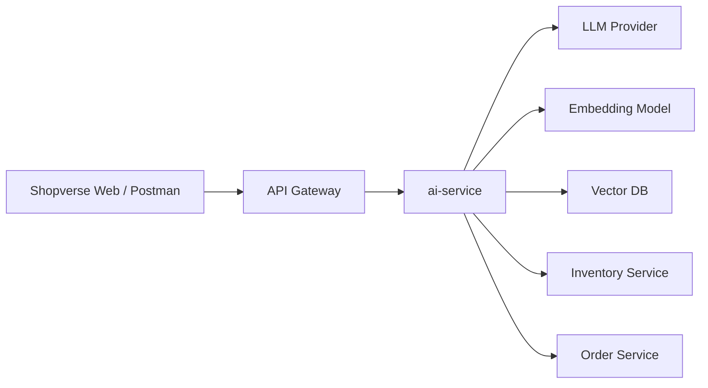

# Shopverse AI POC Plan


## Objective

Build a small interview-ready AI assistant for Shopverse.

The POC should prove:

- you understand LLM API integration
- you can use embeddings and vector search
- you can explain RAG end to end
- you know when to call backend APIs instead of trusting generated text
- you can integrate AI into a Spring Boot microservice architecture

## Recommended Scope

Create a new service or module:

```text
ai-service
```

Why a separate service:

- keeps AI provider dependencies isolated
- avoids mixing experimental AI logic into order/payment services
- makes API key and cost controls easier
- lets you scale or disable AI independently
- fits the existing Shopverse microservice style

Expose simple APIs:

```http
POST /api/ai/chat
POST /api/ai/rag/ask
POST /api/ai/products/recommend
POST /api/ai/documents/ingest
```

## POC Boundaries

| In scope | Out of scope for first POC |
|---|---|
| simple chat | full production chatbot UI |
| document RAG | fine-tuning |
| product intent extraction | autonomous purchasing |
| inventory API lookup | replacing search service |
| sources in answer | advanced ranking pipeline |
| basic metrics | complete cost dashboard |

## Feature 1: Simple Chat

Purpose:

- prove basic AI provider integration
- understand prompts, model response, timeout, and errors

Flow:

```text
User -> ai-service -> LLM provider -> ai-service -> User
```

Example request:

```json
{
  "message": "Explain the Shopverse checkout flow in simple terms"
}
```

Example response:

```json
{
  "answer": "Shopverse checkout creates an order, reserves inventory, processes payment, and updates the order status through service events."
}
```

Interview point:

> This proves basic API integration only. It does not prove private knowledge
> grounding. For that we need RAG.

## Feature 2: RAG Over Shopverse Documents


Create sample knowledge documents:

```text
documentation/docs/ai-knowledge/return-policy.md
documentation/docs/ai-knowledge/shipping-policy.md
documentation/docs/ai-knowledge/refund-policy.md
documentation/docs/ai-knowledge/product-guide.md
documentation/docs/ai-knowledge/shopverse-faq.md
```

Ingestion flow:

```text
Read documents -> split into chunks -> create embeddings -> store in vector DB
```

Question flow:

```text
Question -> embed question -> vector search -> retrieved chunks -> LLM answer
```

Example question:

```text
Can I return a defective product after delivery?
```

Expected behavior:

- answer only from retrieved context
- say when the answer is not found
- return source document names

Example response:

```json
{
  "answer": "Defective products can be returned within 7 days after delivery.",
  "sources": [
    {
      "document": "return-policy.md",
      "section": "Defective products"
    }
  ]
}
```

Implementation notes:

- store document chunks with source metadata
- use `topK = 4` or `topK = 5` initially
- keep the prompt strict: answer only from context
- include a fallback for missing answers
- do not log full customer questions if they may contain personal data

## Feature 3: Product Recommendation


Do not let the LLM invent products.

Correct flow:

```text
User message
  -> LLM extracts search intent as JSON
  -> backend validates JSON
  -> backend calls inventory/catalog API
  -> backend asks LLM to write a short explanation using real products
```

Example extracted JSON:

```json
{
  "intent": "PRODUCT_SEARCH",
  "category": "laptop",
  "maxPrice": 50000,
  "keywords": ["gaming", "ssd"]
}
```

Inventory API query could become:

```http
GET /internal/inventory/products?category=laptop&maxPrice=50000&keyword=gaming&keyword=ssd
```

Final response should be based only on returned products:

```json
{
  "answer": "I found 2 laptops under 50000 that match gaming and SSD preferences.",
  "products": [
    {
      "sku": "LAP-101",
      "name": "Acer Aspire 7",
      "price": 48999
    }
  ]
}
```

Interview point:

> The LLM is used for language understanding and explanation. Product truth
> still comes from the inventory service.

## Feature 4: Interview-Friendly Observability

Track:

- AI request count
- latency
- failures
- vector search duration
- number of retrieved chunks
- provider error type
- token usage if provider exposes it
- fallback response count

Do not log:

- API keys
- access tokens
- sensitive customer data

Suggested metric names:

```text
shopverse.ai.chat.requests
shopverse.ai.chat.failures
shopverse.ai.rag.retrieval.duration
shopverse.ai.rag.chunks.count
shopverse.ai.provider.latency
```

## Suggested Architecture



Architecture explanation:

| Component | Responsibility |
|---|---|
| API Gateway | routes requests and applies edge security |
| AI service | owns prompts, RAG, model calls, and AI DTOs |
| LLM provider | generates language responses |
| embedding model | converts documents and questions into vectors |
| vector DB | stores and searches document chunks |
| inventory service | returns real product catalog data |
| order service | returns real order state when needed |

## Local POC Stack

Recommended:

```text
Spring Boot
Spring AI
OpenAI or Ollama
PGVector or Qdrant
PostgreSQL
Docker Compose
```

Simplest interview setup:

```text
Spring Boot + Spring AI + OpenAI API + PGVector
```

Lower-cost local setup:

```text
Spring Boot + Spring AI + Ollama + Qdrant
```

## Data Model Sketch

Document chunk:

```json
{
  "id": "return-policy-001",
  "content": "Defective products can be returned within 7 days.",
  "source": "return-policy.md",
  "section": "Defective products",
  "embedding": "[vector stored by vector DB]"
}
```

RAG response:

```json
{
  "answer": "string",
  "sources": [
    {
      "document": "string",
      "section": "string",
      "score": 0.82
    }
  ]
}
```

## Build Phases

### Phase 1: Minimal AI Service

- create `ai-service`
- add `/api/ai/chat`
- configure API key from environment
- add timeout/error handling
- return simple response DTO

Done means:

- Postman can call `/api/ai/chat`
- invalid API key produces controlled error
- API key is not committed

### Phase 2: Document RAG

- add document ingestion endpoint
- add chunking
- create embeddings
- store in vector DB
- add `/api/ai/rag/ask`
- return answer plus sources

Done means:

- docs can be ingested
- vector DB has chunks
- answer cites at least one source
- unrelated questions return safe fallback

### Phase 3: Product Recommendation

- extract product intent as JSON
- call inventory/catalog API
- generate final user-friendly response using real product data

Done means:

- model extracts filters as JSON
- backend validates the JSON
- inventory service is called
- no invented product appears in response

### Phase 4: Demo Hardening

- add sample Postman/curl requests
- add README instructions
- add failure behavior
- prepare interview script

Done means:

- README has local run commands
- curl examples are present
- common failure cases are documented
- you can explain the full flow in 5 minutes

## Demo Script

1. Ask a general AI question using `/api/ai/chat`.
2. Ask a return-policy question using `/api/ai/rag/ask`.
3. Show retrieved source documents.
4. Ask for a product recommendation.
5. Show that real product data came from Shopverse services.
6. Explain why RAG is better than asking the LLM directly for policy answers.

## Five-Minute Interview Demo Script

```text
1. This is a separate ai-service in Shopverse.
2. For normal chat, it calls the configured LLM provider.
3. For policy questions, it uses RAG. Documents are chunked, embedded, stored in a vector DB, and retrieved by similarity.
4. The final prompt contains only the relevant context and the user question.
5. For products, the model extracts search intent, but the inventory service returns the actual products.
6. This avoids hallucinated policies and hallucinated products.
```

## Risks And Mitigations

| Risk | Mitigation |
|---|---|
| hallucinated answer | RAG prompt and fallback |
| invented products | backend inventory lookup |
| high latency | timeout, smaller top-k, caching |
| high cost | token limits and request limits |
| prompt injection | validate tool calls and keep auth in backend |
| stale documents | re-ingest on document update |
| sensitive data leakage | avoid logging full prompts |

For detailed secure RAG, tool authorization, user data isolation, and abuse
controls, read [AI Security And Guardrails](AI-SECURITY-GUARDRAILS.md).

## What To Say In Interview

> I added a Shopverse AI service. For normal chat it calls the LLM directly. For
> policy and FAQ questions it uses RAG: documents are chunked, embedded, stored
> in a vector database, retrieved by similarity, and passed to the LLM as
> context. For product recommendations, the LLM only extracts intent; the
> backend calls the real inventory service, so products are not hallucinated.
