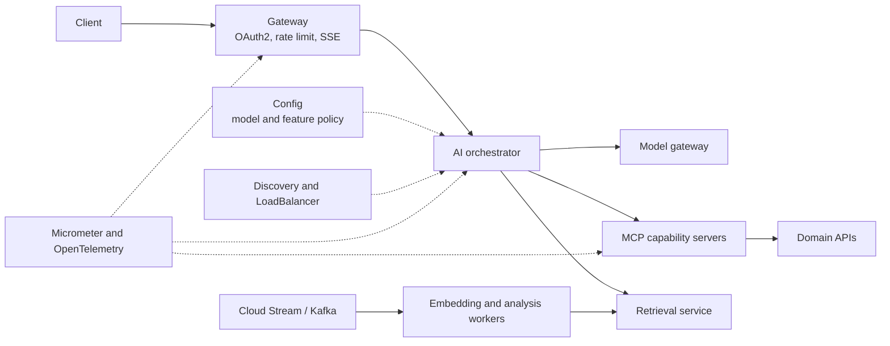
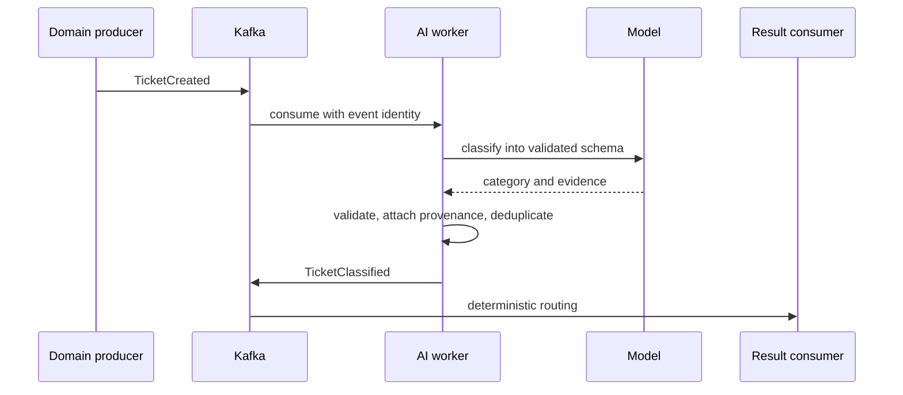

# Spring Cloud AI And MCP Ecosystem

Spring Cloud manages distributed-system concerns. Spring AI or LangChain4j
manages model interaction. MCP standardizes reusable AI-facing capabilities.
Domain microservices remain systems of record.


## Service Boundaries

| Boundary | Owns | Must not own |
|---|---|---|
| domain microservice | invariants, transactions, authorization, persistence, events | free-form model decisions |
| AI application service | prompts, conversation, retrieval, tool orchestration, response validation | final payment or access policy |
| MCP adapter | AI-oriented capability schema, protocol, tool audit and filtering | bypasses around the domain API |
| model gateway | provider routing, quotas, redaction and credentials | domain prompts and business workflow |

Use a dedicated MCP adapter when AI traffic needs independent scaling, security
or release cadence. Embed MCP in a domain service only when coupling is
intentional and AI traffic cannot threaten the core workload.

## Spring Cloud Capability Map



## Gateway For AI Traffic

AI routes have longer latency, streaming responses, larger bodies and a cost per
request. Apply authentication, tenant resolution, body limits, per-user and
per-tenant quotas, concurrent stream limits and abuse controls at the edge.
Downstream services must still validate the identity; a forwarded tenant header
alone is not authorization.

```yaml
spring:
  cloud:
    gateway:
      routes:
        - id: support-assistant
          uri: lb://support-assistant
          predicates:
            - Path=/api/ai/support/**
          filters:
            - name: RequestRateLimiter
              args:
                key-resolver: "#{@authenticatedAiUserKeyResolver}"
                redis-rate-limiter.replenishRate: 5
                redis-rate-limiter.burstCapacity: 10
```

For SSE, measure time to first token and total duration separately. Propagate
client cancellation. Do not retry after partial output or after an ambiguous
write because duplicate text or duplicate effects may result.

## Configuration And Kill Switches

Version model names, prompt IDs, retrieval thresholds, tool allowlists,
deadlines, token budgets and cost budgets. Keep API keys and MCP credentials in
a secret manager or workload identity, not a normal Config repository.

```yaml
ai:
  support:
    model-policy: approved-general
    prompt-version: refund-v4
    max-tool-calls: 5
    deadline: 8s
    write-tools-enabled: false
    external-mcp-enabled: false
```

Prompt and tool-schema changes alter runtime behavior and require evaluation,
canary activation and rollback—not an unreviewed fleet-wide refresh.

## Discovery Versus Capability Discovery

```text
Spring Cloud discovery: Where is payment-mcp-server running?
MCP discovery: Which tools, resources and prompts does it expose?
```

Resolve the service, establish the MCP session, discover capabilities, filter
them by the authenticated principal and workflow state, then expose only the
approved subset to the model. Large catalogs should use dynamic tool search so
definitions do not consume the whole context or confuse tool selection.

## Resilience By Dependency

| Dependency | Timeout and fallback | Retry rule |
|---|---|---|
| model | bounded; approved alternate or verified search results | transient failure only |
| vector store | short; keyword results or no-answer response | safe reads only |
| reranker | short; use base retrieval | usually one bounded retry |
| read tool | deadline; disclose unavailable live fact | only if idempotent |
| write tool | reconcile status before retry | require idempotency key |

Use circuit breakers and bulkheads per dependency class. AI streams, embedding
workers and ordinary business traffic should not share an unbounded resource
pool.

## Event-Driven AI

Use Spring Cloud Stream and Kafka for document ingestion, embedding, batch
classification, transcript analysis and long-running reports.



Every AI-generated event should record model family/version, prompt version,
source identifiers, generation time, validation status and correlation ID.
Consumers must not treat model confidence as authorization.

Long-running MCP operations should return an operation ID. Continue work on an
event-driven workflow and expose a separate status tool instead of holding an
MCP request open for many minutes.

## Trusted Context Propagation

Propagate identity, tenant, scopes, trace ID, deadline and idempotency identity
through trusted middleware. The user prompt and model arguments may provide a
business identifier, but never tenant, role, credential or authorization
header.

```text
user identity -> gateway -> AI application -> tool policy -> MCP adapter
              -> domain authorization -> resource ownership check
```

## End-To-End Observability

Trace gateway handling, AI workflow, retrieval, vector search, model call,
tool selection, MCP call and domain request. Record low-cardinality feature,
model family, prompt version, tool name and outcome. Keep prompt text, tool
arguments and results out of telemetry by default because they can contain
private data.

Spring AI records observations for `ChatClient`, model, advisor, vector-store
and tool operations. Tool arguments and results are excluded by default and
should remain so unless a protected, redacted diagnostic policy explicitly
requires them.

## Recommended Deployment

```text
ai-platform namespace: gateway, assistants, retrieval, embedding workers
mcp namespace: order, payment, customer and operations capability servers
business namespace: existing domain microservices
```

Scale assistants by concurrent requests/streams, workers by queue lag, MCP
servers by tool invocation concurrency and vector stores by corpus/query load.

## Official References

- [Spring Cloud Gateway](https://docs.spring.io/spring-cloud-gateway/reference/)
- [Spring AI observability](https://docs.spring.io/spring-ai/reference/observability/)
- [Spring AI tool calling](https://docs.spring.io/spring-ai/reference/api/tools.html)
- [Spring AI MCP](https://docs.spring.io/spring-ai/reference/api/mcp/mcp-overview.html)
- [Java And Spring MCP](https://docs.spring.io/spring-ai-mcp/reference/overview.html)

## Recommended Next Page

Continue with [Secure AI Agents, Data And Fast Accurate Delivery](./SECURE-AI-AGENTS-DATA-PERFORMANCE.md).

