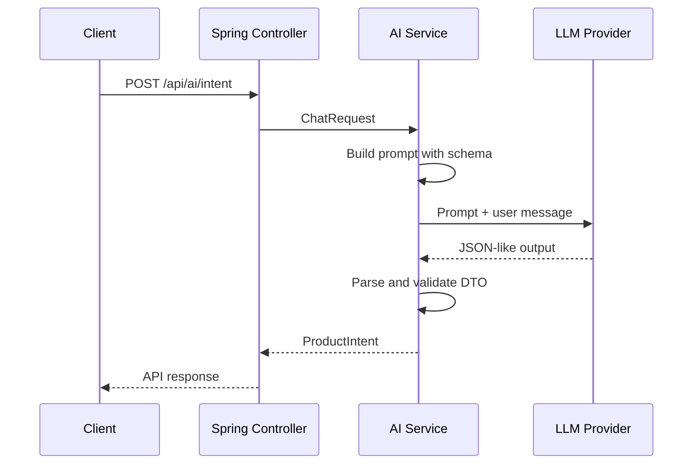
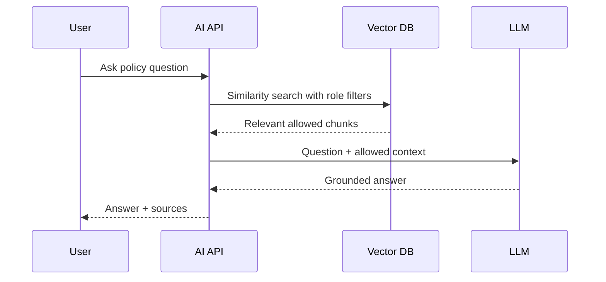
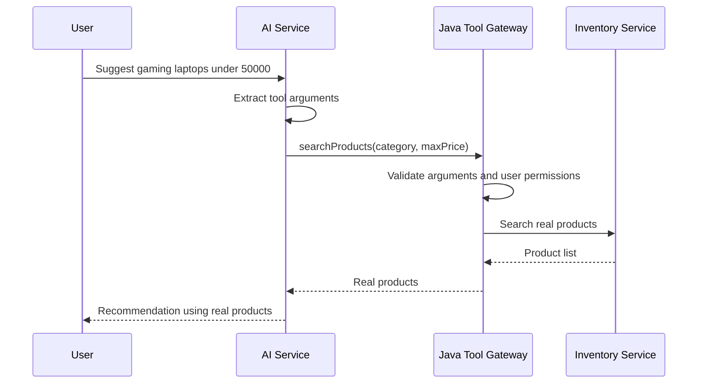
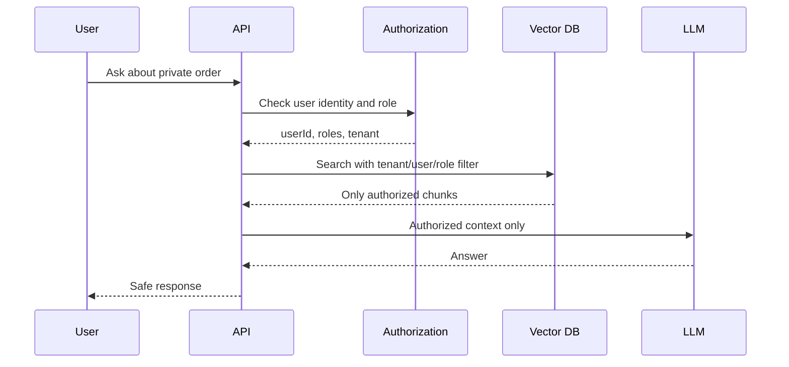
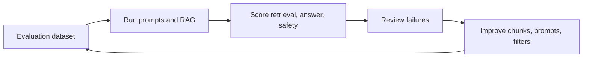

# AI Visual Learning Guide

This page collects the images, animated diagrams, flow diagrams, sequence
diagrams, architecture diagrams, and use-case maps used across the AI learning
track.

## Learning Roadmap


Use this first. It shows the order:

```text
LLM basics -> embeddings -> RAG -> tools -> production security/evaluation
```

## Generative AI Use Cases


Use this to remember where Generative AI fits in a commerce backend:

| Use case | Pattern |
|---|---|
| policy Q&A | RAG |
| product recommendation | structured output + real API data |
| support routing | classification |
| review summary | summarization |
| admin help | secure RAG |

## Architecture Diagrams

### Shopverse AI Assistant Architecture


### Java AI Framework Module Map


### Java AI Component Map


## Framework Flow Diagrams

### Spring AI ChatClient Flow


### LangChain4j AI Service Flow


### Abstraction Levels


## Prompting And Structured Output


Sequence:



## Embeddings, Vector Search, And Chunking

### Keyword Search vs Vector Search


### Chunking Strategy


## RAG Flow Diagrams And Animations

### Static RAG Flow


### Animated RAG Ingestion


Lightweight SVG version:


### Animated RAG Runtime


Lightweight SVG version:


Sequence:



## Tool Calling And Backend Data

### Static Tool Calling Flow


### Animated Tool Authorization


Lightweight SVG version:


Sequence:



## Security And Guardrails

### Security Layers


### Authorization-Aware RAG


### Prompt Injection Defense


Lightweight SVG version:


### Secure Memory Isolation


Security sequence:



## Evaluation And Production


Production sequence:



## Visual Study Checklist

Use this checklist before interview revision:

| Can you explain this visual? | Diagram |
|---|---|
| AI learning order | roadmap |
| where AI fits in Shopverse | architecture |
| Spring AI flow | ChatClient flow |
| LangChain4j flow | AI Service flow |
| prompt construction | prompt lifecycle |
| semantic search | vector search diagram |
| document chunking | chunking strategy |
| RAG ingestion/runtime | animated RAG diagrams |
| tool calling | tool authorization diagrams |
| user-data isolation | RBAC RAG and memory isolation |
| prompt injection defense | animated security diagram |
| production improvement loop | evaluation lifecycle |
