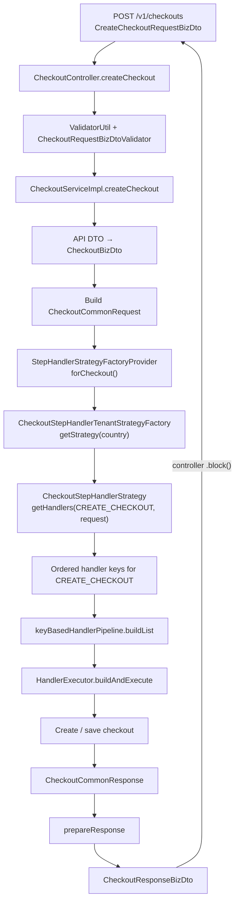

# Amway Create Checkout Execution Flow

<DocLabels items={[
  {label: 'Screenshot-derived', tone: 'shopverse'},
  {label: 'Create checkout', tone: 'advanced'},
  {label: 'Workflow review', tone: 'production'},
]} />

This page reconstructs one continuous `createCheckout` path from supplied
screenshots: controller, validation, mapping, market strategy, handler-key
pipeline, Reactor execution, persistence, and response preparation.

<DocCallout type="mistake" title="Reconstruction, not a source-code specification">

Class names, visible calls, handler keys, and ordering were reconstructed from
screenshots. Confirm them against current source, tests, OpenAPI contract,
pipeline builder, and handlers before changing runtime behavior. The
Spring/Reactor code may belong to a different module from the reported Quarkus
checkout runtime; confirm module ownership.

</DocCallout>

## Executive Flow



The central design decision is that checkout is a configurable workflow of
independent steps rather than a single large service method.

## Evidence Classification

| Classification | Meaning on this page |
|---|---|
| observed/reconstructed | visible in the supplied screenshots or final extracted conversation |
| inferred | plausible responsibility based on a handler name, ordering, or commerce behavior |
| verify | behavior depends on source not available here, especially concurrency, mutation, and failure semantics |

## 1. HTTP And Controller Boundary

The reconstructed endpoint is:

```text
POST /v1/checkouts
request:  CreateCheckoutRequestBizDto
response: CheckoutResponseBizDto
```

The controller is approximately:

```java
@Override
public ResponseEntity<CheckoutResponseBizDto> createCheckout(
        CreateCheckoutRequestBizDto checkoutRequest) {

    LoggerUtil.logInfo(
            log,
            CH_BIZ_CREATE_CHECKOUT_INFO,
            checkoutRequest.getCartId()
    );

    metricsUtil.recordCount(CHECKOUT_REQUESTED_COUNT);

    validatorUtil.validate(
            checkoutRequest,
            checkoutRequestBizDtoValidator
    );

    return ResponseEntity.ok(
            checkoutBizService
                    .createCheckout(checkoutRequest)
                    .block()
    );
}
```

Its visible responsibilities are:

1. log entry into the flow using a cart reference;
2. increment a checkout-request metric;
3. validate the request before expensive downstream work;
4. delegate orchestration to the checkout service;
5. block on the internal Reactor result and return an MVC response.

Logging should contain only approved identifiers. Do not log the full request:
account, profile, address, payment, loyalty, and cart data can contain personal or
sensitive information. A cart identifier can also be sensitive and must not
become an unbounded metric label.

## 2. Validation Before Workflow Execution

The visible validator is `CheckoutRequestBizDtoValidator`, invoked through a
project utility such as `validatorUtil.validate(...)`. That utility likely wraps
Spring `DataBinder`, registers the supplied `Validator`, calls `validate()`, reads
the `BindingResult`, and throws the project's validation exception when errors
exist.

The reconstructed request rules include:

```java
@Override
public void validate(Object target, Errors errors) {
    CreateCheckoutRequestBizDto request =
            (CreateCheckoutRequestBizDto) target;

    if (isEmpty(request.getEntries())
            && isEmpty(request.getSubCarts())) {
        errors.rejectValue(
                "entries",
                CHECKOUT_ENTRY_CANNOT_BE_EMPTY
        );
    }

    // Validate each direct cart entry when present.
    // Validate each sub-cart and its entries when present.

    if (useSelectedWarehouse
            && isEmpty(request.getFulfillmentDetail().getWarehouseId())) {
        errors.rejectValue(
                "fulfillmentDetail.warehouseId",
                CHECKOUT_WAREHOUSE_CANNOT_BE_EMPTY
        );
    }
}
```

The screenshots indicate child entry/sub-cart validation, but the exact nested
path handling must be confirmed. Correct Spring validation should preserve paths
such as `entries[0].quantity` and `subCarts[1].entries[2].sku` rather than returning
an ambiguous top-level message.

This boundary should own structural and deterministic request rules. Account
ownership, current product eligibility, authoritative prices, stock, tax, and
payment decisions depend on current external state and belong in workflow/service
steps with explicit failure policy.

## 3. Service Mapping Boundary

The service returns `Mono<CheckoutResponseBizDto>` and begins by mapping the API
request to an internal model:

```java
CheckoutBizDto checkout =
        checkoutRequestMapper.map(checkoutRequest);
```

This prevents every internal handler from depending on the generated/public
`CreateCheckoutRequestBizDto`. The boundary is:

```text
OpenAPI/request DTO
    ↓ request mapper
internal CheckoutBizDto
    ↓ workflow handlers
domain/workflow result
    ↓ response mapper
CheckoutResponseBizDto
```

That separation lets the API contract and internal checkout model evolve on
different schedules. Mapping must not silently invent price, ownership, status,
tax, or payment defaults; those are explicit business decisions.

## 4. `CheckoutCommonRequest` As Workflow Context

The service builds a shared request approximately as follows:

```java
CheckoutCommonRequest request = CheckoutCommonRequest.builder()
        .fulfillment(checkoutRequest.getFulfillmentDetail())
        .checkout(checkout)
        .source(Source.CREATE_CHECKOUT)
        .paymentDetails(checkoutRequest.getPaymentDetails())
        .loyaltyPointsApplicationRequestBizDto(
                getLoyaltyPointsApplicationRequestBizDto(checkoutRequest)
        )
        .build();
```

Conceptually it contains:

```text
CheckoutCommonRequest
├── mapped checkout
├── fulfillment details
├── payment details/reference
├── loyalty application data
├── source = CREATE_CHECKOUT
└── shared values needed by handlers
```

The context avoids very long handler method signatures and gives the generic
executor one request type. The cost is hidden coupling: a handler can begin to
read or modify any field. Each handler therefore needs a documented contract:

- required inputs;
- values it produces or changes;
- whether mutation is allowed;
- whether it is safe to retry;
- errors it can return;
- handlers that must precede it.

`source = CREATE_CHECKOUT` suggests that the same infrastructure may support
other flows such as update, recalculate, or submit. This is an inference; confirm
the real `Source`/`CheckoutFlow` enum and handler conditions.

## 5. Country Strategy Selection

The reconstructed strategy selection is approximately:

```java
CheckoutStepHandlerStrategy strategy =
        stepHandlerStrategyFactoryProvider
                .forCheckout()
                .getStrategy(
                        TupleService.getTuples().getAmwayCountry()
                );
```

The selected strategy then provides handler keys:

```java
strategy.getHandlers(
        CheckoutFlow.CREATE_CHECKOUT,
        request
);
```

This combines Strategy and Factory patterns:

```text
CheckoutServiceImpl
    ↓
StepHandlerStrategyFactoryProvider.forCheckout()
    ↓
CheckoutStepHandlerTenantStrategyFactory.getStrategy(country)
    ↓
CheckoutStepHandlerStrategy.getHandlers(CREATE_CHECKOUT, request)
    ↓
List<String> handler keys
    ↓
HandlerExecutor.buildAndExecute(keys, request)
```

The provider is a concrete Spring component reconstructed from the later
screenshots:

```java
@Component
public class StepHandlerStrategyFactoryProvider {

    private final CheckoutStepHandlerTenantStrategyFactory checkoutFactory;
    private final PlaceOrderStepHandlerTenantStrategyFactory placeOrderFactory;
    private final LoggedInUserStepHandlerTenantStrategyFactory loggedInUserFactory;
    private final AnonymousUserStepHandlerTenantStrategyFactory anonymousUserFactory;

    public StepHandlerStrategyFactoryProvider(
            CheckoutStepHandlerTenantStrategyFactory checkoutFactory,
            PlaceOrderStepHandlerTenantStrategyFactory placeOrderFactory,
            LoggedInUserStepHandlerTenantStrategyFactory loggedInUserFactory,
            AnonymousUserStepHandlerTenantStrategyFactory anonymousUserFactory) {

        this.checkoutFactory = checkoutFactory;
        this.placeOrderFactory = placeOrderFactory;
        this.loggedInUserFactory = loggedInUserFactory;
        this.anonymousUserFactory = anonymousUserFactory;
    }

    public CheckoutStepHandlerTenantStrategyFactory forCheckout() {
        return checkoutFactory;
    }

    public PlaceOrderStepHandlerTenantStrategyFactory forPlaceOrder() {
        return placeOrderFactory;
    }

    public LoggedInUserStepHandlerTenantStrategyFactory forLoggedInUser() {
        return loggedInUserFactory;
    }

    public AnonymousUserStepHandlerTenantStrategyFactory forAnonymousUser() {
        return anonymousUserFactory;
    }
}
```

Each layer answers a different question:

| Layer | Decision |
|---|---|
| provider | which workflow family: checkout, place order, logged-in user, or anonymous user? |
| tenant strategy factory | which country/tenant implementation? |
| strategy | which handler plan for this flow and request? |
| executor | how should that plan run? |

The provider does **not** select a country strategy and does not execute a
handler. It returns the checkout-family factory; `getStrategy(country)` performs
the tenant lookup; the resulting strategy returns the keys. Constructor
injection and `final` fields make all four factories mandatory and stable after
construction.

Market strategies avoid spreading country conditionals across every handler.
They can represent local tax, fulfillment, rationing, promotion, payment, or
compliance differences. A default strategy must be explicit: silently using it
for an unsupported market could calculate a legally or financially incorrect
checkout.

## 6. Complete Create-Checkout Handler Sequence

The screenshot-derived default sequence is:

```text
1. Enrich Users
        ↓
2. [Enrich Product || Populate Segment]
        ↓
3. Account Search
        ↓
4. [Prepare Checkout || Rationing]
        ↓
5. [Fulfillment || Account Balance || Delivery Fee || SOP]
        ↓
6. Prepare Modification
        ↓
7. Tax Calculation
        ↓
8. Prepare Adjustment
        ↓
9. Create / Save Checkout In Database
```

`||` denotes the pipeline's intended parallel grouping. Different numbered
stages execute sequentially.

| Stage | Reconstructed handler key/name | Responsibility and confidence |
|---|---|---|
| 1 | `CHECKOUT_ENRICH_USERS_HANDLER_KEY` | enrich user/customer data; exact sources and ownership checks require verification |
| 2A | `CHECKOUT_ENRICH_PRODUCT_HANDLER_KEY` | load authoritative product attributes used later |
| 2B | `CHECKOUT_POPULATE_SEGMENT_STEP_HANDLER_KEY` | populate customer/business segment data; inferred from name |
| 3 | `CHECKOUT_ACCOUNT_SEARCH_HANDLER_KEY` | locate/enrich the relevant account; matching and authorization rules require verification |
| 4A | `CHECKOUT_PREPARE_STEP_HANDLER_KEY` | construct normalized checkout working state |
| 4B | `CHECKOUT_RATIONING_STEP_HANDLER_KEY` | apply supply/customer quantity limits; exact rationing semantics are market-specific |
| 5A | `CHECKOUT_ENRICH_FULFILLMENT_HANDLER_KEY` | determine/enrich delivery or pickup information |
| 5B | `CHECKOUT_ACCOUNT_BALANCE_CALCULATION_STEP_HANDLER_KEY` | calculate account balance effect; money semantics require source confirmation |
| 5C | `CHECKOUT_CALCULATE_DELIVERY_FEE_HANDLER_KEY` | calculate delivery charges using prepared cart/fulfillment data |
| 5D | `CHECKOUT_SOP_STEP_HANDLER_KEY` | process the project-specific SOP concept; do not expand the acronym without team confirmation |
| 6 | `CHECKOUT_PREPARE_MODIFICATION_HANDLER_KEY` | combine modifications from earlier work; inferred dependency barrier |
| 7 | `CHECKOUT_TAX_CALCULATION_STEP_HANDLER_KEY` | calculate tax after product, quantity, fulfillment, and fee inputs are available |
| 8 | `CHECKOUT_PREPARE_ADJUSTMENT_STEP_HANDLER_KEY` | normalize promotions, credits, discounts, or other adjustments; exact fields require verification |
| 9 | `CHECKOUT_CREATE_DB_HANDLER_KEY` | persist the final prepared checkout |

The ordering communicates dependencies. Tax appears after fulfillment, delivery
fee, rationing, and modifications because those values may affect the tax base.
Persistence appears last so a successfully created record represents a checkout
that passed prior enrichment and calculation stages.

## 7. Handler-Key Pipeline Construction

The executor entry point is reconstructed as:

```java
public Mono<CheckoutCommonResponse> buildAndExecute(
        List<String> keys,
        CheckoutCommonRequest request) {

    List<List<Handler>> handlersList =
            keyBasedHandlerPipeline.buildList(keys);

    // Build stage publishers and execute them.
}
```

The pipeline builder converts a flat key definition containing a designated
parallel separator into a staged structure:

```text
A → B || C → D → E || F || G → H
```

becomes conceptually:

```java
List.of(
        List.of(A),
        List.of(B, C),
        List.of(D),
        List.of(E, F, G),
        List.of(H)
);
```

This makes the handler strategy declarative. A market can insert, remove, or
reorder handler keys without rewriting the generic executor. The builder must
fail fast on an unknown key, duplicate that is not explicitly allowed, leading or
trailing separator, empty group, missing required final persistence handler, or
unsupported flow.

## 8. Sequential And Parallel Reactor Execution

The later executor screenshot supplies the previously missing concurrency
implementation. Reconstructed together, the normal executor is approximately:

```java
public Mono<CheckoutCommonResponse> buildAndExecute(
        List<String> keys,
        CheckoutCommonRequest request) {

    List<List<Handler>> handlersList =
            keyBasedHandlerPipeline.buildList(keys);

    List<Mono<CheckoutCommonResponse>> stepHandlersMono =
            new ArrayList<>();

    for (List<Handler> handlers : handlersList) {
        stepHandlersMono.add(
                Flux.concat(prepareSteps(request, handlers)).last()
        );
    }

    if (CollectionUtils.isEmpty(stepHandlersMono)) {
        return null;
    }

    return Flux.concat(stepHandlersMono).last();
}
```

The missing `prepareSteps(...)` method is approximately:

```java
@NotNull
private static Mono<CheckoutCommonResponse> prepareSteps(
        CheckoutCommonRequest request,
        List<Handler> handlers) {

    List<Mono<CheckoutCommonResponse>> subStepHandlersMono =
            new ArrayList<>();

    for (Handler handler : handlers) {
        subStepHandlersMono.add(handler.call(request));
    }

    return Flux.merge(subStepHandlersMono).last();
}
```

`Flux.concat(stepHandlersMono)` subscribes to stage publishers sequentially, so a
later stage does not begin until the preceding stage completes. Inside one stage,
`Flux.merge(subStepHandlersMono)` subscribes to its handler publishers
concurrently. This is the confirmed two-level execution model:

```text
outer List<List<Handler>> + Flux.concat
    → stages execute sequentially

inner List<Handler> + Flux.merge
    → handlers in that stage execute concurrently
```

`merge` means concurrent subscription, not “create one new thread per handler.”
Actual thread use depends on each publisher and its scheduler. Nonblocking HTTP
publishers can overlap naturally; synchronous CPU work does not become
multi-core merely because it is passed to `merge`.

### What `.last()` actually returns

After `Flux.merge`, emissions arrive in runtime completion order. Therefore:

```java
Flux.merge(subStepHandlersMono).last()
```

returns the response emitted last in time—not necessarily the response from the
last handler in the strategy list. For example, if SOP is last in the key list
but account-balance calculation completes last, the stage result is the
account-balance response.

This may work because the handlers appear to enrich the shared
`CheckoutCommonRequest` and the response is a common envelope. That is an
inference which must be verified. If the identity of the returned response
matters, completion timing creates nondeterministic semantics; prefer an
explicit aggregate such as `Mono.zip` with a deterministic merge function.

### Shared-context concurrency boundary

Every handler in a merged group receives the same `request` reference:

```text
Fulfillment ───────┐
Account balance ───┤
Delivery fee ──────┼──> same CheckoutCommonRequest
SOP ───────────────┘
```

Parallel handlers must write disjoint fields or return immutable partial
results. Concurrent changes to the same collection, totals, entries, or status
can produce lost updates, inconsistent calculations, or
`ConcurrentModificationException`.

### The second executor mode

The later screenshot also shows `buildAndExecuteParallel(...)` ending with:

```java
return Flux.merge(stepHandlersMono).last();
```

That mode appears to merge the stage publishers themselves, while the normal
create-checkout path calls `buildAndExecute(...)` and concatenates stages. The
parallel variant is safe only for a plan whose stages have no inter-stage
dependencies. Confirm its callers before using it for checkout.

The inner `Flux.concat(prepareSteps(...)).last()` wraps a single `Mono` and is
therefore likely redundant; `stepHandlersMono.add(prepareSteps(...))` would be
equivalent if the reconstructed signatures are exact. Treat that as a review
observation, not a required change.

Intended latency improvement for an independent four-handler group is closer to
the slowest handler than the sum of all handlers. That is safe only when handlers:

- have no read-after-write dependency on one another;
- do not concurrently mutate the same `CheckoutCommonRequest` or response field;
- use thread-safe collaborators;
- define how multiple simultaneous failures are selected or aggregated;
- propagate cancellation and timeouts correctly;
- respect downstream connection and rate limits.

A safer model is for parallel handlers to return immutable, typed partial results
and merge them after `zip`, rather than mutating a shared object concurrently.

## 9. Chain, Strategy, Factory, And Pipeline Roles

Several patterns cooperate:

| Pattern/component | Responsibility |
|---|---|
| Spring validator + validation utility | reject an invalid request before workflow execution |
| mapper | isolate public API DTOs from internal workflow models |
| strategy | choose a handler plan for flow and market |
| factory/provider | locate the correct strategy |
| Chain of Responsibility/pipeline | run independent handlers in defined order and stop on failure |
| Reactor | compose asynchronous stage completion and selected concurrency |
| common request/response | give a generic executor stable workflow contracts |

Unlike the classical linked-list Chain of Responsibility, this implementation
appears list/key based: the executor owns traversal instead of each handler
holding a `next` reference.

## 10. Failure And Short-Circuit Semantics

The expected Reactor behavior is:

```text
handler emits response → stage continues/completes
handler returns Mono.error → current stage fails
                         → later sequential stages are not subscribed
                         → error propagates to service/controller handling
```

Confirm these cases in tests:

- validator rejection prevents all handlers;
- one sequential handler failure prevents every later stage;
- one parallel handler failure cancels or joins its siblings according to policy;
- an empty handler publisher does not make `.last()` fail unexpectedly;
- an empty key plan does not return `null` into reactive composition;
- a merged stage's result does not depend accidentally on which handler finishes last;
- a timeout has a stable public error and does not leave hidden work running;
- retries occur only for safe/idempotent operations;
- the database create step cannot be executed twice for one logical request.

The chain is not a distributed transaction. If a handler changes a downstream
system before a later handler fails, a Java exception cannot roll that change
back. State-changing steps require idempotency, audit state, reconciliation, and
compensation where the business supports reversal.

## 11. Persistence Boundary

`CHECKOUT_CREATE_DB_HANDLER_KEY` is the final reconstructed stage. Review it for:

- idempotency key and unique constraint;
- atomic storage of checkout state and any integration-event intent;
- optimistic/pessimistic concurrency policy;
- authoritative price, currency, tax, and adjustment precision;
- account/profile ownership evidence without copying unnecessary PII;
- behavior when the database commit succeeds but the HTTP response is lost;
- safe retry response for an already created checkout.

Persisting last reduces partial records during calculation, but it also means all
earlier results live only in memory unless downstream side effects were already
made. Decide deliberately which stages are pure enrichment and which create
durable external state.

## 12. `CheckoutCommonResponse` And `prepareResponse`

The executor produces:

```java
Mono<CheckoutCommonResponse>
```

The reconstructed response normalization is:

```java
private Mono<CheckoutResponseBizDto> prepareResponse(
        Mono<CheckoutCommonResponse> response) {

    return response.map(commonResponse -> {
        if (commonResponse.getCheckoutResponse() != null) {
            return commonResponse.getCheckoutResponse();
        }

        if (commonResponse.getCheckout() != null) {
            return checkoutMapper.mapCheckoutResponse(
                    commonResponse.getCheckout()
            );
        }

        return new CheckoutResponseBizDto();
    });
}
```

There are therefore three paths:

1. a handler already produced the public response;
2. only an internal checkout exists, so it is mapped;
3. neither exists, so an empty response DTO is returned.

The third path deserves review. Returning an empty successful DTO can mask a
broken handler contract. A typed failure or explicit “no checkout result” outcome
is usually safer unless the API deliberately defines an empty success.

`CheckoutCommonResponse` enables a generic executor, but optional overlapping
representations can create ambiguity. Define precedence and invariants such as
“exactly one of checkout response, checkout model, or failure must be present.”

## 13. Blocking At The Controller

The service uses Reactor internally but the controller calls `.block()`. If this
is Spring MVC, the request thread waits until the reactive pipeline completes.
That can be an intentional synchronous boundary, but it does not provide a fully
nonblocking request path.

Review:

- which thread invokes `.block()`;
- whether any handler blocks a Reactor event-loop thread;
- timeout behavior—never wait without a bounded policy;
- servlet thread-pool and downstream connection-pool capacity;
- whether a fully MVC synchronous service would be simpler;
- whether a WebFlux controller should instead return `Mono<CheckoutResponseBizDto>`.

Do not mix blocking database or client calls into an event-loop chain without an
approved scheduler and measured capacity.

## 14. Observability

Instrument the workflow at the chain boundary and per stage:

```text
checkout.flow = CREATE_CHECKOUT
checkout.strategy = approved bounded market strategy name
checkout.stage = bounded handler name
checkout.outcome = success | rejected | timeout | technical_failure
checkout.duration = timer/histogram
```

Propagate correlation and trace context through every handler and downstream
client. Avoid account, profile, cart, order, or payment identifiers as metric
labels. Logs should record stable error codes and bounded handler names, with
sensitive request/response fields redacted.

Parallel stages need child spans so the trace shows overlap, join time, the
critical path, cancellation, and which dependency failed.

## 15. Tests That Protect The Design

### Controller and validation

- invalid direct entries and sub-carts return the documented field paths;
- selected-warehouse mode requires a warehouse identifier;
- validation failure never invokes the checkout service;
- request metrics and safe correlation logging behave as intended.

### Strategy and builder

- every supported market/flow produces the exact approved handler sequence;
- an unsupported market has an explicit failure/default policy;
- unknown keys and malformed separators fail during startup or focused tests;
- required persistence and response-producing steps cannot disappear silently.

### Executor

- sequential groups never overlap;
- intended parallel handlers actually overlap under a controlled scheduler test;
- dependent handlers are never placed in the same parallel group;
- one failure prevents later stages and follows the sibling-cancellation policy;
- empty publishers, multiple emissions, timeout, cancellation, and retry are
  tested explicitly because `.last()` depends on publisher cardinality.

### Business and persistence

- tax uses final fulfillment, fee, quantity, and adjustment inputs;
- money uses explicit currency and decimal rounding policy;
- idempotent retries return the original checkout rather than creating another;
- concurrent requests cannot create duplicate checkout state;
- post-commit response loss and reconciliation have a recovery path.

## Design Strengths And Trade-Offs

### Strengths

- isolates complex checkout responsibilities into focused handlers;
- supports market variation without pervasive conditionals;
- allows independent work to reduce critical-path latency;
- keeps public DTOs outside internal handler contracts;
- makes handler sequencing configurable and independently testable;
- enables one executor to serve multiple checkout flows.

### Trade-offs

- control flow is distributed across strategy, key registry, builder, executor,
  handlers, and common context;
- string handler keys can fail at runtime without startup validation;
- parallel mutation of shared context can introduce races;
- ordering changes can alter money or fulfillment behavior invisibly;
- optional common-response fields weaken compile-time guarantees;
- `.block()` can erase some reactive scalability benefits;
- a lightweight in-memory workflow is not durable orchestration after process
  failure.

## First Repository Walkthrough

Use this order when the source becomes available:

1. Open the OpenAPI `POST /v1/checkouts` operation and generated DTOs.
2. Trace controller logging, metric, validator, exception mapper, and `.block()`.
3. Read `CheckoutRequestBizDtoValidator`, child validators, and `ValidatorUtil`.
4. Inspect the request mapper and unmapped-field policy.
5. List every field in `CheckoutCommonRequest` and who may mutate it.
6. Follow the strategy provider, market lookup, default behavior, and flow enum.
7. Compare every `getHandlersForCreateCheckout()` variant.
8. Read handler-key registry and malformed-configuration behavior.
9. Read `buildList`, `prepareSteps`, `Flux.concat`, join, timeout, and scheduler
   semantics directly.
10. Trace every handler's input, output, downstream call, retry, and error code.
11. Inspect database idempotency, transactions, and post-commit behavior.
12. Verify `prepareResponse` invariants and empty-result handling.
13. Use tests and a trace to prove the complete success and failure sequences.

## Known Gaps To Confirm

- exact controller, service, and package names;
- whether the endpoint path is exactly `/v1/checkouts` in the current contract;
- complete validation conditions and nested validator behavior;
- meaning of SOP in this domain;
- which handlers mutate request versus return response state;
- exact generic types, annotations, and error behavior around `prepareSteps(...)`;
- exact purpose and callers of `buildAndExecuteParallel(...)`;
- whether the last-completing merged response is deliberately the stage result;
- scheduler, timeout, retry, and cancellation policy;
- whether account balance, payment, or loyalty steps create side effects;
- database technology and transaction boundary for the create handler;
- empty response DTO behavior and public error mapping;
- whether this Spring/Reactor flow is current, shared, or superseded by Quarkus.

## Official References

- [Spring MVC Annotated Controllers](https://docs.spring.io/spring-framework/reference/web/webmvc/mvc-controller.html)
- [Spring Validation](https://docs.spring.io/spring-framework/reference/core/validation.html)
- [Project Reactor Reference Guide](https://projectreactor.io/docs/core/release/reference/)
- [OpenAPI Specification](https://spec.openapis.org/oas/latest.html)

## Related Learning

- [Amway Checkout Domain Primer](./AMWAY-CHECKOUT-DOMAIN-PRIMER.md)
- [Checkout Chain Of Responsibility](./AMWAY-CHECKOUT-CHAIN-OF-RESPONSIBILITY.md)
- [Checkout Strategy Pattern](./AMWAY-CHECKOUT-STRATEGY-PATTERN.md)
- [Checkout Factory And Strategy Provider](./AMWAY-CHECKOUT-FACTORY-PROVIDER.md)
- [OpenAPI Contracts And Generated DTO Artifacts](./AMWAY-OPENAPI-CONTRACT-ARTIFACTS.md)
- [Spring DataBinder Validator And BindingResult](../spring/validation/SPRING-DATABINDER-VALIDATOR-BINDINGRESULT.md)
- [Chain of Responsibility Pattern](../development/design-patterns/chain-of-responsibility.md)
- [Idempotent Commands](../development/spring-rest/REST-IDEMPOTENT-COMMANDS.md)
- [Reactive Programming](../spring/SPRING-REACTIVE.md)
