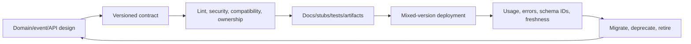

# API And Event Schema Governance Path

Schema governance is the technical and organizational system that keeps independently
deployed producers, consumers, clients, servers, stored messages and documentation compatible.
It covers semantics, ownership and lifecycle—not only whether bytes still deserialize.

## Complete Route

1. [API Contract Lifecycle, OpenAPI, Versioning, And Deprecation](./governance/API-CONTRACT-GOVERNANCE.md)
2. [Event Contracts, Schema Registry, Avro, Protobuf, And JSON Schema](./governance/EVENT-SCHEMA-REGISTRY-GOVERNANCE.md)
3. [Governance Operating Model, Security, Tooling, And Production Operations](./governance/CONTRACT-GOVERNANCE-OPERATIONS.md)
4. [Incidents, Labs, Architect Interviews, And Revision](./governance/SCHEMA-GOVERNANCE-INTERVIEW-REVISION.md)

## Contract Surface

An API/event contract includes names and types plus meaning, units, optionality/null/default,
validation, errors, authorization, idempotency, ordering, key/routing, timestamps, retention,
privacy, rate/size limits, availability and deprecation. A registry cannot detect a silent
change from cents to dollars.

## Completion Standard

You can choose compatibility mode from deployment order, design additive changes, govern OpenAPI/
AsyncAPI/schema artifacts, define ownership and consumer inventory, secure registry and generated
code, migrate breaking semantics, preserve replay, execute deprecation with usage evidence and
diagnose schema incidents without forcing synchronized fleet deployment.

## Official References

- [OpenAPI Specification](https://spec.openapis.org/oas/latest.html)
- [AsyncAPI Specification](https://www.asyncapi.com/docs/reference/specification/latest)
- [Apache Avro specification](https://avro.apache.org/docs/current/specification/)
- [JSON Schema specification](https://json-schema.org/specification)
- [Protocol Buffers documentation](https://protobuf.dev/)

## Recommended Next

Begin with [API Contract Lifecycle, OpenAPI, Versioning, And Deprecation](./governance/API-CONTRACT-GOVERNANCE.md).

