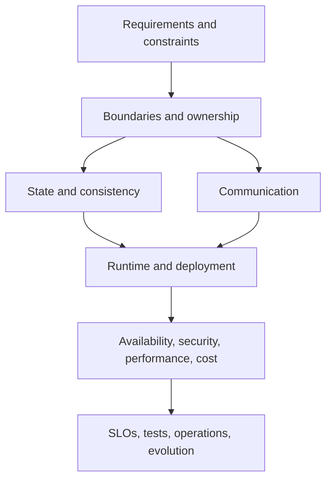

# Software And Systems Architecture Overview

Architecture is the set of consequential decisions about boundaries, ownership,
data, communication, deployment, and operation. Good architecture makes required
qualities achievable and expensive mistakes reversible where possible.

## Important Topics

| Topic | Brief explanation |
|---|---|
| functional requirements | Behaviors and user outcomes the system must provide. |
| non-functional requirements | Measurable availability, latency, throughput, durability, security, compliance, and cost constraints. |
| HLD | System boundaries, components, interactions, deployment, data ownership, and technology decisions. |
| LLD | Classes, interfaces, state machines, algorithms, schemas, and object collaboration. |
| service boundaries | Cohesive ownership of business capability and data, not arbitrary technical layers. |
| consistency | Rules governing when observers see writes and which conflicts or stale states are acceptable. |
| availability | Ability to provide an acceptable outcome during component failure. |
| scalability | Ability to sustain growth by adding or resizing resources without violating constraints. |
| resilience | Controlled behavior under timeout, overload, dependency failure, retry, and recovery. |
| observability | Evidence needed to explain system state and user impact. |
| security architecture | Trust boundaries, identities, policy enforcement, data protection, and audit. |
| evolutionary architecture | Compatibility, migration, rollback, deprecation, and controlled replacement. |

## Core Decisions

An architect must make explicit decisions about:

- synchronous versus asynchronous communication;
- transaction boundaries and distributed consistency;
- relational, NoSQL, search, cache, object, or streaming storage;
- partition key, replication, retention, and recovery;
- stateless and stateful scaling;
- load balancing, rate limiting, backpressure, and admission control;
- failure isolation, timeout, retry, circuit breaker, and compensation;
- authentication, authorization, tenancy, privacy, and secrets;
- deployment topology, health, rollout, rollback, and disaster recovery;
- build versus buy and managed versus self-managed infrastructure.

## Architecture Levels

| Level | Main question | Evidence |
|---|---|---|
| context | Who uses the system and which external systems matter? | actors, trust boundaries, external contracts |
| container/service | Which deployable units own capabilities and data? | service map, communication and ownership |
| component | How does one service organize behavior? | modules, ports, adapters, transaction boundaries |
| code/data | How are objects, algorithms, schemas, and state transitions implemented? | LLD, ERD, tests and constraints |
| deployment | Where does software run and how does traffic/state move? | topology, capacity, HA and DR |

## Failure-First Questions

For every remote call, queue, database, cache, and scheduler ask:

1. What if it is slow rather than completely down?
2. What if the caller times out but the operation succeeds?
3. What if the same command or event arrives twice?
4. What if instances disagree about current state?
5. What if capacity is exhausted?
6. What evidence distinguishes each outcome?
7. How is recovery performed without worsening the incident?

## Recommended Route

1. [HLD And LLD](./HLD-LLD.md)
2. [System Design Concepts](./SYSTEM-DESIGN-CONCEPTS.md)
3. [Distributed Systems](./DISTRIBUTED-SYSTEMS.md)
4. [Microservices Architect Path](./microservices/MICROSERVICES-ARCHITECT-PATH.md)
5. [Capacity And Performance](./hld-lld/CAPACITY-PERFORMANCE-ESTIMATION.md)
6. [State, Data, And Deployment Boundaries](./STATE-DATA-DEPLOYMENT-BOUNDARIES.md)
7. [Production Platform Engineering](./PRODUCTION-PLATFORM-ENGINEERING.md)
8. [Architecture Revision Sheet](./ARCHITECTURE-REVISION-SHEET.md)
9. [System Design Case Studies](./system-design-deep-dives/CASE-STUDY-WORKBOOK.md)

## Completion Check

- convert requirements into measurable quality attributes;
- define service, data, trust, transaction, and deployment boundaries;
- calculate capacity and identify bottlenecks;
- defend consistency and failure trade-offs;
- design compatible evolution, migration, rollback, and recovery;
- show how tests and telemetry prove the design;
- compare alternatives rather than presenting one inevitable solution.
