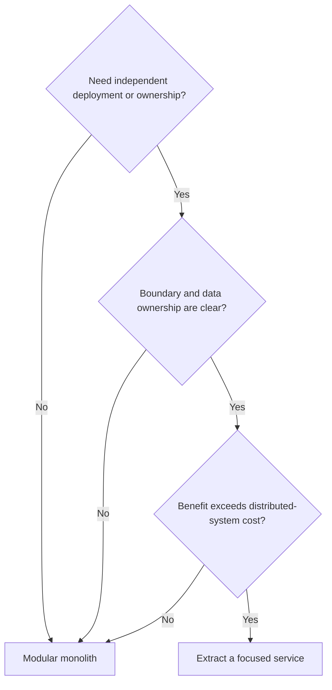

# Software Architecture Styles

Architecture terms often describe different dimensions. A system can be a
modular monolith, use hexagonal boundaries inside each module, publish events,
run some serverless workers, and expose a layered web adapter. Do not treat every
term as a mutually exclusive deployment choice.


*Visual summary supplied by the project owner. Source:
[LinkedIn architecture-types post](https://www.linkedin.com/posts/sathish-kumarsubramani_softwarearchitecture-systemdesign-backendengineering-activity-7481210600526815233-uwoi/).*

## Comparison

| Style | Dimension | Choose when | Cost / misuse |
|---|---|---|---|
| monolith | deployment | one deployable keeps delivery and transactions simple | becomes a big ball of mud without module boundaries |
| modular monolith | deployment + modularity | domain is growing but independent deployment is not yet required | needs enforced module ownership and dependency rules |
| microservices | deployment + ownership | teams need independent deployment/scaling/failure domains | network, consistency, observability, security, and platform cost |
| layered / N-tier | code organization | request flow maps cleanly through presentation/application/domain/data | domain logic can leak into controllers/services and create pass-through layers |
| hexagonal / ports and adapters | dependency direction | domain logic must be testable independent of HTTP, messaging, and persistence | unnecessary interfaces/mappers for trivial CRUD |
| clean architecture | dependency direction | long-lived use cases need framework-independent core policies | ceremony and duplicated models if applied mechanically |
| event-driven | interaction style | producers and consumers need temporal decoupling and fan-out | eventual consistency, duplicates, ordering, schema evolution |
| CQRS | model separation | read and write shapes or scale differ materially | projections, staleness, duplication, operational complexity |
| serverless | execution/deployment | bursty event/API workloads benefit from managed scaling and per-use billing | cold starts, limits, observability, lock-in, connection storms |
| pipeline | processing topology | data passes through sequential transform/validation stages | error recovery, partial progress, ordering, and backpressure |
| space-based | state/distribution | extreme availability/throughput justify distributed in-memory state | complex consistency, memory cost, product specialization |

## Monolith Or Microservices?

Start with a modular monolith when one team can own the system, one database
transaction is valuable, and deployment/scaling needs are shared. Extract a
service only when a boundary needs independent ownership, release cadence,
scaling, security, data residency, or failure isolation.



## Hexagonal, Clean, And Layered

These can coexist. A practical Spring service might have:

```text
inbound adapters: REST controller, Kafka listener, scheduler
application: use cases and transaction orchestration
domain: business rules and invariants
outbound ports: repository, payment gateway, event publisher
outbound adapters: JPA, HTTP client, Kafka producer
```

Dependencies point toward policy. Framework annotations at the edge are normal;
purity is valuable only when it improves testing, changeability, or ownership.

## Event-Driven And CQRS

Use events for facts that other domains need independently. Use commands when a
specific owner must decide. Add CQRS when measured read requirements justify a
separate model—not merely because two classes named Command and Query look clean.
Require outbox/inbox, idempotency, schema compatibility, replay, lag monitoring,
and explicit projection freshness.

## Java Microservice Patterns


API gateway, circuit breaker, database per service, saga, CQRS, event sourcing,
service discovery, strangler fig, and bulkhead solve different forces. See
[Microservices Patterns](./MICROSERVICES-PATTERNS.md) for their trade-offs and
[the supplied LinkedIn summary](https://www.linkedin.com/posts/manish-munjal-3120093b_building-java-microservices-was-a-mess-until-activity-7481402161243914258-jv60/).

## Decision Checklist

- What is the deployable and who owns it?
- Where are transaction and consistency boundaries?
- Which dependencies may point toward the domain?
- Which workloads need independent scale or isolation?
- What happens during network/broker/provider failure?
- How will schemas, APIs, and events evolve?
- Can the team test, observe, secure, deploy, and recover this architecture?

Choose the simplest combination that satisfies the forces. Architecture is a
set of enforceable decisions, not a diagram of fashionable labels.
