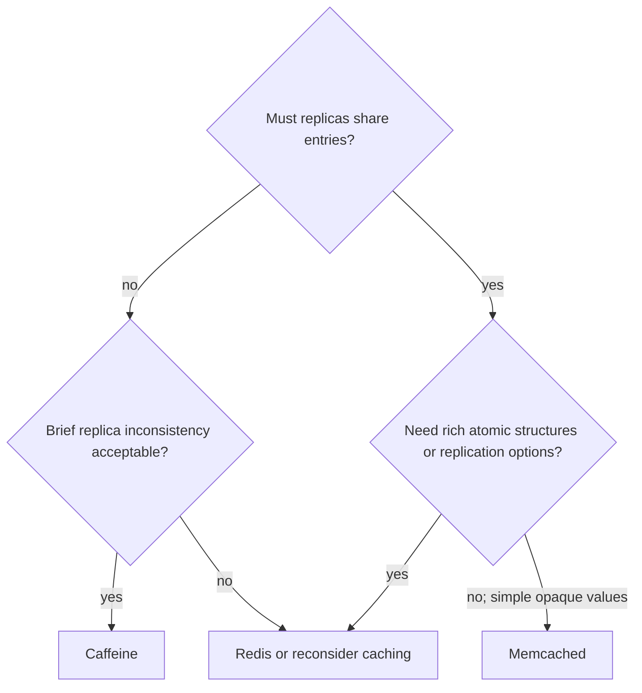

# Caffeine, Redis And Memcached

## Comparison

| Concern | Caffeine | Redis | Memcached |
|---|---|---|---|
| Location | Application JVM | Remote server/cluster | Remote server pool |
| Model | Java objects by key | Rich server-side structures | Opaque value by key, counters, CAS |
| Network/serialization | Normally none | Required; RESP | Required; text/meta protocol |
| Shared by replicas | No | Yes | Yes |
| Persistence/replication | No | Optional | Disposable cache design |
| Strength | Lowest latency and advanced eviction | Shared cache and atomic operations | Simple distributed object cache |

## Caffeine

```java
@Bean
CacheManager cacheManager() {
    CaffeineCacheManager manager = new CaffeineCacheManager("products");
    manager.setCaffeine(Caffeine.newBuilder()
            .maximumSize(10_000)
            .expireAfterWrite(Duration.ofMinutes(5))
            .recordStats());
    return manager;
}
```

- Bound by `maximumSize`, or `maximumWeight` plus a weigher.
- Choose expiry from the freshness budget; removal is not a real-time scheduler.
- `refreshAfterWrite` needs a loading strategy and refreshes on eligible access.
- `recordStats()` enables statistics with some overhead.
- Cache immutable DTOs/defensive copies, not caller-mutated objects.
- Every replica warms, expires, and invalidates independently.

Choose Caffeine for extremely hot, read-heavy data when brief per-replica
inconsistency is acceptable. Restart clearing it must be safe.

## Redis

Redis is a remote in-memory data-structure server. Spring Cache normally maps a
namespaced key to serialized bytes with a TTL; direct Redis use can also access
hashes, sets, sorted sets, streams, counters, and atomic server operations.

### Redis Serialization Protocol (RESP)

Clients use RESP over persistent TCP connections. A command is an array of bulk
strings and the response is a typed RESP2/RESP3 value.

Conceptual `GET product:42` request:

```text
*2\r\n
$3\r\n
GET\r\n
$10\r\n
product:42\r\n
```

RESP transports commands; JSON/protobuf/JDK serialization is a separate value
codec choice. Use a maintained Lettuce/Jedis client, not hand-written protocol.

### Redis Production Controls

- Configure `maxmemory` and an intentional eviction policy for cache workloads.
- Distinguish TTL expiration from memory-pressure eviction.
- Use private networking, TLS, ACLs/authentication, and per-service credentials.
- Bound connect, pool-acquisition, command, and total timeouts.
- Avoid layered retries that consume the request deadline.
- Plan replication/failover and understand possible recent-data loss/lag.
- Treat values as rebuildable even when persistence is enabled.
- Monitor hits, misses, evictions, expirations, memory, latency, blocked clients,
  connections, rejected writes, and replication.

Prefer explicit JSON or a governed binary schema over unversioned Java
serialization. Restrict polymorphic deserialization and version namespaces.

## Memcached

Memcached is a distributed disposable memory cache. Clients commonly select a
server through consistent hashing. Each item contains a key, expiration, flags,
CAS value, and opaque bytes. Operations include `get`, `set`, `add`, `replace`,
`delete`, increment/decrement, and compare-and-swap.

Current Memcached guidance recommends the Meta Text Protocol for new advanced
clients; the binary protocol is deprecated. Consider:

- key/item-size constraints and serialization;
- slab allocation and LRU expiration/eviction behavior;
- client distribution when servers join or leave;
- stampede/stale-while-revalidate support;
- private networking and access isolation;
- hit, miss, eviction, item, byte, connection, and latency statistics.

Spring Boot does not include Memcached in its built-in cache-provider detection.
Use a maintained client plus a tested adapter/third-party `CacheManager`.

## Selecting A Provider



Benchmark full serialization, network, failure, and source-protection behavior.

## Official References

- [Caffeine Wiki](https://github.com/ben-manes/caffeine/wiki)
- [Redis Protocol](https://redis.io/docs/latest/develop/reference/protocol-spec/)
- [Redis Eviction](https://redis.io/docs/latest/develop/reference/eviction/)
- [Memcached Protocols](https://docs.memcached.org/protocols/)
