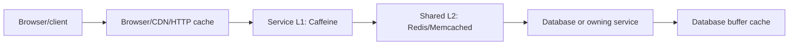
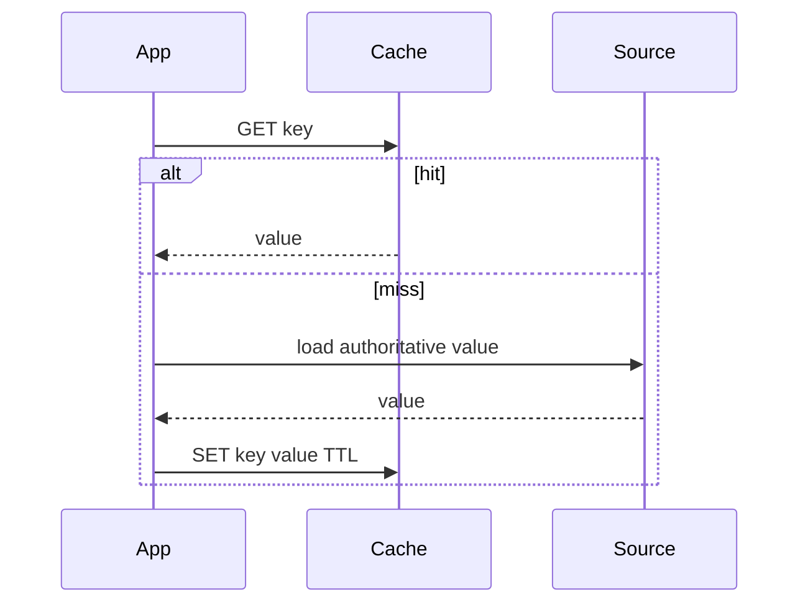

# Cache Umbrella

A cache stores a temporary copy of data so later reads avoid slower computation,
network calls, or storage. It improves latency and capacity by accepting
freshness, invalidation, memory, and failure complexity. The source of truth must
remain recoverable without the cache.

## Read In This Order

| Goal | Page |
|---|---|
| Understand levels, patterns, keys, storage, and consistency | This page |
| Use Spring annotations and proxy behavior | [Spring Cache](../spring/SPRING-CACHE.md) |
| Compare Caffeine, Redis, and Memcached | [Cache Providers](./CACHE-PROVIDERS.md) |
| Design L1/L2 and hybrid caching | [Distributed And Hybrid Cache](./DISTRIBUTED-HYBRID-CACHE.md) |
| Understand persistence-context, Hibernate L2, and query cache | [Hibernate Caching](../data/hibernate/HIBERNATE-CACHING.md) |

## What “Level 1” And “Level 2” Mean

| Context | L1 | L2 |
|---|---|---|
| Hybrid application cache | Per-instance local cache such as Caffeine | Shared remote cache such as Redis |
| Hibernate | Mandatory persistence-context cache in one `EntityManager` | Optional cache shared across sessions |
| CPU hardware | Small cache closest to a core | Larger cache shared more broadly |

Always name the context. Hibernate L1 is not Caffeine, and Redis used by a
microservice is not automatically Hibernate's second-level cache.

## Cache Layers



| Layer | Scope | Best use | Main risk |
|---|---|---|---|
| Browser/HTTP | Client/intermediary | Cacheable HTTP representations | Private data or incorrect headers |
| CDN/edge | Regions/users | Assets and public cacheable responses | Purge delay and wrong cache key |
| Application local | One process | Extremely hot tolerant data | Replicas disagree; duplicate memory |
| Distributed | Many processes | Shared reusable values | Network dependency and outage |
| ORM first-level | One unit of work | Entity identity and repeat loads | Confusing managed state with durable data |
| ORM second-level | Application/provider region | Reusable entity/collection state | Stale data and invalidation complexity |
| Database buffer pool | Database | Frequently used pages and indexes | Does not fix inefficient queries |

## How Data Is Stored

Conceptually:

```text
cache name/namespace + key -> encoded value + expiration + provider metadata

shopverse:catalog:v3:product:42
  -> {"id":42,"name":"Keyboard","price":4999}
  TTL: 300 seconds
```

- **Local cache:** key/value are Java objects in process memory; serialization
  is usually unnecessary, but shared mutable objects are dangerous.
- **Redis/Memcached:** key/value cross the network as bytes. The application
  chooses String, JSON, protobuf, or another serializer.
- **Hibernate L2:** the provider stores entity state by region and identifier,
  not an attached entity object shared across sessions.

Remote values form a deployment contract. Version the namespace or keep
serialization backward compatible. Never put secrets or raw personal data in
keys; keys appear in logs, metrics, and administrative tools.

## Cache Keys

A key must include every input that changes the result:

```text
{service}:{cache}:{schemaVersion}:{tenant}:{locale}:{authorizationVariant}:{id}
```

Ask whether tenant, currency, locale, page, sort, permissions, or representation
version matters. Keys must be deterministic and bounded. Avoid random request IDs
unless implementing deduplication with a strict TTL.

Spring's default key is `SimpleKey.EMPTY` for no arguments, the argument itself
for one argument, and a `SimpleKey` of all arguments for several. Use an explicit
key or `KeyGenerator` when parameters contain unstable/irrelevant fields.

## Core Patterns

| Pattern | Flow | Main trade-off |
|---|---|---|
| Cache-aside | App loads source after miss, then stores | Simple; concurrent misses can stampede |
| Read-through | Cache invokes a loader | Provider-specific loading contract |
| Write-through | Write cache and source synchronously | Latency; two systems are not automatically atomic |
| Write-behind | Cache persists asynchronously | Durability, ordering, and recovery complexity |
| Refresh-ahead | Refresh before expiry | Extra work and temporary staleness |
| Stale-while-revalidate | Serve bounded stale while refreshing | Availability over freshness |



## Expiration, Eviction, And Invalidation

- **Expire-after-write/TTL:** age since load or write.
- **Expire-after-access/time-to-idle:** time since last access.
- **Size/weight eviction:** remove entries when memory capacity is reached.
- **Manual invalidation:** remove/replace affected keys after authoritative write.
- **Namespace version:** make an incompatible key family unreachable.

TTL is a safety net, not complete consistency. Too long serves stale values; too
short destroys hit rate. Add jitter when many keys would otherwise expire together.

Cache and database updates are usually not atomic:

```text
T1 database commit succeeds
T2 cache still contains old value
T3 invalidation arrives
T4 next read reloads the new value
```

Define the acceptable T1–T3 staleness window. For cross-service invalidation,
publish a durable outbox/domain event and consume it idempotently.

## Common Failures

| Problem | Effect | Controls |
|---|---|---|
| Stampede/thundering herd | Many callers reload one key | Single-flight/`sync`, jitter, refresh-ahead |
| Penetration | Repeated absent keys reach source | Validation, brief negative caching, Bloom filter when justified |
| Avalanche | Many keys expire or cache fails together | Jitter, load shedding, controlled warmup |
| Hot key | One key overloads one node | L1 near-cache, replication, split/redesign value |
| Pollution | Low-value entries evict hot entries | Admission/weight limits and targeted caches |
| Stale authorization | Revoked access remains cached | Complete key, short TTL, invalidation, fail-closed policy |
| Poisoned value | Old/bad schema cannot decode | Version prefix, guarded serializer, delete-on-decode failure |
| Cache outage | Source receives full traffic | Short timeout, no retry storm, capacity protection |

## What Not To Cache

- failures disguised as valid empty results;
- mutable correctness-critical inventory without an accepted stale window;
- authorization without full subject, tenant, resource, and policy version;
- huge values more expensive to serialize than recompute;
- one-use unbounded keys;
- secrets or data the cache security boundary cannot protect;
- values whose invalidation costs more than the original operation.

## Measurement And Checklist

Measure hits, misses, load latency/failure, eviction, size/weight, remote command
latency/errors, source load during outage, and business correctness. Hit rate
alone can hide expensive misses.

Before caching, answer:

1. What expensive work is avoided and by how much?
2. What is authoritative and how stale may the copy be?
3. What forms the complete key?
4. Who invalidates after every write path?
5. What bounds memory/cardinality?
6. What happens during cache outage and cold start?
7. Can the source survive misses and recovery?
8. How are values evolved, secured, tested, and monitored?

## Official References

- [Spring Cache Abstraction](https://docs.spring.io/spring-framework/reference/integration/cache.html)
- [Spring Boot Caching](https://docs.spring.io/spring-boot/reference/io/caching.html)
