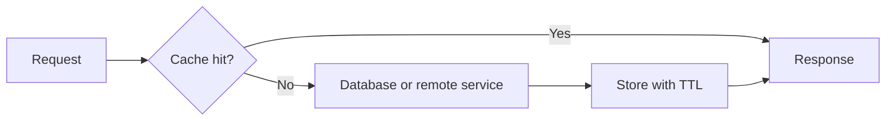
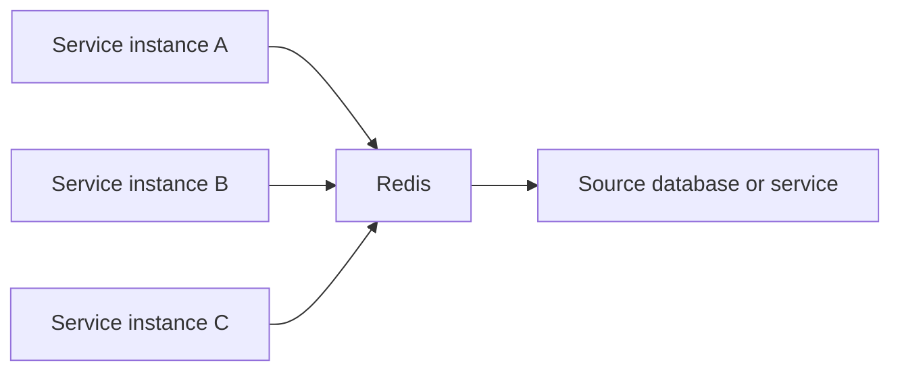

# Caching Principles

Caching trades freshness and invalidation complexity for lower latency and
reduced load.

## Cache Levels

| Level | Example | Scope |
|---|---|---|
| Application local | Caffeine or an in-memory map | one service instance |
| Distributed | Redis | multiple service instances |
| HTTP | cache-control, CDN | clients and edge |
| Database | buffer pool and query execution caches | database engine |

Caching is not a source-of-truth strategy. The authoritative database or
service must remain capable of rebuilding disposable cache entries.

## What Not To Cache

- exceptions and dependency failures;
- security decisions without complete identity context;
- rapidly changing inventory unless staleness is acceptable;
- unbounded keys such as random request IDs;
- sensitive data without encryption and access controls.

The Inventory outage fix throws `ServiceUnavailableException` instead of
returning an empty catalog, preventing a failure from appearing to be valid
cacheable data.

## Cache-Aside Flow



## Local Versus Redis

| Concern | Local cache | Redis |
|---|---|---|
| Latency | lowest | network hop |
| Replica consistency | independent values | shared value |
| Availability | tied to instance | separate dependency |
| Eviction | per process | centralized |
| Serialization | often unnecessary | required |

## Common Cache Patterns

| Pattern | Flow | Main trade-off |
|---|---|---|
| Cache-aside | application loads and stores misses | simple, but misses can stampede |
| Read-through | cache provider loads missing data | provider-specific loading contract |
| Write-through | write cache and backing store together | higher write latency |
| Write-behind | cache acknowledges before asynchronous persistence | durability and ordering complexity |
| Refresh-ahead | refresh before expiry | extra refresh load and prediction |

Cache-aside is the most common application pattern:

```text
read cache
  -> hit: return value
  -> miss: read source, cache with TTL, return value
```

For writes:

```text
commit source-of-truth change
  -> invalidate or replace affected cache entry
```

Invalidating after a successful database commit avoids exposing uncommitted
state. Cross-service invalidation commonly uses a durable domain event.

## Redis As A Centralized Cache

Redis is a remote in-memory data structure server. Multiple application
replicas can share the same cache namespace:



Redis communicates through RESP, the Redis Serialization Protocol. RESP frames
commands and typed responses over a persistent TCP connection. Applications
normally use a client library and connection pool rather than constructing
RESP messages themselves.

Centralized cache does not mean a generic service should own every domain's
keys. Prefer one managed Redis deployment with:

- domain-owned key prefixes;
- separate logical or physical isolation where risk requires it;
- explicit TTL and serialization contracts;
- access controls and encrypted transport;
- memory limits and an intentional eviction policy.

Avoid building a custom HTTP "cache service" in front of Redis unless it owns a
real cross-domain contract. An extra service adds latency, another failure
boundary, and often removes useful Redis operations without improving data
ownership.

## Consistency And Failure Behavior

Every cache use must answer:

1. How stale may the value become?
2. Who invalidates or refreshes it?
3. What happens when Redis is unavailable?
4. Can the source survive a cache miss storm?
5. Is it safe for two users or tenants to share the key?
6. Can old serialized values be read after deployment?

A cache outage should usually degrade performance, not correctness. That
requires bounded timeouts, no unbounded retries, and protection for the
source-of-truth dependency.

## Cache Key Design

Good keys are deterministic, bounded, namespaced, and versioned:

```text
shopverse:inventory:v1:product:101
shopverse:user:v2:profile:42
```

Do not include secrets or raw personal information in keys. Avoid unbounded
key dimensions such as request IDs unless the cache is specifically designed
for deduplication with a strict TTL.

## Stampede, Penetration, And Hot Keys

- **Stampede:** many callers reload the same expired value. Use request
  coalescing, synchronized loading, jittered TTLs, or refresh-ahead.
- **Penetration:** repeated misses reach the source. Validate input, cache safe
  negative results briefly, or use a Bloom filter for suitable datasets.
- **Hot key:** one key receives disproportionate traffic. Replicate reads,
  partition the value, use local near-cache, or redesign access patterns.

## Production Practices

- define maximum size and TTL;
- record hit, miss, load time, and eviction metrics;
- include tenant/user context where authorization affects values;
- prevent cache stampedes with synchronization or request coalescing;
- use versioned key prefixes during incompatible schema changes;
- treat cache as disposable unless explicitly designed otherwise;
- test stale-value behavior and dependency recovery.

## Do And Do Not

| Do | Do not |
|---|---|
| Define TTL and maximum memory | Create immortal entries by accident |
| Namespace and version keys | Share ambiguous keys across domains |
| Measure hits, misses, loads, and evictions | Judge cache value only by hit rate |
| Use bounded connection and command timeouts | Retry Redis indefinitely |
| Protect the source from miss storms | Assume Redis is always available |
| Cache only when staleness is acceptable | Cache correctness-critical mutable state blindly |
| Secure Redis and isolate tenants | Put secrets or personal data in keys |

## Related Guides

- [Spring Cache](../spring/SPRING-CACHE.md)
- [Distributed Systems Fundamentals](DISTRIBUTED-SYSTEMS-GENERIC.md)
- [Consistency And CAP](DISTRIBUTED-CONSISTENCY-CAP.md)
- [Micrometer metrics](../observability/MICROMETER-METRICS.md)
