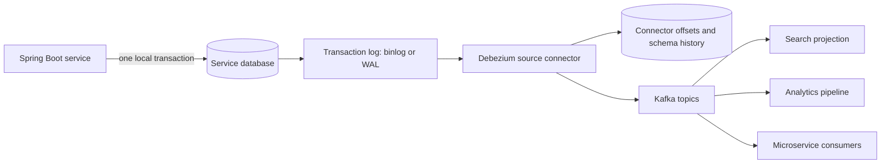

# Change Data Capture In Microservices

Change data capture (CDC) converts committed database changes into a durable
stream. Log-based CDC reads the database's ordered transaction log—MySQL binlog,
PostgreSQL WAL through logical decoding, SQL Server transaction log, or Oracle
redo/log-mining sources—instead of repeatedly querying business tables.

CDC is infrastructure for observing committed changes. It is not automatically
a domain-event model, a distributed transaction, or an exactly-once business
guarantee.

## The Problems CDC Solves

| Problem | CDC contribution | What still needs design |
|---|---|---|
| repeatedly polling for changed rows | streams changes from the transaction log | connector capacity, offsets, and log retention |
| keeping search, cache, analytics, or replicas current | provides an incremental committed-change feed | projection idempotency, rebuild, and reconciliation |
| relaying transactional outbox rows | removes the application polling relay | event contract, routing, cleanup, and consumer deduplication |
| bootstrapping an existing data set | snapshot establishes a baseline before streaming | snapshot load, consistency, duration, and restart policy |
| recovering after connector restart | persistent source offset identifies the resume position | source log must still contain the required position |

### The Dual-Write Failure

This code is unsafe because the database and broker do not share one atomic
transaction:

```java
orderRepository.save(order);       // database commit can succeed
kafkaTemplate.send("orders", event); // process can fail before this succeeds
```

CDC of the `orders` table can publish the committed row change, but downstream
consumers then depend on the physical table schema and must infer business
meaning. For domain events, prefer **transactional outbox plus CDC**:

```text
one local database transaction
  -> update order
  -> insert OrderCreated outbox event
  -> commit

database log -> CDC connector -> broker -> idempotent consumers
```

The atomic guarantee comes from writing the domain row and outbox row in the
same local transaction. CDC is the relay that observes the committed outbox row.

## Runtime Architecture



A connector normally performs two distinct activities:

1. **Snapshot:** capture an initial consistent baseline when required.
2. **Streaming:** read committed changes after the captured log position and
   emit create, update, and delete change events.

Kafka Connect persists source offsets. On restart, the connector resumes from
the recorded source position if the database still retains it. MySQL binlogs
that are purged too early or PostgreSQL replication slots that are lost can make
normal resume impossible and force a new snapshot or controlled recovery.

## What A Change Event Contains

A row-level event commonly carries an envelope similar to:

```json
{
  "before": {"id": 101, "status": "CREATED"},
  "after": {"id": 101, "status": "PAID"},
  "op": "u",
  "source": {
    "db": "orders",
    "table": "orders",
    "snapshot": "false"
  },
  "ts_ms": 1784192400000
}
```

The exact source metadata is connector-specific. Consumers should not confuse
connector processing time with database commit time, and should not build
business contracts directly around every field in the raw envelope.

## Direct Table CDC Versus Outbox CDC

| Dimension | Direct table CDC | Transactional outbox plus CDC |
|---|---|---|
| emitted meaning | physical row mutation | explicit business event |
| consumer coupling | table names, columns, and database behavior | versioned event contract |
| best fit | replication, analytics, search/cache projections | service-to-service domain events |
| filtering | connector/table/column rules | event type and aggregate routing |
| schema evolution | database schema change affects consumers | event schema evolves deliberately |
| deletes and intermediate writes | visible unless filtered/interpreted | application chooses meaningful events |
| producer effort | little application code | outbox insert in the domain transaction |

Use direct CDC when a trusted projection must mirror authoritative data and the
schema coupling is intentional. Use an outbox for integration events: consumers
need business facts such as `OrderCreated`, not a reconstruction of SQL writes.

## Debezium Outbox Event Router

Debezium's outbox event router single-message transformation can turn inserted
outbox records into purpose-built broker messages. Its default model uses a
unique event ID, aggregate type, aggregate ID, event type, and payload. The
aggregate ID becomes the Kafka key by default, which keeps one aggregate's
events in the same partition when topic partitioning is stable.

```properties
transforms=outbox
transforms.outbox.type=io.debezium.transforms.outbox.EventRouter
transforms.outbox.route.by.field=aggregatetype
transforms.outbox.table.field.event.key=aggregateid
transforms.outbox.table.field.event.id=id
transforms.outbox.table.field.event.payload=payload
```

Apply the transformation only to intended outbox records. Heartbeats,
transactions, schema events, and ordinary table changes have different shapes.
Treat the event ID as a deduplication key; it does not deduplicate business
effects by itself.

## Ordering, Delivery, And Exactly Once

CDC preserves useful source ordering, but the end-to-end ordering boundary must
be explicit:

- database transaction logs establish a source order;
- connector tasks and topic routing determine emitted partitions;
- Kafka orders records only within a partition;
- consumers can process different partitions concurrently;
- retries, replay, and repartitioning can change observed timing.

Use `aggregate_id` as the message key when events for one aggregate must stay in
order, and include `aggregate_version` when consumers need to detect gaps or
stale events.

Do not claim exactly-once business effects merely because a connector or Kafka
Connect mode supports exactly-once source delivery. A consumer can complete a
remote side effect and fail before recording progress. Consumers still require
idempotency keys, an inbox table, conditional state transitions, or provider
operation IDs.

## Snapshots And Bootstrap

An initial snapshot answers, “What state existed before streaming began?” It can
be expensive on large production tables.

Before enabling CDC, decide:

- which schemas, tables, and columns are included;
- whether existing rows or only future changes are required;
- how locks and database load are bounded during the snapshot;
- where snapshot progress and completion are monitored;
- how a failed or interrupted snapshot restarts;
- how downstream projections distinguish snapshot reads from live changes;
- how a newly added table or rebuilt projection is backfilled and reconciled.

Test snapshots with production-like volume. A fast steady-state stream does not
prove that a multi-hour bootstrap is safe.

## Failure Modes And Recovery

| Failure | Expected behavior | Required control |
|---|---|---|
| connector or Connect worker crashes | restart from persisted source offset | replicated internal topics and restart alerting |
| database unavailable | connector stops/retries according to configuration | alert, recover database, verify resume position |
| source log position is purged | normal resume fails | log-retention capacity, lag alerts, snapshot/recovery runbook |
| PostgreSQL slot retained during long outage | WAL can grow until disk pressure | slot lag and disk monitoring, ownership and cleanup policy |
| poison record or incompatible schema | connector/task or consumer can stop | dead-letter/error policy, schema compatibility, replay procedure |
| duplicate delivery after retry | same event can be observed again | stable event ID and idempotent consumer/inbox |
| consumer falls behind | topic lag and projection staleness grow | capacity scaling, quotas, backlog SLO, rebuild plan |
| snapshot and stream overlap | duplicates or transition complexity | connector-supported consistent snapshot and idempotent sink |

Never delete offsets, schema history, a PostgreSQL replication slot, or retained
logs as a casual restart technique. Those artifacts define the connector's
recovery position and require an explicit recovery plan.

## Operations And Security Checklist

Monitor:

- connector/task state and restart count;
- source-to-connector and connector-to-consumer lag;
- last emitted event age and throughput;
- Kafka Connect offset/config/status topic health;
- binlog retention or PostgreSQL replication-slot/WAL growth;
- snapshot progress, duration, rows scanned, and errors;
- schema-history and serialization failures;
- consumer duplicates, DLT volume, and projection reconciliation drift.

Secure the path with least-privilege replication users, TLS, secret rotation,
table/column allowlists, broker ACLs, and payload classification. Exclude secrets,
payment data, and unnecessary personal data before they enter a retained event
stream. Deleting a source row does not automatically erase previously emitted
events from Kafka, warehouses, or backups.

## CDC Versus Polling Decision

| Choose polling when | Choose CDC when |
|---|---|
| one or a few services have modest event volume | many services share a managed event platform |
| application teams own simple relay code | a platform team owns connectors and Kafka Connect |
| seconds of relay latency are acceptable | consistently low publication latency matters |
| database polling cost is measured and acceptable | polling load or publisher contention is material |
| operational simplicity is the primary constraint | offsets, snapshots, log retention, and replay are operationally mature |

CDC is usually an architectural evolution, not a default dependency. A bounded,
correct polling publisher can be the better system when its SLO is met.

## Shopverse Position

Shopverse currently uses the shared application outbox publisher: service
instances load bounded pending IDs, claim each row in a short database
transaction, publish outside the transaction, and recover stale claims. Debezium
CDC is **not currently implemented**.

The migration trigger should be evidence: sustained outbox volume, relay latency,
database polling cost, many producer services, or a platform requirement for
standardized change streams. A safe migration would run CDC in observation or
shadow mode, compare event counts and IDs, validate ordering and replay, then
cut over with one authoritative relay to avoid unintended duplicate publication.

## Related Guides

- [Microservices Architecture Patterns](MICROSERVICES-PATTERNS.md)
- [Transactional Outbox Pattern](../reliability/OUTBOX-PATTERN.md)
- [Outbox Delivery And Operations](../reliability/OUTBOX-DELIVERY-OPERATIONS.md)
- [Inbox Pattern](../reliability/INBOX-PATTERN.md)
- [Spring Distributed Locking Options](../reliability/locking/SPRING-DISTRIBUTED-LOCKING-OPTIONS.md)

## Official References

- [Debezium architecture](https://debezium.io/documentation/reference/architecture.html)
- [Debezium MySQL connector snapshots and streaming](https://debezium.io/documentation/reference/stable/connectors/mysql.html)
- [Debezium PostgreSQL connector and replication slots](https://debezium.io/documentation/reference/stable/connectors/postgresql.html)
- [Debezium outbox event router](https://debezium.io/documentation/reference/stable/transformations/outbox-event-router.html)
- [Apache Kafka Connect documentation](https://kafka.apache.org/documentation/#connect)
