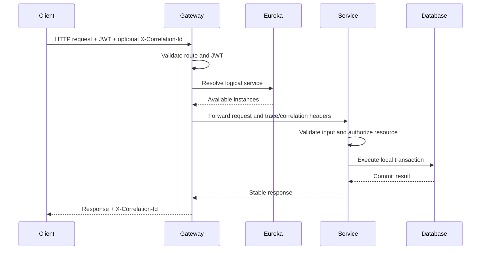
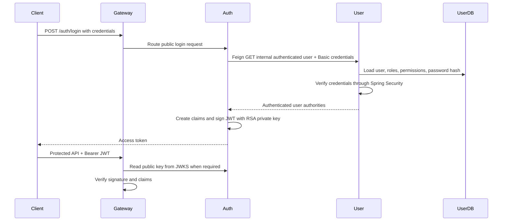
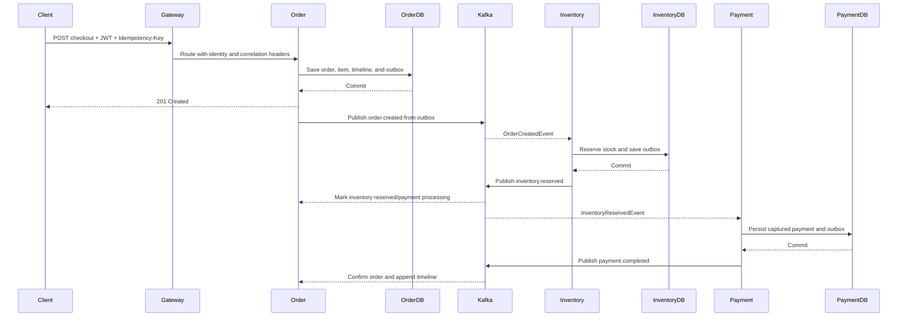
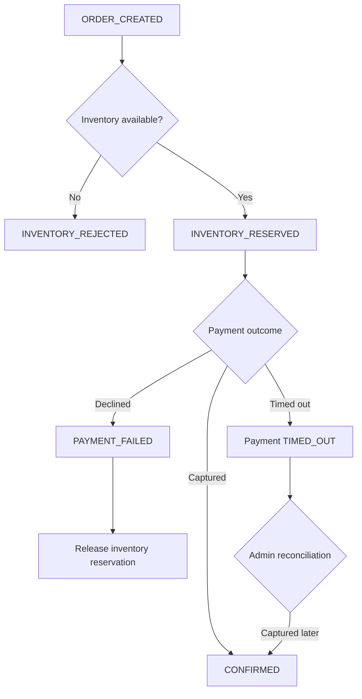
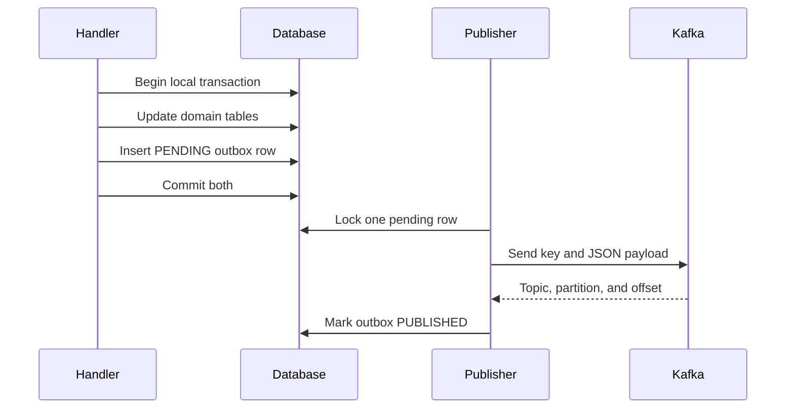
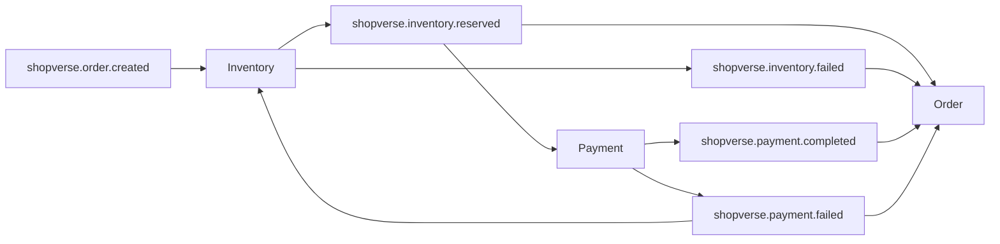

# Checkout, Security, And Event Flows

<DocLabels items={[{label: 'Advanced', tone: 'advanced'}, {label: 'Shopverse', tone: 'shopverse'}, {label: 'Production', tone: 'production'}]} />

## Synchronous Request Flow

The downstream service repeats JWT validation and resource authorization.
Gateway security is not the sole protection for a service.

## Authentication Flow

Resource services use the Auth Service JWKS endpoint to verify tokens. They do
not receive or share the RSA private signing key.

## Successful Checkout SAGA

The HTTP response confirms creation of the Order resource. It does not imply
that asynchronous inventory and payment processing has completed.

## Failure And Compensation

Compensation is a later business transaction. It is not a rollback of the
already committed Inventory transaction.

## Transactional Outbox Flow

If Kafka is unavailable, the committed outbox row remains recoverable. A crash
after Kafka accepts a record but before the row is marked published can cause
duplicate delivery, so consumers must be idempotent.

## Event Topology

| Event | Producer | Consumers | Purpose |
|---|---|---|---|
| `shopverse.order.created` | Order | Inventory | Begin stock reservation |
| `shopverse.inventory.reserved` | Inventory | Order, Payment | Advance order and begin payment |
| `shopverse.inventory.failed` | Inventory | Order | Reject checkout |
| `shopverse.payment.completed` | Payment | Order | Confirm the order |
| `shopverse.payment.failed` | Payment | Order, Inventory | Fail order and release stock |

Event contracts currently carry order ID, order number, correlation ID, and
the fields needed by the consumer. Order number is the Kafka key to preserve
per-order partition ordering. A universal immutable event ID and schema version
are production hardening items.

## Recommended Next

Return to [Shopverse System Design](./SYSTEM-DESIGN.md) to select the next focused guide.

## Official References

- [AWS Well-Architected Framework](https://docs.aws.amazon.com/wellarchitected/latest/framework/welcome.html)
- [RFC 9110: HTTP Semantics](https://www.rfc-editor.org/rfc/rfc9110)
