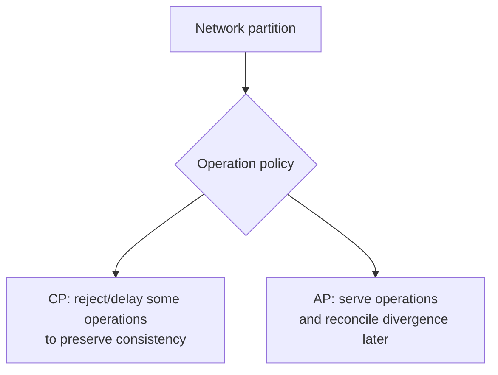

# Distributed Consistency And CAP

Consistency describes what values clients can observe when data is replicated
or updated concurrently across nodes.

## CAP Theorem

CAP states that when a network partition occurs, a distributed data system must
choose between:

- **Consistency:** every successful read observes the latest successful write,
  or the operation fails;
- **Availability:** every request to a non-failed node receives a non-error
  response, even if it may not contain the latest write;
- **Partition tolerance:** the system continues operating despite lost or
  delayed communication between nodes.

Network partitions cannot be eliminated in a distributed system, so the
practical decision during a partition is C versus A.



### CP Example

A leader cannot confirm quorum, so it rejects a bank-balance write rather than
risk two conflicting authoritative balances.

### AP Example

Two shopping-cart replicas accept updates during a partition and merge the
carts after communication recovers.

CAP is not a permanent label for every operation in a product. Different
operations can make different trade-offs.

## CAP Interview Mistake To Avoid

Do not say "this system is CA" as if partitions can be ignored. In a real
distributed system, network partitions and delayed communication are possible.
The practical design question is:

```text
When a partition happens, should this operation reject/delay work to preserve
consistency, or continue serving and reconcile later?
```

For example:

| Operation | Better partition behavior |
|---|---|
| debit bank account | reject/delay if consistency cannot be proven |
| update shopping-cart note | accept and reconcile later |
| reserve last inventory item | preserve consistency to avoid overselling |
| update product-search index | eventual consistency is acceptable |

## PACELC

PACELC extends CAP:

```text
if Partition:
    choose Availability or Consistency
Else:
    choose Latency or Consistency
```

Even without a partition, synchronous replication improves consistency but
adds latency. Asynchronous replication lowers write latency but permits stale
reads.

## Strong Consistency

After a successful write, subsequent reads behave as if there is one current
copy:

```text
write stock = 4 succeeds
all later reads observe 4 or newer
```

Linearizability is a strong model in which operations appear atomic and ordered
consistently with real time.

Costs may include:

- quorum coordination;
- leader dependency;
- higher cross-region latency;
- reduced write availability during partition.

Use strong consistency for invariants such as uniqueness, balance updates, and
exclusive allocation when stale decisions are unacceptable.

Shopverse example:

```text
Two customers try to buy the last unit.
Inventory reservation must not accept both.
```

This needs a local database invariant such as optimistic locking, pessimistic
locking, or an atomic conditional update.

## Eventual Consistency

If updates stop, replicas eventually converge:

```text
t0: replica A = 4, replica B = 5
t1: replication completes
t2: replica A = 4, replica B = 4
```

Before convergence, clients can observe stale values. Eventual consistency does
not define conflict resolution by itself.

Appropriate examples:

- search indexes;
- analytics;
- product descriptions;
- cache copies;
- cross-service read models.

Shopverse example:

```text
Order timeline may be updated after Kafka events are processed.
The checkout API can return the accepted order before every downstream timeline
entry is visible.
```

## Strong Eventual Consistency

The standard term is **strong eventual consistency**. It means:

1. replicas that have received the same updates have equivalent state;
2. all replicas eventually receive updates;
3. convergence does not require a central total order.

Conflict-free Replicated Data Types (CRDTs) can provide this property through
commutative and deterministic merge rules.

"Eventual strong consistency" is sometimes used informally, but strong
eventual consistency is the established model.

## Session Guarantees

Weaker models can still provide useful client expectations:

| Guarantee | Meaning |
|---|---|
| Read-your-writes | a client sees its own completed writes |
| Monotonic reads | a client does not move backward to older data |
| Monotonic writes | one client's writes apply in order |
| Writes-follow-reads | writes are ordered after values the client observed |

Sticky routing, version tokens, or reading from the leader can support these
guarantees.

## Causal Consistency

If event B depends on event A, every observer sees A before B:

```text
A: user creates post
B: user comments on that post
```

Unrelated operations may be observed in different orders. Causal consistency
is stronger than eventual consistency and weaker than linearizability.

## Quorums

For `N` replicas:

```text
W = replicas acknowledging a write
R = replicas consulted for a read
```

When:

```text
R + W > N
```

read and write quorums overlap. Version comparison and repair are still
required.

Example:

```text
N = 3
W = 2
R = 2
```

Quorums are not automatically linearizable. Sloppy quorum, concurrent writes,
clock/version handling, and failure recovery affect the actual guarantee.

## Conflict Resolution

Options:

- reject concurrent writes through leader/quorum;
- last-write-wins using timestamps;
- version vectors;
- application merge;
- CRDT merge;
- preserve conflicts for user/operator resolution.

Last-write-wins is simple but can silently discard valid updates and depends on
ordering/clock assumptions.

## Consistency Versus Isolation

These terms address different scopes:

- distributed consistency: observations across replicas/nodes;
- transaction isolation: interaction between concurrent transactions.

A database can provide strong replica consistency while allowing
`READ_COMMITTED` transaction anomalies. Conversely, one local serializable
transaction does not make a cross-service workflow globally atomic.

## Cross-Service Consistency

In microservices, each service owns its database. A single ACID transaction
should not normally span Order DB, Inventory DB, and Payment DB. Instead, use:

- local transactions inside each service;
- events to communicate state changes;
- SAGA for multi-step workflows;
- compensation for business rollback;
- outbox to avoid losing events;
- idempotent consumers to tolerate duplicate delivery.

This gives eventual business consistency, not one global database transaction.

## Consistency Decision Table

| Use case | Recommended consistency |
|---|---|
| username uniqueness | strong local DB constraint |
| inventory reservation | strong per product/row invariant |
| order timeline projection | eventual consistency |
| search index | eventual consistency |
| analytics dashboard | eventual consistency |
| payment ledger | strong local transaction and reconciliation |
| cache | eventual with TTL/invalidation |

## References

- [CAP Theorem in System Design - GeeksforGeeks](https://www.geeksforgeeks.org/system-design/cap-theorem-in-system-design/)
- [Consistency in System Design - GeeksforGeeks](https://www.geeksforgeeks.org/system-design/consistency-in-system-design/)

Microservices commonly use:

```text
local ACID transaction
  -> transactional outbox
  -> at-least-once event
  -> idempotent consumer
  -> compensating SAGA action
```

This provides eventual semantic consistency, not simultaneous identical state
across databases.

## Choosing A Model

Ask:

1. What harm occurs if a read is stale?
2. Must concurrent writes be rejected or merged?
3. Can the operation be unavailable during partition?
4. What latency budget exists?
5. Is the scope local, regional, or global?
6. How does the client detect versions?
7. How is divergence repaired?

## Interview Questions

<ExpandableAnswer title="Does CAP Mean A System Can Only Have Two Properties?">

No. Outside a partition, systems can be consistent and available. CAP
describes the unavoidable trade-off while communication is partitioned.

</ExpandableAnswer>
<ExpandableAnswer title="Is Eventual Consistency The Same As No Consistency?">

No. It promises convergence if updates stop, but intermediate reads may be
stale. Additional session or conflict-resolution guarantees may apply.

</ExpandableAnswer>
<ExpandableAnswer title="When Should Availability Be Sacrificed?">

When accepting conflicting operations could violate a critical invariant, such
as duplicate ownership, overspending, or assigning one exclusive resource
twice.

</ExpandableAnswer>
<ExpandableAnswer title="Can A Cache Be Strongly Consistent With A Database?">

Not by ordinary cache-aside behavior. Database and cache are separate systems.
Strong coordination adds cost; most cache designs define bounded staleness and
invalidation behavior.

</ExpandableAnswer>
## Related Guides

- [Distributed Systems Fundamentals](DISTRIBUTED-SYSTEMS-GENERIC.md)
- [Distributed Databases](../data/DISTRIBUTED-DATABASES.md)
- [SAGA And Outbox](../reliability/SAGA-GENERIC.md)
