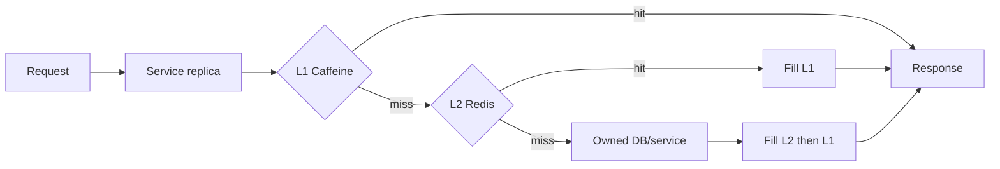

# Distributed And Hybrid Cache

A distributed cache is shared over the network by service replicas. A hybrid
cache combines per-instance L1 with shared L2.



L1 avoids network latency and shields hot keys. L2 shares warm values after
restart and across replicas. The cost is two expiration/invalidation layers and
a larger possible staleness window. Adopt hybrid caching only when measurements
show that remote-cache latency or hot-key pressure justifies it.

## Read Algorithm

```java
Product findProduct(ProductId id) {
    Product local = l1.getIfPresent(id);
    if (local != null) return local;

    Product shared = l2.get(id);
    if (shared != null) {
        l1.put(id, shared);
        return shared;
    }

    Product loaded = repository.findRequired(id);
    l2.put(id, loaded, Duration.ofMinutes(5));
    l1.put(id, loaded);
    return loaded;
}
```

Add per-key request coalescing so concurrent misses do not all load the source.
Do not hold a broad lock around an unbounded network call.

## TTL Relationship

L1 is normally shorter than L2—for example L1 seconds and L2 minutes, both with
jitter. This helps replicas converge while preserving shared reuse. Actual values
must come from business staleness limits and load tests.

## Invalidation

1. Commit the authoritative change.
2. Publish a durable domain/outbox event.
3. Cache owners consume it idempotently.
4. Evict/update L2 and each consumer's own L1.
5. TTL bounds damage from delayed/missed events.

Redis Pub/Sub is fast but not durable for disconnected consumers. A durable
broker supports replay but adds lag, ordering, and contract concerns. A coarse
version token can make old L1 keys unreachable:

```text
L2 catalog:version -> 381
L1 product:42:version:381
```

Old generations still require bounded expiry.

## Microservice Ownership

- A service owns caches derived from its data or contract.
- Consumers do not delete arbitrary keys in another service's namespace.
- Publish domain facts; each consumer invalidates its representation.
- Separate environment/service prefixes, credentials, and ACLs.
- Do not add a generic HTTP cache service merely to wrap Redis.
- Do not share internal serialized DTOs across bounded contexts accidentally.

A shared cache reduces replica disagreement but does not make the database and
cache atomic. Network partitions, failover, delayed events, and concurrent writes
still race. Read the authoritative source when stale data is unacceptable.

## Failure Policies

| Failure | Possible policy | Trade-off |
|---|---|---|
| L1 miss/failure | Bypass to L2 | Higher network load |
| L2 timeout | Bypass to source | May overload source |
| L2 outage with safe L1 | Serve bounded stale | Availability over freshness |
| L2 outage for authorization | Fail closed or authoritative read | Security over availability |
| Source outage | Serve explicitly bounded stale | Must accept/communicate staleness |
| All layers cold | Limit concurrency and warm gradually | Slower recovery protects source |

Cache timeout should consume a small part of the request deadline. Avoid retries
at client, resilience, and proxy layers for the same operation.

## Stampede Controls

- Single-flight same-key loads inside each replica.
- TTL jitter and refresh-ahead for predictable hot keys.
- Bounded stale-while-one-caller-refreshes behavior.
- Miss concurrency limits/load shedding to protect the source.
- Warm only measured hot keys, not the whole database.
- Use a distributed lease only when duplicate cross-replica loads are harmful;
  leases require ownership, expiry, and sometimes fencing.

## Multi-Region And Deployment

Avoid synchronous cache access across distant regions. Prefer region-local
caches with explicit replication/invalidation and staleness. Define failover
warmup and regional key ownership.

During rolling deployment old and new instances share L2 values. Use a compatible
schema, versioned key namespace, or time-bounded dual-read/write migration. Never
make Java object serialization an undocumented distributed contract.

## Test Matrix

- L1 hit, L2 hit, total miss, negative result, and expiration.
- Concurrent same-key misses and hot-key traffic.
- Update/invalidation at every replica, including delayed duplicate events.
- Redis timeout/outage, cold restart, and source overload protection.
- Old/new value formats during rolling deployment.
- Tenant and authorization key isolation.
- TTL avalanche, memory eviction, and recovery warmup.

## Related Guides

- [Cache Umbrella](./CACHE-UMBRELLA.md)
- [Cache Providers](./CACHE-PROVIDERS.md)
- [Transactional Outbox](../reliability/OUTBOX-PATTERN.md)
- [Distributed Locks And Fencing](../reliability/locking/DISTRIBUTED-LOCKS-AND-FENCING.md)

## Official References

- [Google Site Reliability Engineering book](https://sre.google/sre-book/table-of-contents/)
- [AWS Well-Architected Framework](https://docs.aws.amazon.com/wellarchitected/latest/framework/welcome.html)
- [RFC 9110 — HTTP Semantics](https://www.rfc-editor.org/rfc/rfc9110)
