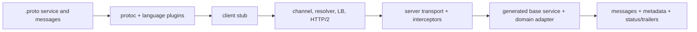

# gRPC And Protocol Buffers Architect Path

gRPC defines typed remote services, normally uses Protocol Buffers for IDL/messages and
maps RPCs to HTTP/2 streams. Generated method calls remain network operations with partial
failure, deadlines, independent client/server outcomes, compatibility and capacity limits.

## Complete Route

1. [Protocol Buffers Wire Format, Modeling, And Evolution](./grpc/PROTOBUF-CONTRACT-EVOLUTION.md)
2. [gRPC Lifecycle, Streaming, Deadlines, Errors, Retries, And Load Balancing](./grpc/GRPC-RUNTIME-RELIABILITY.md)
3. [Spring gRPC Implementation, Security, Testing, And Production Operations](./grpc/SPRING-GRPC-PRODUCTION.md)
4. [Architect Interviews, Failure Labs, Trade-Offs, And Revision](./grpc/GRPC-PROTOBUF-INTERVIEW-REVISION.md)

## Selection Summary

Use gRPC for typed internal unary/streaming communication where generated clients, controlled
ecosystem and HTTP/2 support are acceptable. Prefer REST for broadly interoperable public
resource APIs and Kafka/messaging when durable buffering, replay and temporal decoupling matter.

## Completion Standard

You can explain Protobuf tags/wire types/presence/unknown fields, evolve contracts without
reusing fields, trace a unary/streaming RPC, propagate deadline and cancellation, design status
details and idempotent retry, size streams/channels/executors, secure with TLS/OAuth/mTLS, test
mixed versions, diagnose HTTP/2/flow-control failures and operate Spring gRPC safely.

## Official References

- [gRPC core concepts](https://grpc.io/docs/what-is-grpc/core-concepts/)
- [Protocol Buffers documentation](https://protobuf.dev/)
- [Spring gRPC reference](https://docs.spring.io/spring-grpc/reference/)

## Recommended Next

Begin with [Protocol Buffers Wire Format, Modeling, And Evolution](./grpc/PROTOBUF-CONTRACT-EVOLUTION.md).

