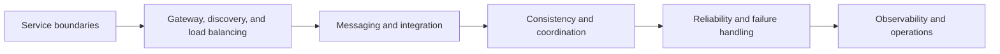

# Microservices And Distributed Systems

Microservices and distributed systems should be studied together. A
microservice architecture is a distributed system once a request crosses
process, network, database, or message-broker boundaries.

This section is organized from architecture basics to production reliability:



## How To Read This Section

| Goal | Start here |
|---|---|
| Decide how to split services | [Microservices fundamentals](MICROSERVICES-GENERIC.md) |
| Select architecture and integration patterns | [Microservices architecture patterns](MICROSERVICES-PATTERNS.md) |
| Understand distributed-system tradeoffs | [Distributed systems fundamentals](DISTRIBUTED-SYSTEMS-GENERIC.md) |
| Route traffic through one entry point | [API Gateway](../development/API-GATEWAY-GENERIC.md) |
| Discover and balance service instances | [Service discovery](SERVICE-DISCOVERY.md) and [Load balancing](LOAD-BALANCING-GENERIC.md) |
| Understand consistency choices | [CAP and consistency](DISTRIBUTED-CONSISTENCY-CAP.md) |
| Coordinate work without a distributed ACID transaction | [SAGA pattern](../reliability/SAGA-GENERIC.md) |
| Avoid losing events after a database commit | [Transactional outbox](../reliability/OUTBOX-PATTERN.md) |
| Make consumers safe under duplicate delivery | [Inbox pattern](../reliability/INBOX-PATTERN.md) |
| Prepare for interviews | [Distributed systems interview guide](../reference/DISTRIBUTED-SYSTEMS-INTERVIEW.md) |

## Boundary Rule

Use this rule while reading the pages:

```text
Service boundary first.
Then data ownership.
Then communication style.
Then failure handling.
Then observability.
```

Do not start by adding services. Start by identifying the business capability,
who owns the data, and what failure the system must tolerate.

## Shopverse Mapping

Shopverse uses this structure:

| Concept | Shopverse implementation |
|---|---|
| API Gateway | one public entry point for routing, logging, security, and correlation IDs |
| Service discovery | Eureka Discovery Server |
| Load balancing | Spring Cloud LoadBalancer and service names |
| Distributed consistency | local transactions, SAGA choreography, outbox, and compensation |
| Messaging | Kafka topics between Order, Inventory, and Payment |
| Duplicate protection | idempotency keys, business keys, unique constraints, and idempotent consumers |
| Observability | JSON logs, MDC correlation IDs, Micrometer, Prometheus, Loki, Grafana, and Zipkin |

For the concrete implementation, use the [Shopverse case study](../case-study/SHOPVERSE.mdx)
and [system design](SYSTEM-DESIGN.md).
