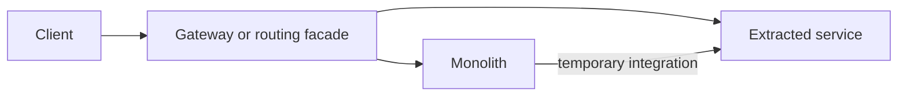

# Microservices Fundamentals

Microservices organize a system around independently owned business
capabilities. They exchange simpler contracts while keeping implementation and
data ownership private.

## When Microservices Help

- teams need independent ownership and release cadence;
- domains have clear boundaries;
- components scale differently;
- failures should be isolated;
- technology or compliance requirements differ.

They add network latency, partial failure, distributed consistency,
observability, deployment, and operational complexity. A modular monolith is
often the better starting point when boundaries or team ownership are unclear.

## Core Design Rules

1. A service owns its data.
2. Other services use APIs or events, not direct database access.
3. Contracts are versioned and backward compatible.
4. Timeouts, retries, and idempotency are designed together.
5. Cross-service workflows use eventual consistency and compensation.
6. Every important workflow is observable by logs, metrics, traces, and
   business state.

## Principles For Defining Service Boundaries

A microservice should normally represent a cohesive business capability, not a
technical layer or one database table.

Evaluate a proposed boundary using:

| Factor | Boundary question |
|---|---|
| Business capability | Does it deliver a distinct business outcome? |
| Ubiquitous language | Does it have its own stable terminology and rules? |
| Data ownership | Can it own and protect its authoritative data? |
| Transaction boundary | Which invariants must commit atomically? |
| Change cadence | Does it change independently from neighboring capabilities? |
| Scaling | Does it need materially different capacity or resource shape? |
| Availability | Can it fail or degrade independently? |
| Security/compliance | Does it have a distinct trust or regulatory boundary? |
| Team ownership | Can one team own build, deploy, and operations? |
| Coupling | Can interaction be expressed through a small stable contract? |

One factor alone is usually insufficient. A table does not deserve a service
merely because it is a separate noun.

## Single Responsibility At Service Level

Service-level SRP means one cohesive business responsibility and one primary
reason for organizational change.

Good:

```text
Inventory Service
  owns stock, reservations, release, and availability
```

Too broad:

```text
Commerce Service
  owns users, products, orders, inventory, payments, and reports
```

Too narrow:

```text
InventoryReadService
InventoryWriteService
ReservationCreateService
ReservationReleaseService
```

The narrow version creates chatty calls and distributed transactions without
independent business value.

## Principles To Break A Monolith Into Microservices

### 1. Start With A Modular Monolith

Create enforceable modules first:

```text
orders
inventory
payments
identity
```

Each module should expose an API and hide internal tables/classes. If
boundaries cannot be maintained inside one process, network separation will
not fix the design.

### 2. Use Business Capabilities And Bounded Contexts

Group rules and data that use one language:

```text
Order: checkout, lifecycle, timeline
Inventory: stock, reservation, expiry
Payment: authorization, capture, refund
```

Avoid splitting by technical layer:

```text
Controller Service
Business Logic Service
Database Service
```

That creates synchronous coupling for every request.

### 3. Keep Strong Invariants Together

Data that must change atomically usually belongs together.

```text
inventory available quantity
inventory reservations
reservation expiry
```

Splitting these into different services forces a distributed consistency
problem for one local invariant.

### 4. Identify Independent Change Pressure

Use repository history and team knowledge:

- which modules change together?
- which releases are blocked by unrelated code?
- where do incidents originate?
- which capability has different compliance or scaling needs?

Low co-change and strong internal cohesion indicate a candidate boundary.

### 5. Extract A Low-Risk Capability First

Prefer a capability with:

- clear ownership;
- few synchronous dependencies;
- a stable contract;
- manageable data migration;
- operational value from independent deployment.

Avoid extracting the most transaction-heavy core workflow first unless that
boundary is already proven.

### 6. Use The Strangler Pattern



Route one capability to the new service, migrate data and callers gradually,
then remove old behavior.

### 7. Establish Data Ownership

Do not leave a permanently shared database:

```text
Order Service -> Order DB
Inventory Service -> Inventory DB
```

During migration, use controlled techniques such as change data capture,
backfill, dual-read comparison, or temporary adapters. Avoid uncontrolled
dual writes.

### 8. Replace In-Process Calls Deliberately

Choose communication by need:

- synchronous query when the response is required now;
- event for a durable fact and independent consumers;
- replicated read model for high-volume cross-domain reads;
- SAGA/outbox for multi-service workflows.

Do not convert every Java method call into an HTTP call.

### 9. Build Operational Capability Before Multiplying Services

Minimum platform needs:

- automated build and deployment;
- service discovery/routing;
- centralized configuration and secrets;
- logs, metrics, and traces;
- health/readiness;
- alerting and ownership;
- contract testing;
- rollback and incident procedures.

### 10. Measure The Result

Extraction should improve a measurable outcome:

- deployment lead time;
- failure isolation;
- team autonomy;
- scalability;
- security isolation;
- maintainability.

If it only increases repositories and network calls, the boundary may be wrong.

## Boundary Warning Signs

### Distributed Monolith

- services must deploy together;
- one request makes many synchronous hops;
- schemas or entities are shared;
- changes require coordinated releases;
- one service directly queries another service's database.

### Nano-Services

- service contains one table or a few CRUD methods;
- network cost exceeds business value;
- independent scaling/deployment is unnecessary;
- every workflow needs several services to succeed.

### Wrong Data Ownership

- multiple services write the same table;
- one service validates another service's private state by SQL;
- cross-service joins are required for normal commands.

## Decomposition Decision Example

Should payment be extracted from an order monolith?

| Question | Observation |
|---|---|
| Distinct capability? | authorization, capture, refund, reconciliation |
| Separate data? | payment attempts and provider references |
| Different security? | stronger secret and audit controls |
| Independent failure? | provider outage should not corrupt orders |
| Separate scaling? | provider latency and retry workload differ |
| Stable contract? | authorize/capture/refund and outcome events |

This is a stronger candidate than extracting `OrderItemService`, whose data
and invariants belong to the Order aggregate.

## Shopverse Boundaries

| Service | Owned capability | Owned data |
|---|---|---|
| Auth | token issuance and JWKS | signing configuration |
| User | identities, roles, permissions | users and authorities |
| Order | checkout and order timeline | orders, items, timeline, Outbox |
| Inventory | stock and reservations | inventory items, reservations, Outbox |
| Payment | payment lifecycle | payment attempts, outcomes, Outbox |
| Gateway | external routing and edge policies | no domain database |
| Config Server | centralized runtime configuration | configuration repository |
| Discovery Server | runtime service registry | ephemeral registration state |

## Communication Choice

| Need | Preferred style |
|---|---|
| Immediate query required to answer request | HTTP/Feign |
| Durable business fact and multiple consumers | Kafka event |
| Cross-service atomic state change | SAGA plus Outbox |
| Administrative reporting across domains | API composition or dedicated read model |

## Common Production Problems

| Problem | Design response |
|---|---|
| Network timeout | explicit timeout, bounded retry, circuit breaker |
| Duplicate request | idempotency key and uniqueness constraint |
| Duplicate event | event ID/inbox deduplication |
| Lost database-plus-message update | transactional Outbox |
| Partial workflow failure | compensation and queryable SAGA state |
| Cascading overload | rate limiting, bulkheads, load shedding |
| Unknown request journey | correlation IDs and distributed tracing |
| Configuration drift | centralized configuration and deployment validation |

## Data Consistency

Local database transactions remain ACID. Cross-service state is eventually
consistent:

```text
Order DB transaction
    -> durable Outbox row
    -> Kafka event
    -> Inventory DB transaction
    -> Kafka event
    -> Payment DB transaction
```

No single rollback can undo already committed work in every service.
Compensating actions release inventory, cancel an order, or refund payment.

## Evolution

- Add fields compatibly before requiring them.
- Consumers should tolerate unknown fields.
- Do not reuse an event name for a different meaning.
- Use contract tests for HTTP and message schemas.
- Prefer expand-and-contract database migrations.

## Operational Readiness

A production service needs more than an endpoint:

- health and readiness checks;
- resource requests and limits;
- graceful shutdown;
- structured logs;
- RED metrics: rate, errors, duration;
- traces across remote calls;
- alert ownership and runbooks;
- deployment and rollback strategy;
- tested backup and recovery procedures.

## Related Guides

- [HLD And LLD](HLD-LLD.md)
- [Engineering Principles](../development/ENGINEERING-PRINCIPLES.md)
- [Java Design Patterns](../development/DESIGN-PATTERNS.md)
- [SAGA And Outbox](../reliability/SAGA-GENERIC.md)
