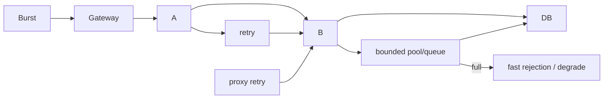

# Microservices Internals And Failure Engineering

Microservices trade in-process coupling for network, data ownership and operational
coupling. Begin with a modular monolith unless independent ownership, deployment,
scaling or failure isolation provides enough value to pay that cost.

## Boundary Worksheet

| Question | Evidence |
|---|---|
| business capability/invariants | transactions that must remain local |
| data ownership | one authoritative writer and explicit projections |
| team/release ownership | independently operable component and on-call |
| scaling/failure isolation | measured workload or blast-radius difference |
| coupling | synchronous call graph, shared schema/library and coordinated releases |
| migration | strangler seam, compatibility and rollback |

Shared databases and common “domain” libraries recreate coupling invisibly. Share
stable infrastructure contracts sparingly; keep business models owned by services.

## Communication

REST is broadly interoperable; gRPC provides typed unary/streaming RPC; brokers
decouple time and support replay/competing consumers depending on semantics. Every
synchronous call needs a total deadline propagated downstream, bounded connection/
concurrency pools and one retry owner. Cancellation should stop avoidable work.

Events need stable identity, schema compatibility, partition/order scope,
idempotent consumers, retry/DLT and replay. Request/reply messaging still creates
temporal coupling while making timeout/correlation harder.

## Consistency

Keep invariants in the owning service/database. Use outbox to publish committed
business events, inbox/unique constraints for deduplication and SAGA compensation
for multi-service workflows. CQRS/read projections are explicitly stale. Reconcile
authoritative records against derived state; do not use a distributed lock to hide
unclear ownership.

## Overload And Cascades

Timeout budgets, admission, bulkheads, load shedding, rate limits and bounded queues
must align. Retrying at client, gateway, mesh and service multiplies load. Scaling
stateless callers while a database is saturated accelerates collapse.

## Security And Observability

Authenticate workload and initiating user where needed; authorize at every owning
service. Use mTLS/workload identity, audience-bound tokens, least privilege, secret
rotation and network policy. Prevent confused-deputy and cross-tenant operations.

Trace HTTP and asynchronous causality, but use metrics for aggregate SLOs and logs
for bounded detail. Control metric cardinality and PII. Define dependency SLIs,
queue age/lag, pool wait, retry, rejection, saturation and reconciliation metrics.

## Failure Lab

Inject slow dependency, DNS/connect failure, Kafka outage, duplicate event, poison
message, database pool exhaustion, retry storm, process termination during outbox,
stale scheduler lease and one-zone loss. Assert bounded resources, invariant safety,
degraded response, alert and recovery/replay—not merely that exceptions occur.

## Official References

- [Google SRE Book — Handling Overload](https://sre.google/sre-book/handling-overload/)
- [Apache Kafka design](https://kafka.apache.org/documentation/#design)
- [Kubernetes Services](https://kubernetes.io/docs/concepts/services-networking/service/)
- [OpenTelemetry traces](https://opentelemetry.io/docs/concepts/signals/traces/)

## Recommended Next Page

Continue with [Distributed Systems Fundamentals](./DISTRIBUTED-SYSTEMS-GENERIC.md).
