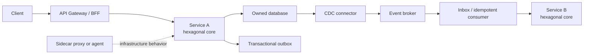

# Microservices Architecture Patterns

Patterns are reusable responses to recurring forces, not features that every
system must contain. Start with a concrete problem and its failure modes, then
adopt the smallest pattern that solves it. A modular monolith remains preferable
when independent deployment and distributed ownership do not justify the cost.

## Quick Pattern Selection Cheat Sheet

Start in the first column: identify the concrete problem, select the smallest
matching pattern, and confirm that the trade-off is acceptable. Patterns can be
combined, but each one should solve an observed or clearly anticipated problem.

| When you need to... | Pattern | Problem it solves | Main trade-off |
|---|---|---|---|
| Define service boundaries | Business capability + bounded context | Prevents tangled ownership and one shared domain model | Requires domain discovery and boundary refinement |
| Protect domain logic from frameworks | Hexagonal / ports and adapters | Keeps business rules testable and independent of HTTP, Kafka, or persistence | Adds interfaces and mapping at meaningful boundaries |
| Migrate a monolith gradually | Strangler fig | Replaces one capability at a time without a high-risk rewrite | Temporary routing, reconciliation, and duplicate paths |
| Isolate a legacy or external domain model | Anti-corruption layer | Stops foreign concepts from leaking into the internal domain | Translation code must be maintained |
| Give clients one stable entry point | API gateway | Centralizes edge routing, authentication, limits, and observability | Can become a bottleneck or contain too much business logic |
| Tailor APIs for web, mobile, or partners | Backend for frontend (BFF) | Avoids forcing very different clients through one response model | More deployable components and possible duplicated composition |
| Locate changing service instances | Service discovery + load balancing | Routes calls to healthy, dynamically changing instances | Adds infrastructure and failure modes |
| Get an immediate result | Synchronous request-response | Provides simple, direct queries and validations | Runtime coupling; call chains reduce availability and increase latency |
| Decouple producers from consumers | Publish-subscribe | Allows independent consumers and asynchronous processing | Eventual consistency, duplicates, ordering, and harder tracing |
| Smooth traffic spikes | Queue-based load leveling | Buffers work so consumers process at a safe rate | Adds latency and backlog operations |
| Scale background processing | Competing consumers | Distributes queued work across workers | Ordering and idempotency require deliberate design |
| Update state across multiple services | SAGA | Coordinates local transactions without a global database transaction | Compensation, reconciliation, and intermediate states are complex |
| Make a complex workflow explicit | SAGA orchestration | Centralizes workflow sequence, state, timeout, and compensation decisions | Coordinator becomes important infrastructure |
| Keep a small event flow decentralized | SAGA choreography | Lets services react without a central workflow coordinator | End-to-end flow becomes difficult to understand as participants grow |
| Guarantee atomicity across compatible resources | Two-phase commit (2PC) | Provides one all-or-nothing outcome in a tightly controlled boundary | Locks, latency, coordinator recovery, and poor autonomy |
| Publish an event with a database update | Transactional outbox | Removes the failure gap between committing data and publishing an event | Requires a relay or CDC plus cleanup and monitoring |
| Safely process redelivered messages | Idempotent consumer / inbox | Prevents duplicate business side effects | Requires message keys and deduplication state |
| Keep each service autonomous over its data | Database per service | Prevents hidden coupling through shared table writes | Cross-service queries and transactions become harder |
| Join a small amount of cross-service data | API composition | Builds a result while preserving data ownership | Inherits downstream latency and partial failures |
| Serve frequent, fast cross-service reads | Materialized view | Precomputes a query-specific projection | Read data is eventually consistent and must be rebuildable |
| Separate substantially different reads and writes | CQRS | Lets command and query models evolve and scale independently | More models, synchronization, and consistency decisions |
| Preserve domain history as the source of truth | Event sourcing | Enables audit, temporal reconstruction, and replay | Event evolution, projection rebuilds, and operations are difficult |
| Turn committed database changes into events | Change data capture (CDC) | Supports outbox relay, replication, search, cache, and analytics updates | Log retention, schema coupling, lag, and connector operations |
| Bound waiting on a dependency | Timeout / deadline | Prevents slow calls from exhausting caller resources | Incorrect budgets create premature failures |
| Recover from a brief transient failure | Retry with backoff and jitter | Repeats safe operations after temporary faults | Can amplify overload or duplicate non-idempotent work |
| Stop calling a persistently unhealthy dependency | Circuit breaker | Fails fast and prevents cascading resource exhaustion | Thresholds and recovery probes require tuning |
| Isolate failures between workloads | Bulkhead | Stops one dependency or workload consuming every resource | Reserved pools can reduce utilization |
| Protect finite capacity | Rate limiting + load shedding | Rejects excess work before the system collapses | Clients need clear retry and prioritization behavior |
| Add infrastructure behavior beside each instance | Sidecar / ambassador | Standardizes proxying, telemetry, secrets, or protocol behavior | Extra resource usage and another component that can fail |
| Standardize service-to-service networking | Service mesh | Centralizes mTLS, traffic policy, and network telemetry | High platform and operational complexity |
| Release with rapid environment rollback | Blue-green deployment | Switches traffic between old and new environments | Extra capacity and database compatibility planning |
| Limit exposure to a new release | Canary deployment | Validates a version on a small traffic cohort | Needs traffic control, useful metrics, and automated promotion rules |
| Evolve contracts without breaking consumers | Expand and contract | Supports backward-compatible API, event, and schema migration | Old and new representations coexist temporarily |
| Trace one request across services | Correlation IDs + distributed tracing | Reveals latency, causation, and failure paths | Context propagation and telemetry storage must be consistent |

### Fast Decision Rules

- Prefer a **modular monolith** until independent deployment, scaling, security,
  or team ownership provides concrete value.
- Prefer **synchronous calls** when the caller needs an immediate answer; prefer
  **messages or events** when work can finish later or traffic needs buffering.
- Prefer **API composition** for small, occasional joins; prefer a **materialized
  view** for frequent or latency-sensitive cross-service reads.
- Prefer **SAGA orchestration** for complex or regulated workflows; use
  **choreography** for small flows with few participants.
- Use **CQRS** only when read and write needs differ substantially. Add **event
  sourcing** only when immutable domain history must be the source of truth.
- Combine **timeout, bounded retry, circuit breaker, and bulkhead** as one
  resilience policy; do not stack retries independently at every layer.



## Hexagonal Architecture: Ports And Adapters

Hexagonal architecture keeps business behavior independent of delivery and
infrastructure technology. The domain/application core defines **ports**—the
interfaces it needs or exposes. **Adapters** connect those ports to HTTP,
messaging, databases, external APIs, clocks, or other technology.

```text
Inbound adapter                 Application/domain                 Outbound adapter
REST controller  --->  input port/use case  --->  output port  --->  JPA repository
Kafka consumer   --->  PlaceOrder              PaymentPort      --->  payment HTTP client
```

### Direction Rule

Dependencies point inward. A controller may depend on an application use case,
but the use case must not depend on Spring MVC. The domain must not know whether
an event came from Kafka or HTTP, or whether persistence uses JPA or an in-memory
test adapter.

### Practical Layers

- **Domain:** entities, value objects, domain services, invariants, domain events.
- **Application:** use cases, transaction boundary, orchestration, input and output ports.
- **Inbound adapters:** REST controllers, message consumers, schedulers, CLI handlers.
- **Outbound adapters:** repositories, event publishers, HTTP clients, clock and ID providers.

Use hexagonal architecture when domain rules deserve independent tests or
infrastructure is likely to change. Avoid creating an interface for every class;
ports should represent meaningful boundaries. Keep framework annotations at the
edges where practical, but do not trade readability for artificial purity.

## Change Data Capture (CDC)

CDC observes committed database changes, usually from the transaction log, and
turns them into a stream. Typical uses include propagating transactional outbox
records, updating search indexes and caches, feeding analytics, and incremental
data replication.

### Outbox Plus CDC

1. The service writes business state and an outbox row in one local transaction.
2. A CDC connector reads the committed log entry.
3. The connector publishes the outbox event to a broker.
4. Consumers process it idempotently.
5. Retention and cleanup remove old outbox records safely.

This solves the dual-write gap between a database commit and event publication.
It does not provide exactly-once business effects. Duplicate publication,
restarts, reordering across partitions, schema evolution, and poison events
still require design.

### CDC Design Decisions

| Decision | Questions |
|---|---|
| Capture style | Publish purpose-built outbox events or expose raw table changes? |
| Contract | Is the payload a stable business event rather than a database schema leak? |
| Ordering | Which aggregate key selects the partition and ordering boundary? |
| Delivery | How are duplicates detected and failed events replayed? |
| Operations | How are connector lag, log retention, schema history, and publication failures monitored? |
| Security | Can the connector read only required logs/tables and are sensitive columns excluded? |
| Bootstrap | How is an initial snapshot reconciled with changes occurring during the snapshot? |

Prefer an outbox when publishing domain events. Direct table CDC is appropriate
for controlled replication or analytics, but tightly couples consumers to the
producer's physical schema and can expose writes that are not meaningful domain
events.

## Two-Phase Commit (2PC)

2PC coordinates one atomic outcome across transactional participants.

1. **Prepare:** the coordinator asks participants to perform work, retain locks
   or prepared state, and promise they can commit.
2. **Commit/rollback:** if all vote yes, the coordinator records commit and tells
   each participant to commit; otherwise it orders rollback.

### Strengths And Costs

| Strength | Cost or risk |
|---|---|
| Atomic all-or-nothing outcome | Coordinator and protocol availability affect progress |
| Familiar transaction semantics | Prepared participants may hold locks and resources |
| Useful with compatible resource managers | Adds latency and operational recovery complexity |
| Avoids application compensation | Poor fit across autonomous services and heterogeneous SaaS APIs |

2PC can be reasonable inside a tightly controlled boundary with compatible
resources, short transactions, strict atomicity, and a proven recovery process.
Across independently deployed microservices, prefer local transactions plus a
SAGA when temporary inconsistency and compensating actions are acceptable.

### 2PC Versus SAGA

| Question | 2PC | SAGA |
|---|---|---|
| Consistency | Atomic commit | Eventual consistency |
| Failure response | Protocol recovery and retained prepared state | Retry, compensate, or manually reconcile |
| Participant requirement | Shared transaction protocol | Business operations and compensations |
| Isolation | Transaction-manager semantics | Other workflows may observe intermediate states |
| Best boundary | Controlled compatible resources | Autonomous services and long-running workflows |

See [Distributed Transactions And Locks](../reliability/DISTRIBUTED-TRANSACTIONS-LOCKS.md)
and the [SAGA Pattern](../reliability/SAGA-GENERIC.md) for deeper treatment.

## Sidecar, Ambassador, And Adapter Patterns

### Sidecar

A sidecar is a helper process or container deployed beside each application
instance and sharing part of its lifecycle or environment. Common examples are
service-mesh proxies, log/telemetry agents, secret refreshers, and configuration
reloaders.

Use a sidecar for cross-language infrastructure behavior that must be near each
workload. Account for its CPU/memory, startup and shutdown order, health,
security boundary, version compatibility, and the fact that a failing sidecar
can make the application unavailable.

Do not put domain logic in a sidecar. A library is often simpler for behavior
that is language-specific, needs in-process context, or does not justify an
additional network/process hop.

### Ambassador

An ambassador is an outbound proxy that handles remote connectivity for the
application, such as TLS, service discovery, retries, or protocol translation.
Service-mesh data-plane proxies commonly perform this role. Ensure retries do
not multiply between application, proxy, gateway, and client layers.

### Adapter

An adapter normalizes an incompatible component's interface, protocol, or data
format. It is useful while integrating legacy systems or third-party products.
The adapter translates mechanics; an anti-corruption layer also translates the
external domain model into the internal domain language.

## Service Boundary And Evolution Patterns

### Bounded Context And Database Per Service

Define services around cohesive business capabilities and give each ownership
of its data. Other services integrate through APIs or events, not shared table
writes. Database-per-service means ownership isolation; it does not require a
separate database server for every small service.

### Strangler Fig

Route selected capabilities from a legacy system to new components gradually.
Use measurable routing, reconciliation, rollback, and a plan to remove the old
path. Without deletion milestones, the temporary bridge becomes permanent
complexity.

### Anti-Corruption Layer

Translate an external or legacy model into the consuming bounded context's
language. This prevents foreign concepts and unstable contracts from spreading
through the domain. It is especially useful during migration and third-party
integration.

### API Composition

A gateway or composition service calls multiple owners and combines responses.
It is simple for small read models but inherits the latency and availability of
its dependencies. Apply deadlines, bounded concurrency, partial-response rules,
and caching intentionally. For complex or high-volume reads, consider a
materialized view maintained by events.

## Communication Patterns

### API Gateway And Backend For Frontend (BFF)

An API gateway provides a stable edge for routing, authentication enforcement,
rate limiting, and observability. A BFF supplies a client-specific API for web,
mobile, or partner needs. Keep core business rules in domain services and avoid
turning the gateway into a distributed monolith.

### Request-Response

Synchronous calls are appropriate when the caller needs an immediate answer.
Set a deadline, propagate cancellation where possible, limit retries to safe
operations, and design degraded behavior. A call chain consumes the availability
and latency budgets of every dependency.

### Publish-Subscribe

Producers publish facts without knowing every consumer. This reduces direct
coupling but introduces eventual consistency, contract evolution, duplicate
delivery, ordering boundaries, replay, and observability requirements.

### Competing Consumers

Multiple workers share a queue or partitioned stream to scale processing. The
work key determines ordering and parallelism. Consumers must be idempotent, and
autoscaling should consider backlog age and processing time rather than CPU alone.

## Data And Consistency Patterns

### Transactional Outbox And Idempotent Consumer

Write business state and the event-to-publish in one local transaction. A
publisher relays the outbox using polling or CDC. On the consumer, record a
message/operation identifier or enforce a business uniqueness constraint in the
same transaction as the side effect. See [Outbox](../reliability/OUTBOX-PATTERN.md)
and [Inbox](../reliability/INBOX-PATTERN.md).

### CQRS

CQRS uses distinct write and read models when their rules, scale, or data shapes
differ significantly. It does not require event sourcing. Read models are often
eventually consistent, so the UI and API must define read-your-writes behavior.

### Event Sourcing

Event sourcing stores immutable domain events as the source of truth and derives
current state by replay or snapshots. It enables audit and temporal reconstruction
but makes event compatibility, projection rebuilds, privacy deletion, concurrency,
and operational tooling central concerns. Do not adopt it merely to publish events.

### SAGA: Choreography Or Orchestration

A SAGA is a sequence of local transactions with compensations. Choreography
lets services react to events and works well for small flows; orchestration uses
an explicit coordinator and makes complex workflow state easier to inspect.
Compensation is a business action, not a database rollback, and can itself fail.

## Resilience Patterns

Apply these as one policy, not isolated annotations:

| Pattern | Purpose | Main trap |
|---|---|---|
| Timeout/deadline | Bound resource use and caller waiting | Timeout longer than the caller's remaining budget |
| Retry with jitter | Recover from brief transient failure | Retrying non-idempotent work or multiplying retries across layers |
| Circuit breaker | Stop calls while a dependency is persistently unhealthy | Treating it as a latency optimizer or using one breaker for unrelated calls |
| Bulkhead | Isolate pools/concurrency so one dependency cannot consume everything | Too many tiny pools or an unbounded queue before the bulkhead |
| Rate limiter | Protect capacity and enforce fair usage | Limiting only at the edge while internal fan-out overloads dependencies |
| Load shedding | Reject low-priority/excess work before collapse | Returning ambiguous errors that clients retry aggressively |
| Fallback | Provide safe degraded behavior | Serving incorrect or dangerously stale data |

Also use health checks, graceful shutdown, backpressure, dead-letter quarantine,
and reconciliation jobs. A dead-letter queue without ownership and replay tooling
is only delayed data loss.

## Deployment And Observability Patterns

- **Rolling deployment:** replace instances gradually; requires backward-compatible contracts.
- **Blue-green:** maintain old and new environments and switch traffic; data migration still needs a compatibility plan.
- **Canary:** expose a small cohort to the new version and promote using defined health and business metrics.
- **Feature flag:** separate deployment from feature activation; assign ownership and expiration to every flag.
- **Externalized configuration:** keep environment configuration outside the artifact, validated and versioned.
- **Correlation ID and tracing:** connect calls and events across services while preserving causation IDs for asynchronous work.
- **Log aggregation and metrics:** centralize structured signals, but keep business workflow state queryable rather than reconstructing truth only from logs.

## Pattern Selection Checklist

1. What concrete failure, coupling, or scaling problem exists?
2. Can a simpler module, local transaction, or direct call solve it?
3. Who owns the new infrastructure and its on-call response?
4. What delivery, ordering, consistency, and duplicate guarantees are required?
5. How does the pattern behave during timeout, restart, partition, and replay?
6. Which metrics and business states prove it is working?
7. How are contracts evolved and old components removed?
8. What security boundary and sensitive data does it introduce?
9. Can the team test recovery, not only the happy path?

## Common Anti-Patterns

- **Distributed monolith:** services deploy separately but must change or be available together.
- **Shared database writes:** multiple services bypass ownership and create hidden coupling.
- **Chatty services:** a user request makes many fine-grained synchronous calls.
- **Entity service per table:** technical nouns replace cohesive business boundaries.
- **Retry storm:** several layers retry the same overloaded dependency.
- **Event soup:** events have unclear ownership, semantics, versions, or discoverability.
- **Exactly-once assumption:** infrastructure claims are mistaken for exactly-once business effects.
- **Sidecar everywhere:** extra proxies and agents are added without an owned operational benefit.
- **Premature event sourcing/CQRS:** complexity is adopted without a read/write or history requirement.
- **Observability as logging only:** no service-level indicators, workflow state, correlation, or actionable alarms.

## Related Guides

- [Microservices Fundamentals](./MICROSERVICES-GENERIC.md)
- [Distributed Systems Fundamentals](./DISTRIBUTED-SYSTEMS-GENERIC.md)
- [API Gateway](../development/API-GATEWAY-GENERIC.md)
- [CQRS](./CQRS.md)
- [SAGA Pattern](../reliability/SAGA-GENERIC.md)
- [Transactional Outbox](../reliability/OUTBOX-PATTERN.md)
- [Resilience4j And Resilience Patterns](../reliability/RESILIENCE4J-GENERIC.md)
- [Deployment Strategies](../operations/DEPLOYMENT-STRATEGIES.md)
