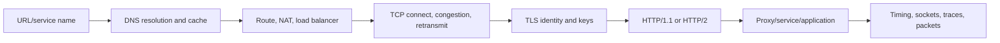

# DNS, TCP, TLS, And HTTP/2 Diagnosis Path

“The network is slow” is not a diagnosis. A request can wait in name resolution,
connection acquisition, TCP handshake/retransmission, TLS negotiation, proxy queues,
HTTP stream limits, application queues or downstream processing.

## Complete Route

1. [DNS Resolution, Caching, Discovery, And Failures](./networking/DNS-RESOLUTION-DIAGNOSIS.md)
2. [TCP Connections, Reliability, Congestion, NAT, And Sockets](./networking/TCP-CONNECTION-DIAGNOSIS.md)
3. [TLS Handshakes, Certificates, HTTP/1.1, And HTTP/2](./networking/TLS-HTTP2-DIAGNOSIS.md)
4. [End-To-End Incidents, Packet Analysis, Labs, Interviews, And Revision](./networking/NETWORK-INCIDENT-LABS-REVISION.md)

## Timing Vocabulary

Track separately: DNS, connection-pool acquisition, TCP connect, TLS handshake, request
write/upload, time to first byte, response download, application/dependency spans and total
deadline. A single “request latency” hides the failing layer.

## Completion Standard

You can explain recursive DNS and TTL, TCP state/retransmission/congestion and ephemeral ports,
TLS chain/SNI/ALPN/mTLS/rotation, HTTP connection reuse and HTTP/2 streams/flow control, then use
system/application/packet evidence to diagnose failures without disabling certificate checks or
randomly tuning the kernel.

## Official References

- [IETF DNS terminology — RFC 8499](https://www.rfc-editor.org/rfc/rfc8499)
- [TCP specification — RFC 9293](https://www.rfc-editor.org/rfc/rfc9293)
- [TLS 1.3 — RFC 8446](https://www.rfc-editor.org/rfc/rfc8446)
- [HTTP/2 — RFC 9113](https://www.rfc-editor.org/rfc/rfc9113)

## Recommended Next

Begin with [DNS Resolution, Caching, Discovery, And Failures](./networking/DNS-RESOLUTION-DIAGNOSIS.md).

