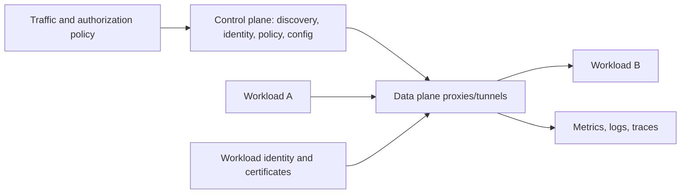

# Service Mesh Architect Path

A service mesh moves selected service-to-service networking concerns into a platform data
plane controlled by declarative policy. It can standardize identity, mTLS, telemetry and
traffic behavior, but adds privileged infrastructure, hops, resource cost, configuration
failure modes and another debugging layer.

## Complete Route

1. [Selection, Architecture, Sidecar, Ambient, And Linkerd Models](./service-mesh/SERVICE-MESH-ARCHITECTURE-SELECTION.md)
2. [Identity, mTLS, Authorization, Routing, Resilience, And Observability](./service-mesh/SERVICE-MESH-TRAFFIC-SECURITY.md)
3. [Installation, Capacity, Multicluster, Upgrades, And Incident Operations](./service-mesh/SERVICE-MESH-PRODUCTION-OPERATIONS.md)
4. [Labs, Architect Interviews, Trade-Offs, And Revision](./service-mesh/SERVICE-MESH-INTERVIEW-REVISION.md)

## When A Mesh Is Justified

Strong drivers include many services/teams needing consistent workload identity and mTLS,
auditable service authorization, common L7/L4 telemetry, safe traffic shifting and a platform
team capable of operating the mesh. A few services can often use application libraries,
gateway, NetworkPolicy and direct TLS with lower complexity.

## Completion Standard

You can trace captured traffic and configuration distribution, compare sidecar and node/waypoint
models, design trust domains and authorization, prevent retry duplication, capacity-plan proxies,
roll out policy fail-closed without outage, diagnose config/cert/routing failures, operate multi-
cluster trust and failover, and define an exit/rollback strategy.

## Official References

- [Istio architecture](https://istio.io/latest/docs/ops/deployment/architecture/)
- [Istio ambient mode](https://istio.io/latest/docs/ambient/overview/)
- [Linkerd features](https://linkerd.io/2/features/)
- [Kubernetes Gateway API](https://gateway-api.sigs.k8s.io/)

## Recommended Next

Begin with [Selection, Architecture, Sidecar, Ambient, And Linkerd Models](./service-mesh/SERVICE-MESH-ARCHITECTURE-SELECTION.md).

