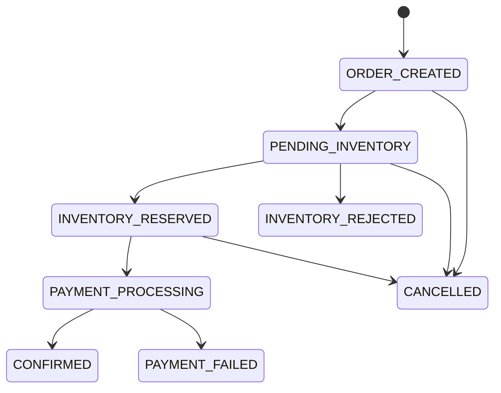
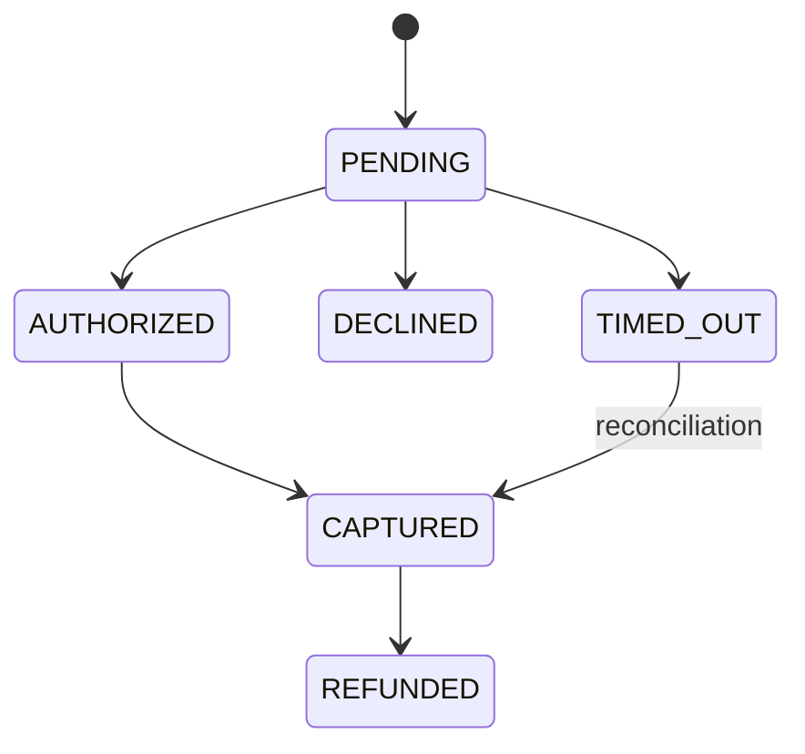
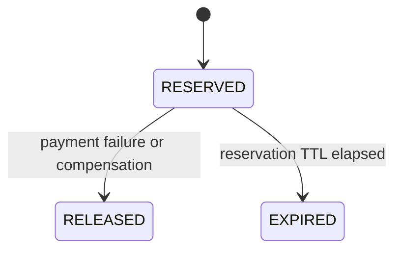
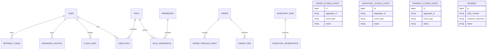
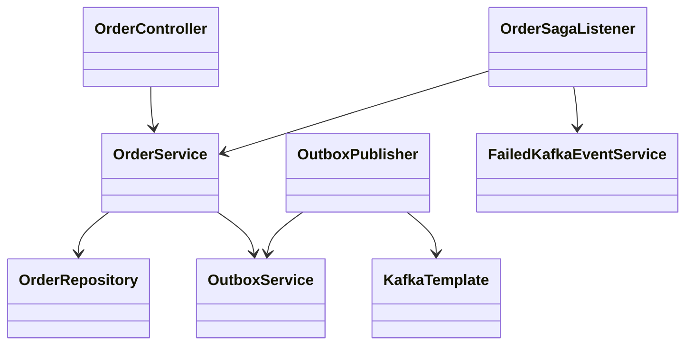
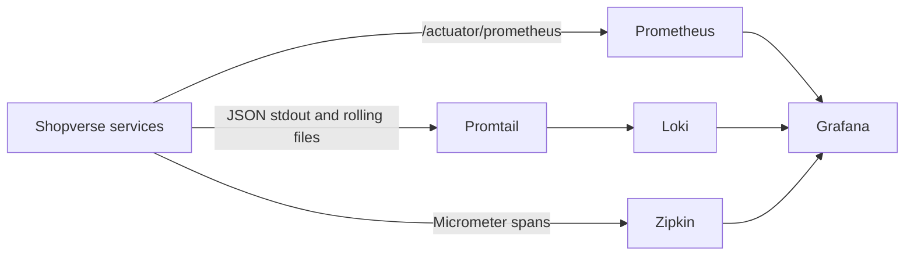
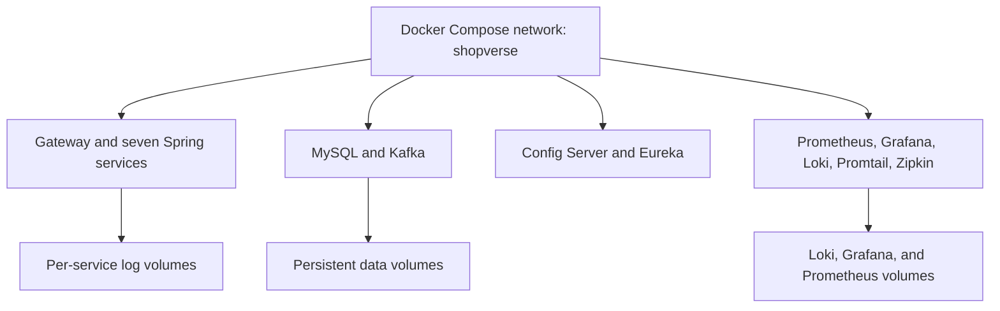

# State, Data, Deployment, And Failure Boundaries

<DocLabels items={[{label: 'Advanced', tone: 'advanced'}, {label: 'Shopverse', tone: 'shopverse'}, {label: 'Production', tone: 'production'}]} />

## State Machines

### Order



Order timeline stages are:

```text
ORDER_CREATED
INVENTORY_RESERVED
INVENTORY_REJECTED
PAYMENT_PROCESSING
PAYMENT_COMPLETED
PAYMENT_FAILED
ORDER_CONFIRMED
ORDER_CANCELLED
```

### Payment



The stub provider supports `SUCCESS`, `DECLINE`, and `TIMEOUT`.

### Inventory Reservation



## Logical Data Ownership



This is a logical overview. Relationships do not cross schema boundaries.
Outbox and failed-event tables belong to Order, Inventory, and Payment
independently.

## Core Class Collaboration



Controllers handle transport concerns. Services own authorization-aware
business operations and transactions. Repositories own persistence. Kafka
listeners restore correlation context and delegate transactional work.

## Observability Architecture



Correlation IDs connect the business journey across several traces. Trace IDs
connect spans inside one distributed technical execution.

## Deployment Topology



Docker Compose is the current local deployment model. The production
deployment list below is a hardening target, not implemented runtime behavior:
secret management, TLS, broker authentication, backups, multi-node
Kafka/Loki/Prometheus strategy, alert delivery, and orchestrator
health/resource controls.

## Consistency And Failure Boundaries

| Concern | Current control |
|---|---|
| Duplicate checkout | idempotency key lookup and database uniqueness |
| Concurrent stock purchase | JPA `@Version` optimistic locking |
| Domain change plus outgoing event | transactional outbox |
| Duplicate Kafka delivery | state checks and business/database uniqueness |
| Publisher contention | pessimistic lock on one outbox row |
| Transient listener failure | bounded `@RetryableTopic` attempts |
| Poison event | DLT plus persisted replay record |
| Long business workflow | SAGA state and compensation |
| Cross-service diagnosis | correlation ID, trace ID, timeline, logs, metrics |

Current DLT deduplication uses an application existence check and is not
strictly race-safe. A database-unique event ID/inbox remains planned.

## Current Runtime Boundaries

- Checkout currently accepts one item.
- Cache providers are local in-memory caches, not distributed Redis.
- Payment integration is a configurable stub.
- Kafka processing is at least once; exactly-once business processing is not
  claimed.
- Outbox status is `PENDING` or `PUBLISHED`; bounded terminal failure/backoff
  policy remains a hardening item.
- Full OAuth2 Authorization Server behavior is planned; current authentication
  issues custom RSA-signed JWTs.
- The observability stack is single-node and intended for the POC.

## Related Guides

- [Features and demonstrations](../reference/FEATURES-AND-DEMOS.md)
- [Distributed systems](DISTRIBUTED-SYSTEMS.md)
- [Apache Kafka](../integration/APACHE-KAFKA.md)
- [Spring Kafka](../spring/SPRING-KAFKA.md)
- [SAGA and outbox](../reliability/SAGA-OUTBOX.md)
- [Security](../security/JWT-OAUTH2-SPRING-SECURITY.md)
- [Observability](../observability/OBSERVABILITY.md)

## Official References

- [Google Site Reliability Engineering book](https://sre.google/sre-book/table-of-contents/)
- [AWS Well-Architected Framework](https://docs.aws.amazon.com/wellarchitected/latest/framework/welcome.html)
- [RFC 9110 — HTTP Semantics](https://www.rfc-editor.org/rfc/rfc9110)

## Recommended Next

Return to [Shopverse System Design](./SYSTEM-DESIGN.md) to select the next focused guide.
