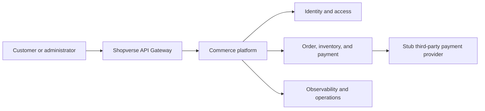
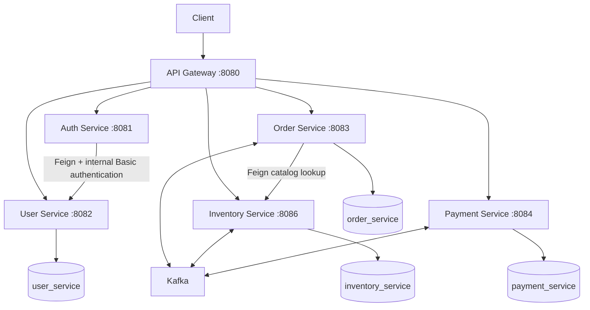
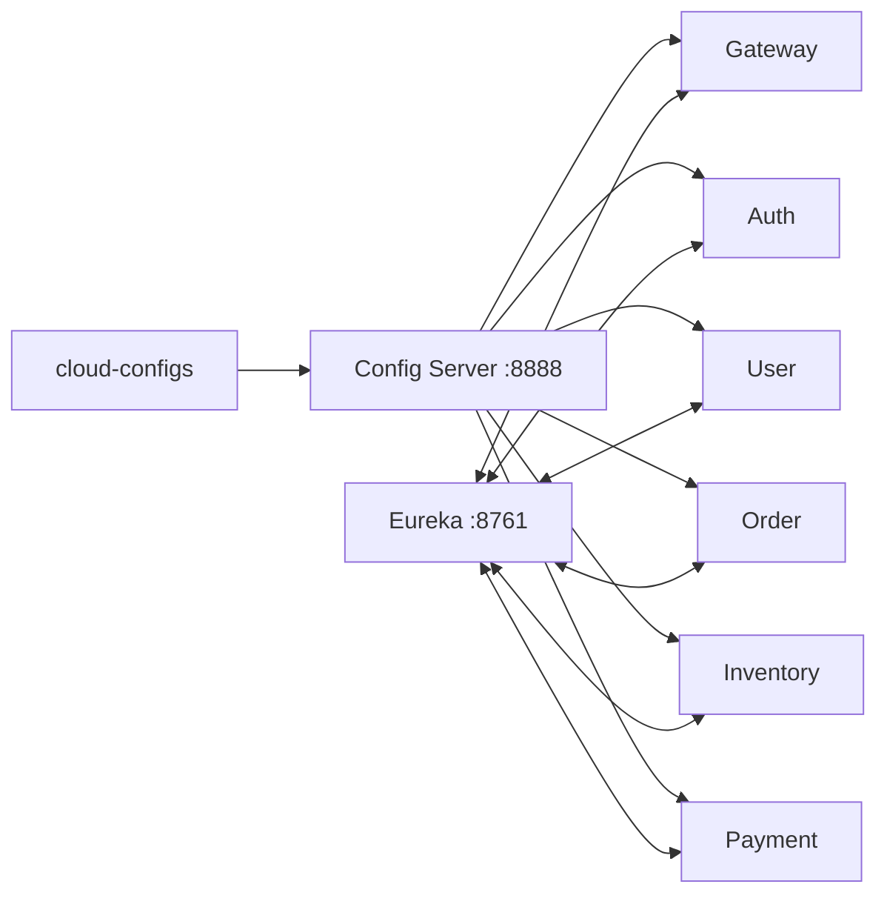

# System Context And Service Ownership

<DocLabels items={[{label: 'Advanced', tone: 'advanced'}, {label: 'Shopverse', tone: 'shopverse'}, {label: 'Production', tone: 'production'}]} />

## System Context

The payment provider is deliberately a configurable stub. It models success,
decline, and timeout without requiring external credentials.

## Runtime Architecture

Each stateful service owns a separate MySQL schema. There are no cross-service
foreign keys or cross-schema joins. A service accesses another service's data
through an API or event contract.

## Platform Infrastructure

Config Server centralizes runtime properties. Eureka records service instances.
The gateway and Feign clients use logical names such as `ORDER-SERVICE`; Spring
Cloud LoadBalancer selects a registered instance.

## Service Responsibilities

| Component | Responsibility |
|---|---|
| API Gateway | Edge routing, JWT validation, correlation handling, request metrics |
| Auth Service | Authenticate through User Service, sign RSA JWTs, expose JWKS |
| User Service | Users, roles, permissions, internal credential lookup, method security |
| Order Service | Idempotent checkout, ownership, order state, timeline, SAGA outcomes |
| Inventory Service | Stock, optimistic locking, reservation, expiry, compensation |
| Payment Service | Payment state machine, provider simulation, reconciliation, refund |
| Config Server | Centralized configuration backed by local files or Git |
| Discovery Server | Eureka registration and logical service discovery |
| Kafka | Durable asynchronous event transport |
| MySQL | Service-owned schemas and Liquibase metadata |
| Prometheus | Metric scraping, rules, SLO signals, and alert evaluation |
| Loki | Central log storage and LogQL querying |
| Promtail | Log discovery, parsing, positions, labeling, and Loki shipping |
| Zipkin | Distributed trace storage and span visualization |
| Grafana | Dashboards and investigation across metrics, logs, and traces |

## Recommended Next

Return to [Shopverse System Design](./SYSTEM-DESIGN.md) to select the next focused guide.

## Official References

- [AWS Well-Architected Framework](https://docs.aws.amazon.com/wellarchitected/latest/framework/welcome.html)
- [RFC 9110: HTTP Semantics](https://www.rfc-editor.org/rfc/rfc9110)
