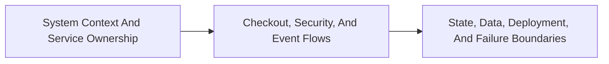

<!-- split-guide-index -->
# Shopverse System Design

<DocLabels items={[{label: 'Focused guides', tone: 'advanced'}, {label: 'Shopverse', tone: 'shopverse'}, {label: 'Architect route', tone: 'production'}]} />

The complete Shopverse system context, runtime flows, data ownership, and operational boundaries. The original long-form material is preserved without duplication across the focused pages below.

<TopicCards items={[
  {title: 'System Context And Service Ownership', href: '/architecture/SYSTEM-CONTEXT-SERVICE-OWNERSHIP', description: 'Part 1 of the focused Shopverse System Design learning route.', icon: 'route', tags: ['Focused', 'Advanced']},
  {title: 'Checkout, Security, And Event Flows', href: '/architecture/CHECKOUT-SECURITY-EVENT-FLOWS', description: 'Part 2 of the focused Shopverse System Design learning route.', icon: 'layers', tags: ['Focused', 'Advanced']},
  {title: 'State, Data, Deployment, And Failure Boundaries', href: '/architecture/STATE-DATA-DEPLOYMENT-BOUNDARIES', description: 'Part 3 of the focused Shopverse System Design learning route.', icon: 'security', tags: ['Focused', 'Advanced']},
]} />

<DocCallout type="tip" title="Use the index as the stable entry point">

Each focused page owns one concern. Cross-links point to the canonical explanation instead of repeating the same material.

</DocCallout>

## Recommended Learning Order

1. [System Context And Service Ownership](./SYSTEM-CONTEXT-SERVICE-OWNERSHIP.md)
2. [Checkout, Security, And Event Flows](./CHECKOUT-SECURITY-EVENT-FLOWS.md)
3. [State, Data, Deployment, And Failure Boundaries](./STATE-DATA-DEPLOYMENT-BOUNDARIES.md)

## Reading Strategy

Use **Shopverse System Design** as a decision and verification guide inside **Shopverse System Design**. Start by naming the invariant or operational outcome, then follow the runtime flow and identify the owning component. For every example, record the expected success evidence, the most important failure mode, and the metric or test that proves recovery. This keeps the material useful for implementation reviews, production incidents, and architect interviews instead of treating it as isolated syntax.

Within **Shopverse System Design**, apply the Shopverse guidance incrementally: verify the current behavior, introduce one bounded change, test the unhappy path, and preserve a rollback or reconciliation route. Follow links to canonical pages when a concept belongs to another track; do not copy that explanation into this page. This ownership rule keeps the focused guides short while retaining technical depth and traceability.

## Official References

- [AWS Well-Architected Framework](https://docs.aws.amazon.com/wellarchitected/latest/framework/welcome.html)
- [RFC 9110: HTTP Semantics](https://www.rfc-editor.org/rfc/rfc9110)
