# Shopverse System Design

import {DocFigure, ReadingGuide} from '@site/src/components/DocumentationLanding';

Shopverse is an observable, failure-aware commerce microservices POC. It
demonstrates secure and idempotent checkout across independently persisted
services using synchronous discovery-based HTTP calls, asynchronous Kafka
choreography, local transactions, transactional outbox, compensation, and
operational recovery.

This page describes current runtime architecture unless a paragraph explicitly
uses roadmap language such as `planned`, `target`, or `production hardening`.
For precise feature status and demonstration evidence, use the
[Features and demonstrations](../reference/FEATURES-AND-DEMOS.md) matrix.

<DocFigure
  src="/img/diagrams/shopverse-architecture-flow.svg"
  alt="Shopverse runtime architecture with API Gateway, Spring services, Kafka, service databases, configuration, discovery, security, and observability"
  caption="High-level runtime architecture. The Mermaid diagrams below decompose each part of this topology."
/>

<ReadingGuide>

Read this page from top to bottom for the complete platform model. For a faster
walkthrough, focus on **Runtime Architecture**, **Successful Checkout SAGA**,
**Failure And Compensation**, and **Observability Architecture**.

</ReadingGuide>

## System Context

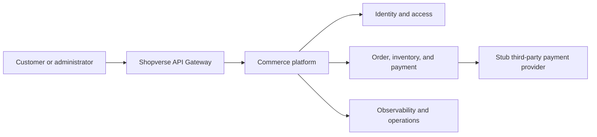

The payment provider is deliberately a configurable stub. It models success,
decline, and timeout without requiring external credentials.

## Runtime Architecture

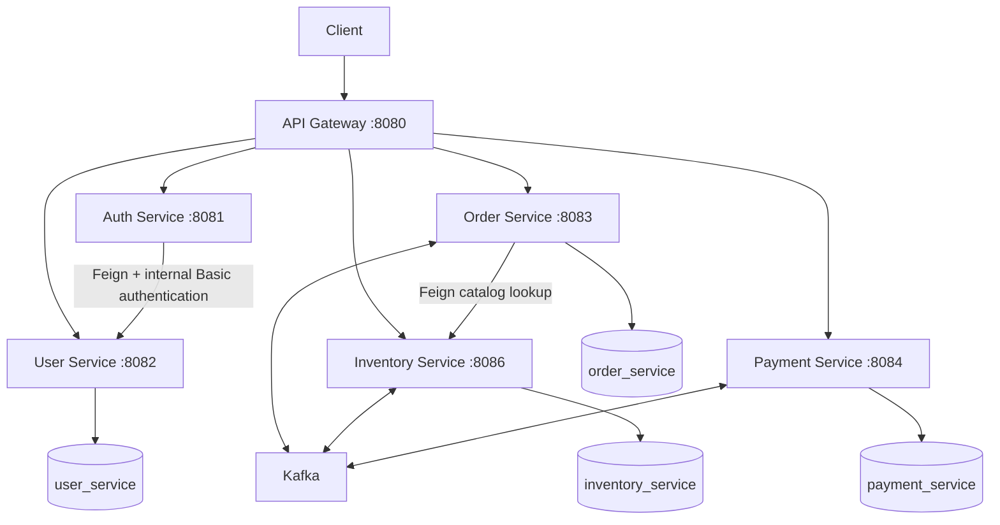

Each stateful service owns a separate MySQL schema. There are no cross-service
foreign keys or cross-schema joins. A service accesses another service's data
through an API or event contract.

## Platform Infrastructure

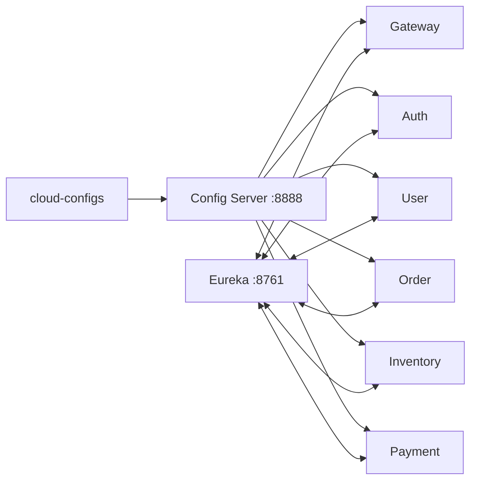

Config Server centralizes runtime properties. Eureka records service instances.
The gateway and Feign clients use logical names such as `ORDER-SERVICE`; Spring
Cloud LoadBalancer selects a registered instance.

## Service Responsibilities

| Component | Responsibility |
|---|---|
| API Gateway | Edge routing, JWT validation, correlation handling, request metrics |
| Auth Service | Authenticate through User Service, sign RSA JWTs, expose JWKS |
| User Service | Users, roles, permissions, internal credential lookup, method security |
| Order Service | Idempotent checkout, ownership, order state, timeline, SAGA outcomes |
| Inventory Service | Stock, optimistic locking, reservation, expiry, compensation |
| Payment Service | Payment state machine, provider simulation, reconciliation, refund |
| Config Server | Centralized configuration backed by local files or Git |
| Discovery Server | Eureka registration and logical service discovery |
| Kafka | Durable asynchronous event transport |
| MySQL | Service-owned schemas and Liquibase metadata |
| Prometheus | Metric scraping, rules, SLO signals, and alert evaluation |
| Loki | Central log storage and LogQL querying |
| Promtail | Log discovery, parsing, positions, labeling, and Loki shipping |
| Zipkin | Distributed trace storage and span visualization |
| Grafana | Dashboards and investigation across metrics, logs, and traces |

## Synchronous Request Flow

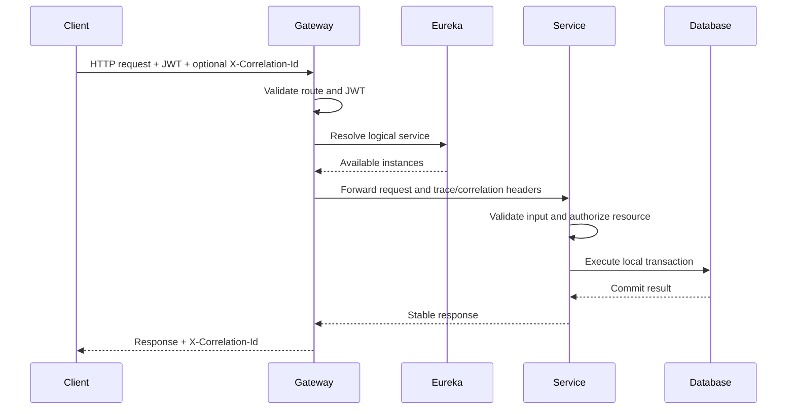

The downstream service repeats JWT validation and resource authorization.
Gateway security is not the sole protection for a service.

## Authentication Flow

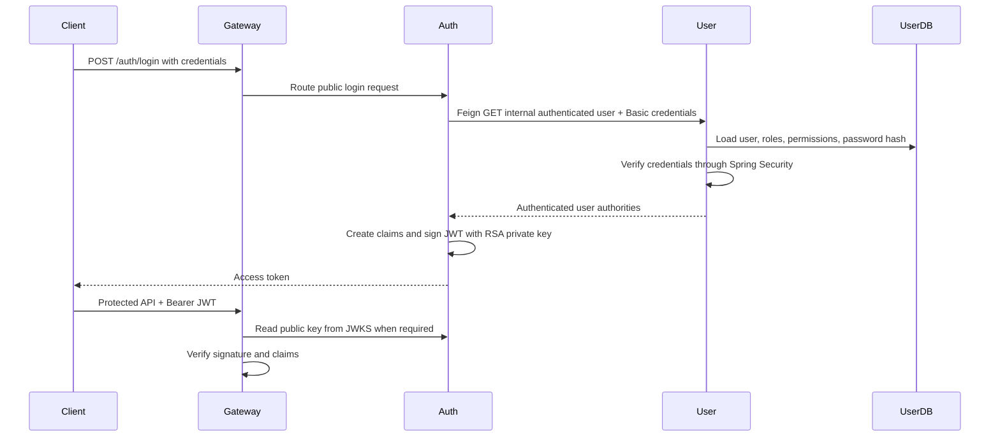

Resource services use the Auth Service JWKS endpoint to verify tokens. They do
not receive or share the RSA private signing key.

## Successful Checkout SAGA

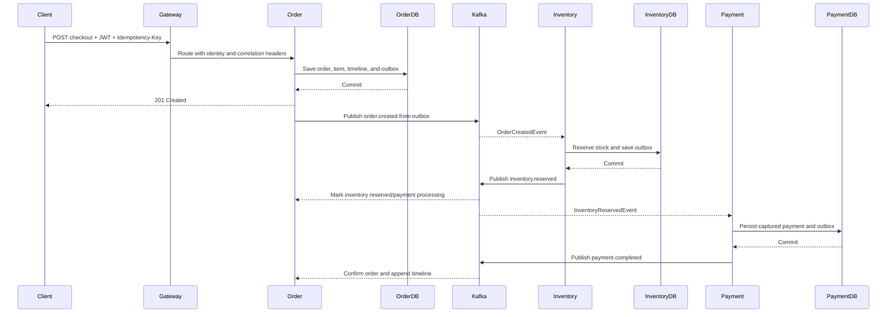

The HTTP response confirms creation of the Order resource. It does not imply
that asynchronous inventory and payment processing has completed.

## Failure And Compensation

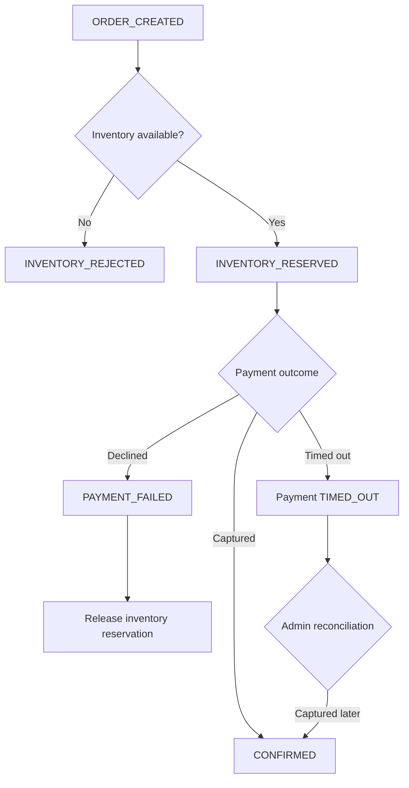

Compensation is a later business transaction. It is not a rollback of the
already committed Inventory transaction.

## Transactional Outbox Flow

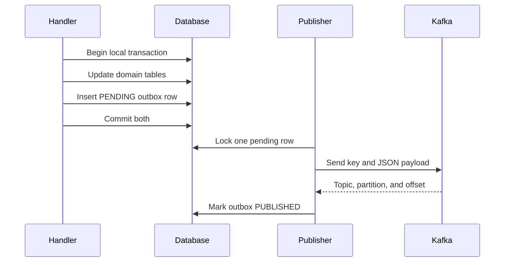

If Kafka is unavailable, the committed outbox row remains recoverable. A crash
after Kafka accepts a record but before the row is marked published can cause
duplicate delivery, so consumers must be idempotent.

## Event Topology

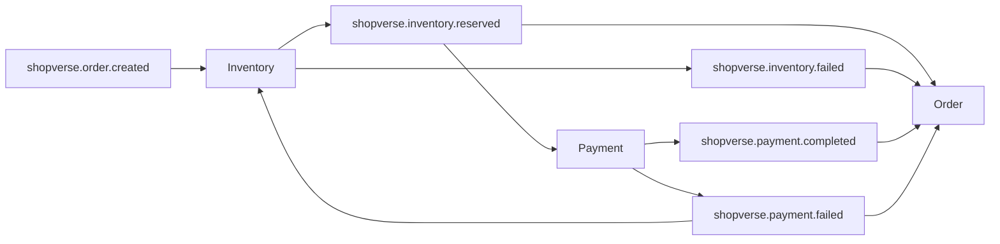

| Event | Producer | Consumers | Purpose |
|---|---|---|---|
| `shopverse.order.created` | Order | Inventory | Begin stock reservation |
| `shopverse.inventory.reserved` | Inventory | Order, Payment | Advance order and begin payment |
| `shopverse.inventory.failed` | Inventory | Order | Reject checkout |
| `shopverse.payment.completed` | Payment | Order | Confirm the order |
| `shopverse.payment.failed` | Payment | Order, Inventory | Fail order and release stock |

Event contracts currently carry order ID, order number, correlation ID, and
the fields needed by the consumer. Order number is the Kafka key to preserve
per-order partition ordering. A universal immutable event ID and schema version
are production hardening items.

## State Machines

### Order

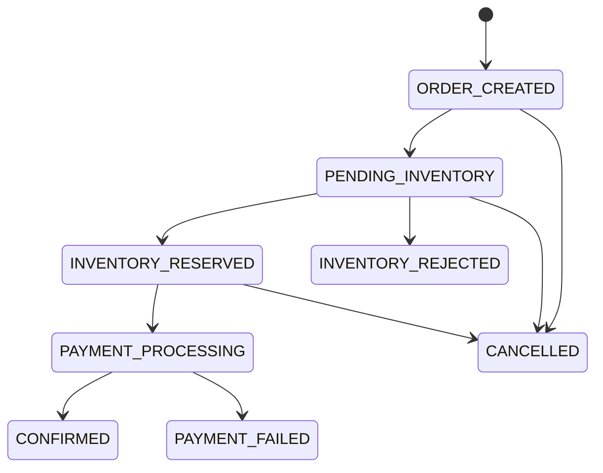

Order timeline stages are:

```text
ORDER_CREATED
INVENTORY_RESERVED
INVENTORY_REJECTED
PAYMENT_PROCESSING
PAYMENT_COMPLETED
PAYMENT_FAILED
ORDER_CONFIRMED
ORDER_CANCELLED
```

### Payment

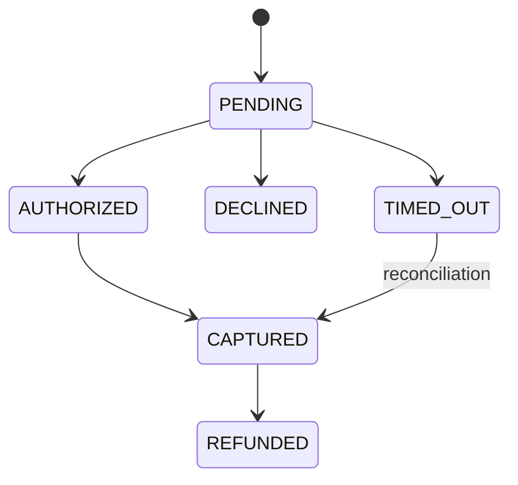

The stub provider supports `SUCCESS`, `DECLINE`, and `TIMEOUT`.

### Inventory Reservation

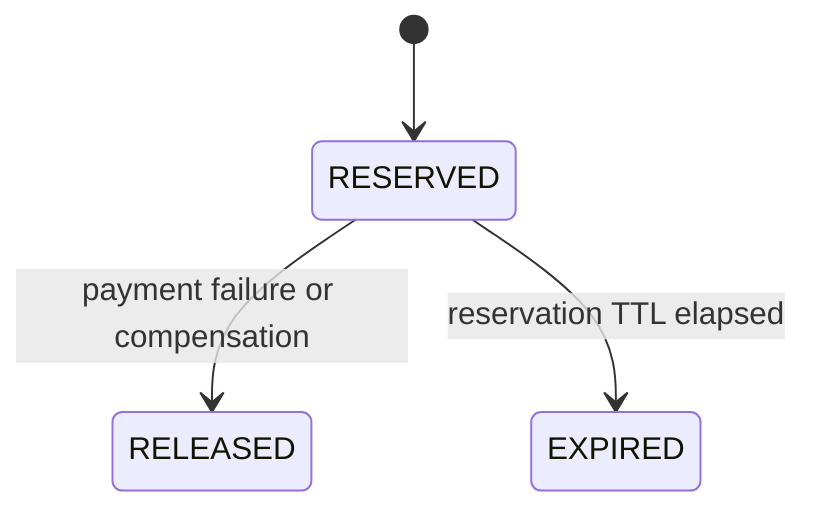

## Logical Data Ownership

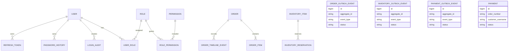

This is a logical overview. Relationships do not cross schema boundaries.
Outbox and failed-event tables belong to Order, Inventory, and Payment
independently.

## Core Class Collaboration

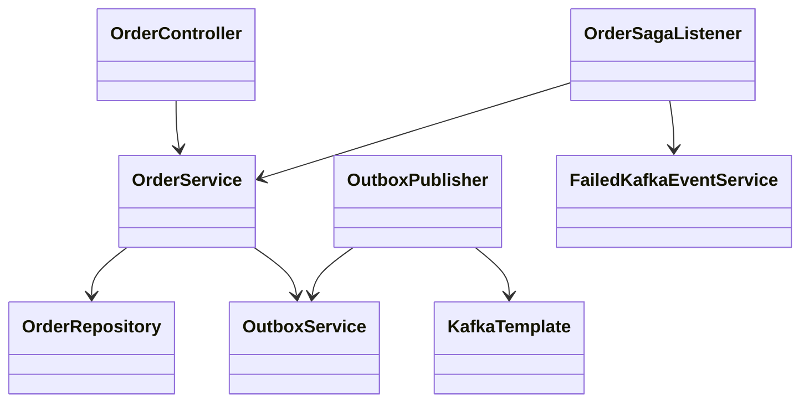

Controllers handle transport concerns. Services own authorization-aware
business operations and transactions. Repositories own persistence. Kafka
listeners restore correlation context and delegate transactional work.

## Observability Architecture

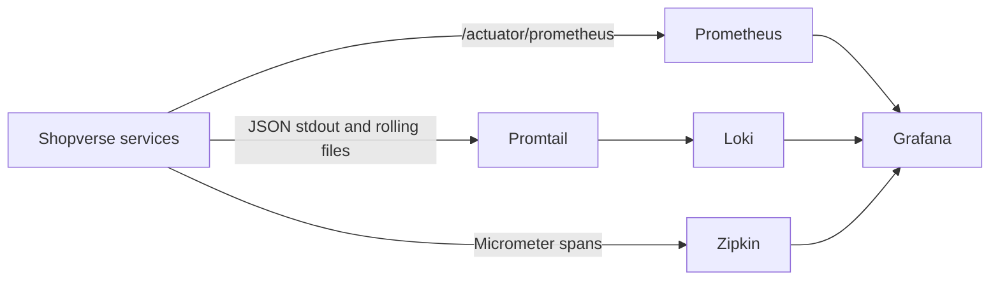

Correlation IDs connect the business journey across several traces. Trace IDs
connect spans inside one distributed technical execution.

## Deployment Topology

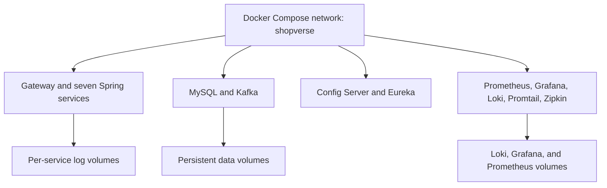

Docker Compose is the current local deployment model. The production
deployment list below is a hardening target, not implemented runtime behavior:
secret management, TLS, broker authentication, backups, multi-node
Kafka/Loki/Prometheus strategy, alert delivery, and orchestrator
health/resource controls.

## Consistency And Failure Boundaries

| Concern | Current control |
|---|---|
| Duplicate checkout | idempotency key lookup and database uniqueness |
| Concurrent stock purchase | JPA `@Version` optimistic locking |
| Domain change plus outgoing event | transactional outbox |
| Duplicate Kafka delivery | state checks and business/database uniqueness |
| Publisher contention | pessimistic lock on one outbox row |
| Transient listener failure | bounded `@RetryableTopic` attempts |
| Poison event | DLT plus persisted replay record |
| Long business workflow | SAGA state and compensation |
| Cross-service diagnosis | correlation ID, trace ID, timeline, logs, metrics |

Current DLT deduplication uses an application existence check and is not
strictly race-safe. A database-unique event ID/inbox remains planned.

## Current Runtime Boundaries

- Checkout currently accepts one item.
- Cache providers are local in-memory caches, not distributed Redis.
- Payment integration is a configurable stub.
- Kafka processing is at least once; exactly-once business processing is not
  claimed.
- Outbox status is `PENDING` or `PUBLISHED`; bounded terminal failure/backoff
  policy remains a hardening item.
- Full OAuth2 Authorization Server behavior is planned; current authentication
  issues custom RSA-signed JWTs.
- The observability stack is single-node and intended for the POC.

## Related Guides

- [Features and demonstrations](../reference/FEATURES-AND-DEMOS.md)
- [Distributed systems](DISTRIBUTED-SYSTEMS.md)
- [Apache Kafka](../integration/APACHE-KAFKA.md)
- [Spring Kafka](../spring/SPRING-KAFKA.md)
- [SAGA and outbox](../reliability/SAGA-OUTBOX.md)
- [Security](../security/JWT-OAUTH2-SPRING-SECURITY.md)
- [Observability](../observability/OBSERVABILITY.md)
