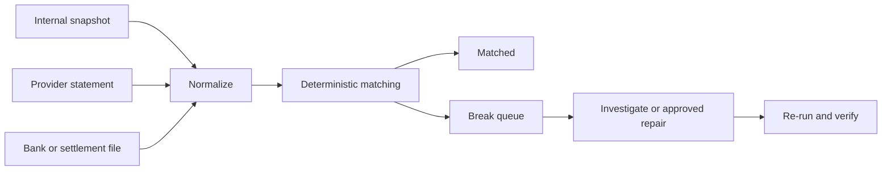

# Reconciliation, Settlement, And Restartable Batch

Reconciliation compares independently produced evidence to prove completeness and accuracy. It
detects missing, duplicate, mismatched, late, or incorrectly valued operations that request-time
logic and message delivery cannot eliminate.

## Reconciliation Layers

| Comparison | Example question |
|---|---|
| workflow to ledger | did every captured/refunded payment create the intended postings? |
| internal to processor | do provider operations match internal attempts, amounts, currencies and states? |
| processor to bank/settlement | do cleared/settled totals and fees match cash movements? |
| ledger to balance/report | can account and report totals be rebuilt from postings? |
| source to event/read model | did CDC/outbox/Kafka consumers produce complete projections? |

Each comparison names an authoritative source per field. A provider may own capture status, the
internal ledger may own customer balance, and the bank statement may own cash-settlement evidence.

## Matching Pipeline



Match strongest identities first: provider reference, internal operation ID, account, currency,
amount, direction, and dates. Fuzzy matching may suggest candidates but should not silently create
financial adjustments.

## Control Totals

For every file, partition, business date, and stage retain:

```text
record count
sum of debit amount by currency
sum of credit amount by currency
accepted, rejected and duplicate counts
source checksum and sequence
first and last identifiers or sequence range
```

Control totals detect truncation and duplication even when individual rows look valid. Never sum
different currencies into one meaningless total.

## Break Lifecycle

```text
OPEN -> ASSIGNED -> INVESTIGATING -> ACTION_PENDING -> RESOLVED -> VERIFIED
```

A break records classification, financial exposure, age, evidence, owner, SLA, action, approval,
and linked adjustment. Distinguish timing breaks from genuine mismatches. Auto-resolution must be
rule-based, versioned, bounded, observable, and reversible through new entries.

## Settlement And Cutoffs

Settlement commonly includes position calculation, net/gross obligations, fees, funding checks,
instruction or file generation, acknowledgement, cash confirmation, and posting. Define time zone,
holiday calendar, cutoff, business date, late-item policy, value date, finality, and rerun policy
with domain specialists.

Do not infer settlement from successful capture. Clearing and cash settlement may happen later
and can be netted, rejected, adjusted, or disputed.

## Restartable Batch Design

A job identity is the business operation, such as `provider + businessDate + statementSequence`,
not a random timestamp added to bypass duplicate detection.

```text
JobInstance: RECONCILE / provider-X / 2026-07-28 / sequence-0042
  Step 1: ingest immutable source and verify checksum
  Step 2: normalize to staging with row identity
  Step 3: match in deterministic partitions
  Step 4: publish matched/break outcomes idempotently
  Step 5: calculate and verify control totals
```

Persist execution metadata and checkpoints. A restarted chunk must not duplicate postings or lose
rows. Use database uniqueness and operation identities in addition to framework metadata.

```java
@Bean
Job reconciliationJob(JobRepository repository, Step ingest, Step match, Step verify) {
    return new JobBuilder("provider-reconciliation", repository)
            .start(ingest)
            .next(match)
            .next(verify)
            .build();
}
```

### One record fails after 99 succeed

If record 100 fails before a transactional chunk commits, the whole chunk normally rolls back and
runs again. If the writer invoked a non-transactional external API for the first 99 items, database
rollback cannot undo them. Use idempotent external operations, an outbox/staging boundary, or a
different step design.

Classify malformed input separately from transient failure. Quarantine a record only when policy
permits completion without it; preserve totals and expose the incomplete outcome.

## End-Of-Day And Close

```text
OPEN -> CUTOFF_REACHED -> INPUT_COMPLETE -> RECONCILED
     -> POSTED -> REPORTS_VERIFIED -> CLOSED
```

Late events enter the defined next-period or reopen/adjustment process. Do not silently mutate a
closed period. Store calendar and rule versions plus evidence for every gate.

## Operational Runbook

1. Confirm business-date/cutoff impact and assign incident plus finance-operations owners.
2. Inspect job, step, chunk, checkpoint, locks, resources, source arrival and checksum.
3. Determine whether external effects occurred beyond the checkpoint.
4. Preserve source, staging, execution metadata, logs and control totals.
5. Restart with the same logical identity only after idempotency is verified.
6. Quarantine or repair data through an approved workflow.
7. Verify record matches, totals, ledger state and downstream reports.
8. Record completion time, breaks, adjustments and evidence.

## Production Signals

Track source arrival, checksum/sequence gaps, job and step duration, read/process/write rates,
retry/skip/rollback counts, checkpoint age, match rate, break value/age, settlement acknowledgement,
control-total mismatch, and close-gate status.

## Official References

- [Spring Batch domain language](https://docs.spring.io/spring-batch/reference/domain.html)
- [Spring Batch job configuration and restartability](https://docs.spring.io/spring-batch/reference/job/configuring-job.html)
- [Spring Batch `JobRepository`](https://docs.spring.io/spring-batch/reference/job/configuring-repository.html)
- [ISO 20022](https://www.iso20022.org/)

## Recommended Next

Continue with [Financial Controls, Security, And Auditability](./FINANCIAL-CONTROLS-SECURITY-AUDIT.md).

