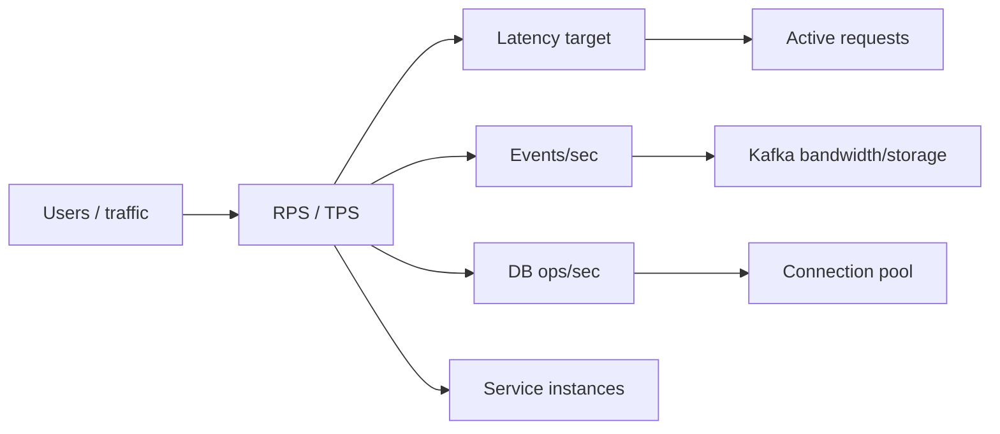

# Capacity Estimation Fundamentals

<DocLabels items={[{label: 'Advanced', tone: 'advanced'}, {label: 'Shopverse', tone: 'shopverse'}, {label: 'Production', tone: 'production'}]} />

## Capacity Estimation

Example:

```text
peak checkout requests:       500 requests/second
events per checkout:          5
peak event rate:              2,500 records/second
average event size:           2 KB
daily event data:
  2,500 x 2 KB x 86,400
  approximately 432 GB before replication at sustained peak
```

Real estimates should distinguish average from peak traffic and include
retention, replication, compression, growth, read/write ratios, and recovery
objectives.

## Capacity Estimation Flow

Use this sequence before choosing infrastructure:

1. Estimate users and traffic.
2. Split average and peak load.
3. Estimate read/write ratio.
4. Estimate request and event size.
5. Calculate throughput, bandwidth, and storage.
6. Estimate active requests from latency.
7. Estimate database connection demand.
8. Add replication, retention, backup, and growth.
9. Add headroom for failures, deploys, retries, and bursts.
10. Validate with load testing.



## Quick Estimation Formulas

| Metric | Formula |
|---|---|
| average RPS | `daily requests / 86,400` |
| peak RPS | `average RPS x peak factor` |
| active requests | `RPS x average latency seconds` |
| event rate | `business requests/sec x events per request` |
| bandwidth | `messages/sec x average message size` |
| raw daily event storage | `events/sec x size x 86,400` |
| retained replicated storage | `raw daily x retention days x replication factor x compression factor` |
| DB connection demand | `DB ops/sec x average DB hold time seconds` |
| instance count | `ceil(peak RPS / safe RPS per instance)` |

Keep units consistent. Most mistakes come from mixing milliseconds and seconds,
or average traffic and peak traffic.

## Example Interview Calculation

<ExpandableAnswer title="What should an architect explain about Capacity Estimation Fundamentals?">

For **Capacity Estimation Fundamentals**, a strong answer starts with the runtime responsibility and the invariant that must remain true. It then walks through one Shopverse request or event, names the important boundary, and explains the failure behavior rather than describing only the happy path. Close with the trade-off, the production signal that verifies the design, and the condition that would justify a different approach. This structure demonstrates practical judgment without memorizing isolated definitions.

</ExpandableAnswer>

Assume:

```text
monthly active users:       3,000,000
daily active users:           300,000
checkouts per DAU:                  2
peak factor:                        8
events per checkout:                5
average event size:              2 KB
```

Average checkout RPS:

```text
daily checkouts = 300,000 x 2 = 600,000
average RPS = 600,000 / 86,400 = 6.94 RPS
peak RPS = 6.94 x 8 = 55.5 RPS
```

Peak event rate:

```text
55.5 x 5 = 277.5 events/sec
```

Raw event bandwidth:

```text
277.5 x 2 KB = 555 KB/sec
```

This is much smaller than a 500 RPS checkout scenario. Capacity estimates must
be based on explicit assumptions, not guessed infrastructure.

## Recommended Next

Return to [Capacity And Performance Estimation](./CAPACITY-PERFORMANCE-ESTIMATION.md) to select the next focused guide.


## Official References

- [AWS Well-Architected Framework](https://docs.aws.amazon.com/wellarchitected/latest/framework/welcome.html)
- [RFC 9110: HTTP Semantics](https://www.rfc-editor.org/rfc/rfc9110)
