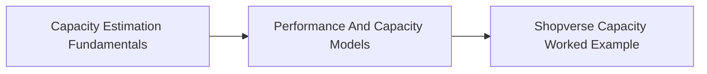

<!-- split-guide-index -->
# Capacity And Performance Estimation

<DocLabels items={[{label: 'Focused guides', tone: 'advanced'}, {label: 'Shopverse', tone: 'shopverse'}, {label: 'Architect route', tone: 'production'}]} />

Estimate demand, translate it into resource budgets, and validate the design with operational signals. The original long-form material is preserved without duplication across the focused pages below.

<TopicCards items={[
  {title: 'Capacity Estimation Fundamentals', href: '/architecture/hld-lld/CAPACITY-ESTIMATION-FUNDAMENTALS', description: 'Part 1 of the focused Capacity And Performance Estimation learning route.', icon: 'route', tags: ['Focused', 'Advanced']},
  {title: 'Performance And Capacity Models', href: '/architecture/hld-lld/PERFORMANCE-CAPACITY-MODELS', description: 'Part 2 of the focused Capacity And Performance Estimation learning route.', icon: 'layers', tags: ['Focused', 'Advanced']},
  {title: 'Shopverse Capacity Worked Example', href: '/architecture/hld-lld/SHOPVERSE-CAPACITY-WORKED-EXAMPLE', description: 'Part 3 of the focused Capacity And Performance Estimation learning route.', icon: 'security', tags: ['Focused', 'Advanced']},
]} />

<DocCallout type="tip" title="Use the index as the stable entry point">

Each focused page owns one concern. Cross-links point to the canonical explanation instead of repeating the same material.

</DocCallout>

## Recommended Learning Order

1. [Capacity Estimation Fundamentals](./CAPACITY-ESTIMATION-FUNDAMENTALS.md)
2. [Performance And Capacity Models](./PERFORMANCE-CAPACITY-MODELS.md)
3. [Shopverse Capacity Worked Example](./SHOPVERSE-CAPACITY-WORKED-EXAMPLE.md)

## Reading Strategy

Use **Capacity And Performance Estimation** as a decision and verification guide inside **Capacity And Performance Estimation**. Start by naming the invariant or operational outcome, then follow the runtime flow and identify the owning component. For every example, record the expected success evidence, the most important failure mode, and the metric or test that proves recovery. This keeps the material useful for implementation reviews, production incidents, and architect interviews instead of treating it as isolated syntax.

Within **Capacity And Performance Estimation**, apply the Shopverse guidance incrementally: verify the current behavior, introduce one bounded change, test the unhappy path, and preserve a rollback or reconciliation route. Follow links to canonical pages when a concept belongs to another track; do not copy that explanation into this page. This ownership rule keeps the focused guides short while retaining technical depth and traceability.

## Official References

- [AWS Well-Architected Framework](https://docs.aws.amazon.com/wellarchitected/latest/framework/welcome.html)
- [RFC 9110: HTTP Semantics](https://www.rfc-editor.org/rfc/rfc9110)
