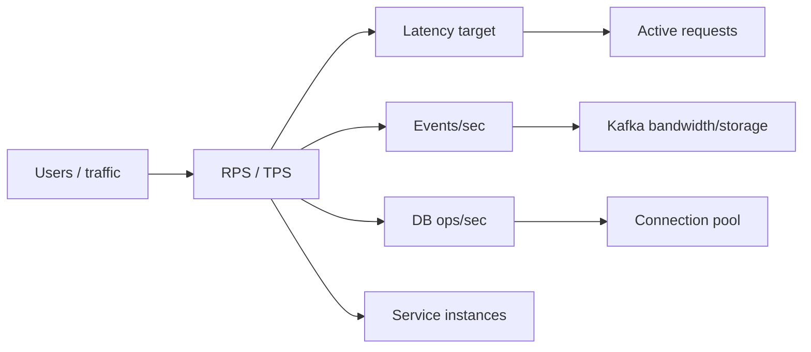

---
title: Capacity And Performance Estimation
---

# Capacity And Performance Estimation

Capacity estimation, latency, throughput, active requests, worked checkout estimate, RED/USE/business metrics, and performance rules.

Back to [HLD And LLD](../HLD-LLD.md).

## Capacity Estimation

Example:

```text
peak checkout requests:       500 requests/second
events per checkout:          5
peak event rate:              2,500 records/second
average event size:           2 KB
daily event data:
  2,500 x 2 KB x 86,400
  approximately 432 GB before replication at sustained peak
```

Real estimates should distinguish average from peak traffic and include
retention, replication, compression, growth, read/write ratios, and recovery
objectives.

## Capacity Estimation Flow

Use this sequence before choosing infrastructure:

1. Estimate users and traffic.
2. Split average and peak load.
3. Estimate read/write ratio.
4. Estimate request and event size.
5. Calculate throughput, bandwidth, and storage.
6. Estimate active requests from latency.
7. Estimate database connection demand.
8. Add replication, retention, backup, and growth.
9. Add headroom for failures, deploys, retries, and bursts.
10. Validate with load testing.



## Quick Estimation Formulas

| Metric | Formula |
|---|---|
| average RPS | `daily requests / 86,400` |
| peak RPS | `average RPS x peak factor` |
| active requests | `RPS x average latency seconds` |
| event rate | `business requests/sec x events per request` |
| bandwidth | `messages/sec x average message size` |
| raw daily event storage | `events/sec x size x 86,400` |
| retained replicated storage | `raw daily x retention days x replication factor x compression factor` |
| DB connection demand | `DB ops/sec x average DB hold time seconds` |
| instance count | `ceil(peak RPS / safe RPS per instance)` |

Keep units consistent. Most mistakes come from mixing milliseconds and seconds,
or average traffic and peak traffic.

## Example Interview Calculation

Assume:

```text
monthly active users:       3,000,000
daily active users:           300,000
checkouts per DAU:                  2
peak factor:                        8
events per checkout:                5
average event size:              2 KB
```

Average checkout RPS:

```text
daily checkouts = 300,000 x 2 = 600,000
average RPS = 600,000 / 86,400 = 6.94 RPS
peak RPS = 6.94 x 8 = 55.5 RPS
```

Peak event rate:

```text
55.5 x 5 = 277.5 events/sec
```

Raw event bandwidth:

```text
277.5 x 2 KB = 555 KB/sec
```

This is much smaller than a 500 RPS checkout scenario. Capacity estimates must
be based on explicit assumptions, not guessed infrastructure.


## Performance And Capacity Parameters

System design should define measurable performance targets and estimate the
resources required to meet them. Use production measurements when available;
use explicit assumptions before the system exists.

### Latency

Latency is the elapsed time required to complete an operation:

```text
latency = response completion time - request arrival time
```

Example:

```text
request arrived:  10:00:00.100
response returned: 10:00:00.350
latency:                    250 ms
```

Report distributions rather than only averages:

| Metric | Meaning |
|---|---|
| p50 | 50% of requests completed at or below this time |
| p90 | 90% completed at or below this time |
| p95 | 95% completed at or below this time |
| p99 | 99% completed at or below this time |
| maximum | slowest observed request in the measurement window |

Example:

```text
p50 = 80 ms
p95 = 300 ms
p99 = 900 ms
```

The average could be `110 ms` while a significant tail still takes nearly one
second. User experience, deadlines, thread occupancy, and cascading failures
are often determined by tail latency.

Break end-to-end latency into components:

```text
total latency =
    gateway time
  + application processing
  + database time
  + downstream service time
  + queueing time
  + network time
  + serialization time
```

Parallel calls do not add in the same way as sequential calls. The critical
path is approximately the slowest parallel branch plus common work.

### Throughput

Throughput is the amount of completed work per unit of time:

```text
throughput = completed requests / measurement duration
```

Example:

```text
60,000 successful requests in 5 minutes

60,000 / 300 seconds = 200 requests/second
```

Common units:

- requests per second (RPS);
- transactions per second (TPS);
- Kafka records per second;
- database queries or rows per second;
- bytes per second;
- jobs per minute.

Define whether throughput counts attempted, successful, or completed requests.
For capacity planning, use peak throughput and burst behavior, not only the
daily average.

```text
average RPS =
    daily requests / 86,400
```

If 8.64 million requests arrive per day:

```text
8,640,000 / 86,400 = 100 average RPS
```

Traffic may peak at five or ten times that average.

### Active Requests And Concurrency

Active requests are requests accepted but not yet completed. They consume
threads or event-loop work, memory, connections, and downstream capacity.

For a stable system, Little's Law gives an estimate:

```text
average concurrency =
    average throughput x average response time
```

Keep units consistent:

```text
throughput = 500 requests/second
average latency = 0.200 seconds

average active requests = 500 x 0.200 = 100
```

If p95 latency rises to two seconds during a dependency slowdown:

```text
500 x 2 = 1,000 active requests
```

The same arrival rate now requires roughly ten times as many in-flight request
slots. This explains how latency increases can exhaust servlet threads,
database connections, memory, and queues even when traffic is unchanged.

Little's Law describes long-term averages in a stable system. It does not
replace direct metrics for instantaneous active requests, bursts, retries, or
uneven workloads.

Measure active HTTP requests with a gauge or derive them from:

```text
active = requests started - requests completed
```

The value must be decremented in a `finally` block so exceptions and
cancellations do not leak the count.

### Arrival Rate And Service Rate

```text
arrival rate (lambda) = incoming work per second
service rate (mu) = work one worker can complete per second
```

Approximate one worker's service rate:

```text
service rate = 1 / average service time
```

If one sequential worker takes `50 ms`:

```text
1 / 0.050 = 20 requests/second
```

Theoretical workers for `500 RPS`:

```text
500 / 20 = 25 workers
```

This is only a starting estimate. Add headroom for variance, garbage
collection, downstream waits, retries, maintenance, and instance failure.

When arrival rate approaches total service capacity, queueing latency can grow
sharply. Do not design steady-state utilization at 100%.

### Utilization And Saturation

Utilization describes the fraction of a resource currently busy:

```text
utilization = busy capacity / total capacity
```

Examples:

```text
CPU utilization = CPU busy time / available CPU time
connection utilization = active connections / maximum pool size
thread utilization = busy request threads / maximum request threads
```

Saturation means demand is waiting because capacity is exhausted or nearly
exhausted. Useful saturation indicators:

- request queue length;
- database connection pending count;
- servlet thread pool active/max;
- executor queue depth;
- Kafka consumer lag;
- CPU run queue;
- disk I/O wait;
- memory pressure and garbage-collection pauses.

High utilization is not automatically bad. Sustained high utilization plus
growing queues, latency, or errors indicates insufficient capacity or a
bottleneck.

### Error Rate

```text
error rate =
    failed requests / total requests
```

Example:

```text
500 failures / 100,000 requests = 0.5% error rate
```

Separate:

- client errors such as validation and authorization failures;
- server errors;
- dependency timeouts;
- throttled requests;
- business declines such as insufficient stock or declined payment.

A payment decline can be a successful technical response and should not be
counted as a platform failure.

### Availability

```text
availability =
    successful eligible requests / total eligible requests
```

Approximate maximum downtime:

| Monthly target | Approximate downtime in 30 days |
|---:|---:|
| 99% | 7 hours 12 minutes |
| 99.9% | 43 minutes 12 seconds |
| 99.95% | 21 minutes 36 seconds |
| 99.99% | 4 minutes 19 seconds |

Define what counts as available. A `200` response that violates the business
contract is not meaningful availability.

For sequential dependencies that are all mandatory, end-to-end availability
is approximately:

```text
system availability =
    gateway availability
  x order availability
  x inventory availability
  x payment availability
```

Four components at `99.9%` each produce approximately:

```text
0.999 ^ 4 = 99.6006%
```

This is why optional work, asynchronous processing, fallback, redundancy, and
failure isolation matter.

### Bandwidth

```text
bandwidth =
    messages per second x average message size
```

Example:

```text
2,500 Kafka records/second x 2 KB
    = 5,000 KB/second
    approximately 5 MB/second before protocol overhead and replication
```

For replication factor three, brokers write roughly three copies, although
network and disk behavior depends on leaders, followers, compression, and
batching.

Estimate both ingress and egress. A record consumed by five independent groups
creates substantially more outbound broker traffic.

### Storage

```text
raw daily storage =
    events per second
  x average event size
  x 86,400
```

```text
retained storage =
    raw daily storage
  x retention days
  x replication factor
  x compression factor
```

If:

```text
event rate:          2,500/second
event size:          2 KB
retention:           7 days
replication factor:  3
compression ratio:   0.40
```

Then:

```text
raw daily = 2,500 x 2 KB x 86,400
          approximately 432 GB/day

retained = 432 GB x 7 x 3 x 0.40
         approximately 3.63 TB
```

Add index, metadata, filesystem, compaction, growth, and operational headroom.

Database storage estimates should include:

- row payload;
- primary and secondary indexes;
- transaction and binary logs;
- audit/history tables;
- backups and replicas;
- temporary space for migrations.

### Cache Hit Ratio

```text
cache hit ratio =
    cache hits / (cache hits + cache misses)
```

A 95% hit ratio is not sufficient evidence by itself. Measure:

- latency for hits and misses;
- source load during misses;
- stale-value risk;
- eviction and memory behavior;
- hot-key distribution.

### Queue And Kafka Lag

Queue depth is pending work. Kafka lag is:

```text
lag =
    log-end offset - committed consumer offset
```

Approximate time to drain a backlog:

```text
drain time =
    backlog / (consumer capacity - incoming rate)
```

If:

```text
backlog = 100,000 records
consumer capacity = 2,000 records/second
new arrival rate = 1,500 records/second
```

Then net drain capacity is `500 records/second`:

```text
100,000 / 500 = 200 seconds
```

If capacity is less than or equal to arrival rate, the backlog cannot drain.

### Database Connection Pool Sizing

Application concurrency does not imply that every active request should own a
database connection.

Approximate database connection demand:

```text
DB concurrency =
    DB operations per second x average DB hold time in seconds
```

If a service performs `400` database operations per second and each holds a
connection for `25 ms`:

```text
400 x 0.025 = 10 average active connections
```

Add measured headroom, but avoid oversized pools. Across replicas:

```text
total possible connections =
    service replicas x pool size per replica
```

Ten replicas with a pool of 50 can open 500 connections. The database must
support the combined pools of every service plus administration and migration
work.

Monitor:

- active, idle, and pending connections;
- acquisition time;
- transaction duration;
- slow queries;
- lock waits and deadlocks.

### Instance Count

A simple throughput estimate:

```text
required instances =
    ceiling(
        peak throughput
        / measured safe throughput per instance
    )
```

Add failure and deployment headroom:

```text
peak requirement:                 1,000 RPS
safe measured capacity/instance:    250 RPS
minimum throughput instances:          4

with one-instance failure tolerance:   5
```

"Safe capacity" should be measured below the point where latency and errors
rise sharply. Include rolling deployment, availability-zone loss, and burst
headroom.

### Read And Write Ratio

```text
read/write ratio =
    read operations / write operations
```

Example:

```text
9,000 reads and 1,000 writes per second
read/write ratio = 9:1
```

Read-heavy systems may benefit from caching, replicas, projections, and search
indexes. Write-heavy systems require careful index count, batching,
partitioning, locking, and durability design.

### Recovery Metrics

| Metric | Meaning |
|---|---|
| RTO | maximum acceptable time to restore service |
| RPO | maximum acceptable amount of lost data measured in time |
| MTTR | average time to recover from incidents |
| MTBF | average operating time between failures |

Example:

```text
RPO = 5 minutes
```

The backup/replication design must ensure at most roughly five minutes of
committed data can be lost under the defined disaster.


## Worked Checkout Estimate

Assumptions:

```text
peak incoming checkout rate:        500 requests/second
average HTTP acceptance latency:    200 ms
p95 HTTP acceptance latency:        500 ms
events per checkout:                5
average event size:                 2 KB
database operations per checkout:   4
average DB connection hold time:    20 ms per operation
safe service capacity per instance: 150 requests/second
```

Calculations:

```text
average active HTTP requests:
500 x 0.200 = 100

p95 in-flight estimate:
500 x 0.500 = 250

Kafka event throughput:
500 x 5 = 2,500 records/second

raw Kafka ingress:
2,500 x 2 KB = approximately 5 MB/second

database operation rate:
500 x 4 = 2,000 operations/second

average database connection concurrency:
2,000 x 0.020 = 40 connections

throughput instances:
ceiling(500 / 150) = 4

with one-instance failure tolerance:
5 instances
```

These numbers are hypotheses until load tests confirm them. Validate:

- p50, p95, and p99 latency;
- error and timeout rate;
- active request and queue count;
- CPU, memory, GC, and thread saturation;
- database connection acquisition and query time;
- Kafka producer latency and consumer lag;
- behavior during one-instance and dependency failure.


## RED, USE, And Business Metrics

Use multiple metric models:

### RED For Request-Driven Services

- **Rate:** requests per second;
- **Errors:** failed requests per second or ratio;
- **Duration:** latency distribution.

### USE For Resources

- **Utilization:** percentage busy;
- **Saturation:** queued or waiting work;
- **Errors:** resource-level failures.

### Business Metrics

- checkouts started and completed;
- payment authorization success/decline;
- inventory reservation conflicts;
- active, failed, and compensated SAGAs;
- order confirmation duration.

Infrastructure can appear healthy while the business workflow is failing.


## Performance Design Rules

1. Define latency as percentiles, not only averages.
2. Distinguish arrival rate from completed throughput.
3. Calculate in-flight concurrency from throughput and latency.
4. Plan for peak traffic, bursts, retries, and one-instance loss.
5. Keep sustained utilization below the saturation cliff.
6. Size thread, connection, and consumer concurrency together.
7. Calculate storage with retention, replication, indexes, and backups.
8. Define availability from correct business responses.
9. Measure queue depth, lag, and oldest-work age.
10. Validate estimates with load, stress, endurance, and failure tests.

## Interview Questions

### Why Is Average RPS Not Enough?

Average RPS hides bursts. A system with 100 average RPS can receive 1,000 RPS
during peak traffic. Design for peak and burst behavior.

### Why Use Percentiles Instead Of Average Latency?

Averages hide tail latency. Users and thread pools suffer when p95/p99 latency
grows, even if average latency looks acceptable.

### How Do You Estimate Active Requests?

Use Little's Law:

```text
active requests = throughput x latency
```

If latency increases while traffic stays constant, active requests increase and
can exhaust threads, memory, queues, and database connections.

### What Is The Difference Between Throughput And Capacity?

Throughput is current completed work per time. Capacity is the maximum safe
throughput the system can handle before latency/errors rise beyond target.

## References

- [Capacity Estimation in Systems Design - GeeksforGeeks](https://www.geeksforgeeks.org/system-design/capacity-estimation-in-systems-design/)


