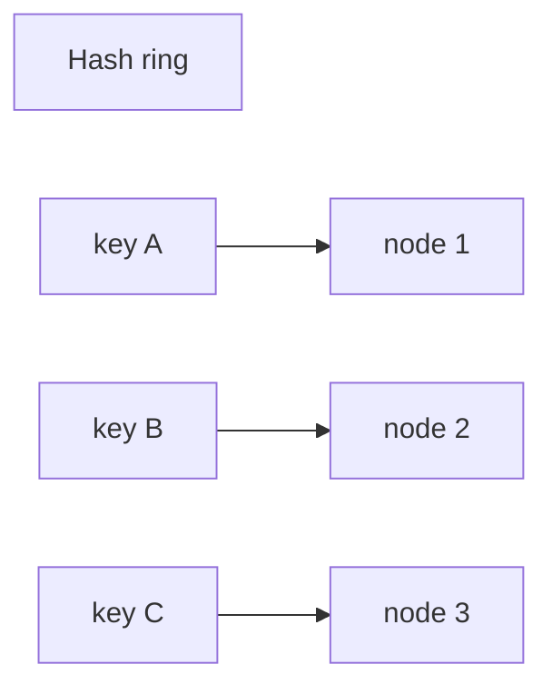

# Data Partitioning

Back to [HLD And LLD](../HLD-LLD.md).

Data partitioning splits a large dataset or workload into smaller parts so the
system can scale storage, reads, writes, and processing across multiple nodes.

Partitioning is not only a database topic. It appears in databases, Kafka,
caches, search indexes, object storage, and batch-processing systems.

## Why Partition Data?

| Problem | How partitioning helps |
|---|---|
| one node cannot store all data | split data across nodes |
| one node cannot handle all writes | distribute writes by key |
| queries scan too much data | route query to smaller partition |
| one queue consumer is too slow | parallelize by partition |
| failure blast radius is too large | isolate some data/workload |

Partitioning improves scalability, but it also introduces new problems:

- choosing the wrong partition key creates hot partitions;
- cross-partition queries become expensive;
- cross-partition transactions are harder;
- rebalancing can be operationally risky;
- global uniqueness and ordering become more complex.

## Horizontal Partitioning

Horizontal partitioning splits rows by a key.

```text
orders_0: customers A-F
orders_1: customers G-M
orders_2: customers N-Z
```

Or by hash:

```text
partition = hash(customer_id) % number_of_partitions
```

Use it when the table grows too large or write volume exceeds one node.

## Vertical Partitioning

Vertical partitioning splits columns or capabilities.

```text
user_profile: id, name, email
user_security: user_id, password_hash, mfa_secret
user_preferences: user_id, theme, locale
```

Use it when different groups of fields have different access patterns,
security needs, or storage characteristics.

## Range Partitioning

Range partitioning groups data by ordered ranges:

```text
orders_2026_01
orders_2026_02
orders_2026_03
```

Good for:

- time-series data;
- audit logs;
- old-data archival;
- queries by date range.

Risk: recent time ranges can become hot if most writes go to the newest
partition.

## Hash Partitioning

Hash partitioning spreads keys by hash value:

```text
partition = hash(order_number) % 16
```

Good for even distribution when key cardinality is high. It is less suitable
when queries need range scans.

## Directory-Based Partitioning

A lookup service maps keys to partitions:

```text
tenant-a -> shard-01
tenant-b -> shard-07
tenant-c -> shard-03
```

Good for tenant isolation and custom placement. The lookup directory becomes a
critical component and must be highly available.

## Consistent Hashing

Consistent hashing reduces key movement when nodes are added or removed. It is
commonly used in distributed caches and storage systems.



Virtual nodes improve distribution because each physical node owns many small
ranges on the ring.

## Choosing A Partition Key

Good partition keys have:

- high cardinality;
- even distribution;
- stable value;
- strong query locality;
- low cross-partition transaction need.

Bad partition keys:

| Key | Problem |
|---|---|
| status | few values, creates hot partitions |
| country | uneven traffic and storage |
| current date only | latest partition gets all writes |
| sequential ID with range sharding | newest shard becomes hot |

## Shopverse Examples

| System area | Partitioning idea |
|---|---|
| Kafka order events | key by `orderNumber` so one order's events stay ordered |
| Orders table at large scale | shard by customer or order number |
| Inventory | partition by product/warehouse if catalog becomes huge |
| Logs | partition by service/date/tenant in logging backend |
| Object storage | object keys grouped by product ID or tenant |

## Partitioning And Kafka

Kafka partitions are ordered logs. Records with the same key go to the same
partition, preserving order for that key.

```text
key = ORD-1001 -> partition 2
key = ORD-1002 -> partition 7
key = ORD-1001 -> partition 2
```

If Shopverse keys SAGA events by `orderNumber`, all events for one order can be
processed in order by a consumer group.

## Rebalancing

Rebalancing moves data or work when partitions/nodes change.

Risks:

- extra network and disk load;
- temporary latency increase;
- stale routing metadata;
- duplicated or delayed processing;
- split-brain ownership if coordination is weak.

Design for rebalancing before the system is under pressure.

## Interview Questions

<ExpandableAnswer title="Partitioning Versus Replication?">

Partitioning splits different data across nodes. Replication copies the same
data across nodes. Most large systems use both.

</ExpandableAnswer>
<ExpandableAnswer title="Sharding Versus Partitioning?">

Sharding is usually horizontal partitioning across independent database nodes.
Partitioning is the broader concept and can happen inside one database or
across many systems.

</ExpandableAnswer>
<ExpandableAnswer title="How Do You Handle A Hot Partition?">

Options:

- choose a better key;
- split the hot tenant/key;
- add write salting when ordering is not required;
- cache hot reads;
- isolate large tenants;
- rate limit abusive traffic;
- redesign the access pattern.

</ExpandableAnswer>
<ExpandableAnswer title="Why Are Cross-Shard Transactions Hard?">

They require coordination across nodes. Failures can occur after one shard
commits and before another commits. Designs often use SAGA, outbox, idempotency,
or carefully scoped distributed transactions.

</ExpandableAnswer>
## References

- [Data Partitioning Techniques in System Design - GeeksforGeeks](https://www.geeksforgeeks.org/system-design/data-partitioning-techniques/)
- [Partitioning in Distributed Systems - GeeksforGeeks](https://www.geeksforgeeks.org/system-design/partitioning-in-distributed-systems/)
