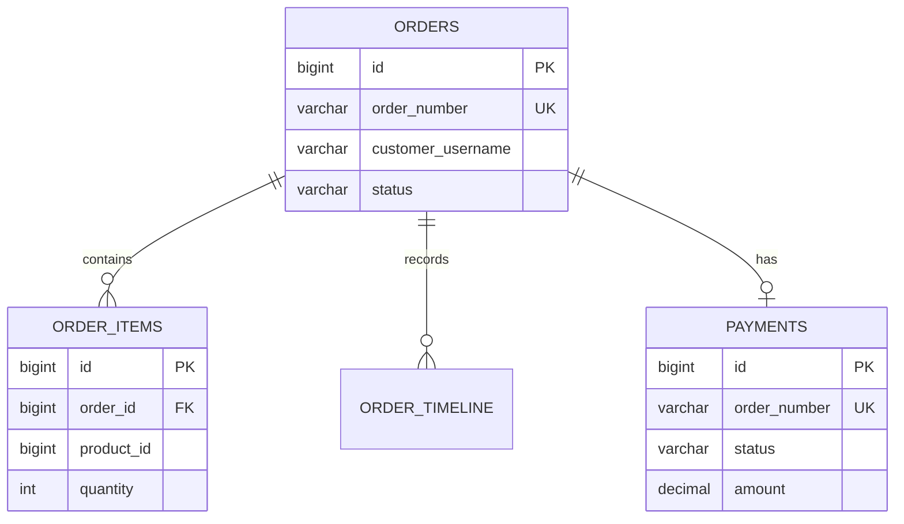

# ERD Diagrams

An Entity Relationship Diagram describes persistent data, primary keys,
foreign keys, cardinality, and important constraints.

## What An ERD Should Show

| Element | Example |
|---|---|
| Entity/table | `orders`, `order_items`, `payments` |
| Primary key | `orders.id` |
| Foreign key | `order_items.order_id -> orders.id` |
| Cardinality | one order has many items |
| Constraints | unique order number, non-null status |

## Example

## ERD Versus JPA Entity Diagram

| ERD | JPA entity diagram |
|---|---|
| database-centric | Java-object-centric |
| shows tables, keys, constraints | shows classes and relationships |
| used for migrations and query design | used for domain code design |
| should match Liquibase/Flyway | should match entity mappings |

## Production Checklist

- Every high-cardinality lookup should have an index.
- Foreign keys should match real ownership boundaries.
- Unique constraints should enforce idempotency and duplicate prevention.
- Audit fields should be explicit.
- Avoid storing unbounded JSON where relational querying is required.
