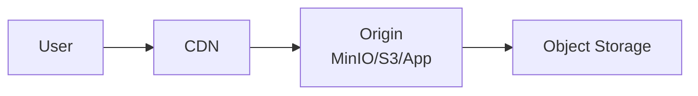
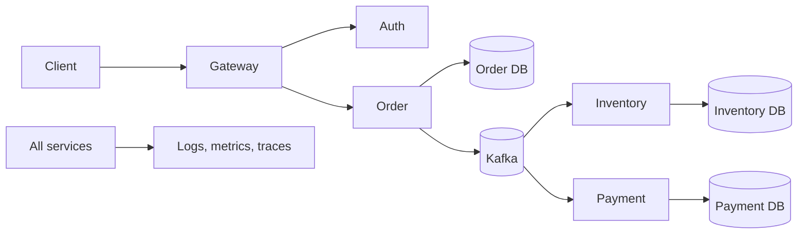

---
title: HLD Fundamentals
---

# HLD Fundamentals

HLD versus LLD, HLD contents, and an HLD example. For deeper HLD topics, use
the dedicated pages:

- [Introduction To HLD](hld/INTRODUCTION-TO-HLD.md)
- [Availability](hld/AVAILABILITY.md)
- [CAP Theorem](hld/CAP-THEOREM.md)
- [Consistency](hld/CONSISTENCY.md)
- [Content Delivery Network](hld/CONTENT-DELIVERY-NETWORK.md)

Back to [HLD And LLD](../HLD-LLD.md).

## HLD Versus LLD

| Concern | HLD | LLD |
|---|---|---|
| Audience | architects, leads, product, operations | developers and reviewers |
| Scope | whole system or major domain | one service, component, or use case |
| Focus | boundaries and trade-offs | implementation contracts |
| Diagrams | context, container, deployment, data flow | class, sequence, state, schema |
| Decisions | protocols, stores, scaling, security | methods, models, validation, algorithms |

## HLD Contents

A useful HLD normally covers:

1. goals, non-goals, assumptions, and constraints;
2. functional and non-functional requirements;
3. capacity estimates;
4. system context and service boundaries;
5. synchronous and asynchronous communication;
6. data ownership and consistency;
7. availability, scaling, and failure handling;
8. security and trust boundaries;
9. observability and operations;
10. deployment, recovery, and major trade-offs.

## HLD Design Process

Use this order in interviews and real design docs:

1. Clarify functional requirements.
2. Clarify non-functional requirements.
3. Estimate capacity and traffic.
4. Define APIs and external contracts.
5. Identify core entities and data ownership.
6. Draw the high-level architecture.
7. Choose storage, cache, queue, search, CDN, and object-storage components.
8. Define consistency and failure handling.
9. Add observability, security, deployment, and recovery.
10. Explain trade-offs and alternatives.

Do not start by drawing services. Start with requirements and constraints.

## HLD Building Blocks

| Building block | What to decide |
|---|---|
| Client/API layer | public APIs, authentication, rate limits, gateway |
| Services | business capability boundaries and ownership |
| Databases | data model, consistency, indexes, partitioning |
| Cache | cache keys, invalidation, TTL, stale-data tolerance |
| Queue/broker | event flow, ordering, retry, dead-letter handling |
| Search | indexing pipeline, freshness, query model |
| CDN/object storage | static/media delivery, caching, invalidation |
| Observability | logs, metrics, traces, dashboards, alerts |
| Deployment | scaling, rolling deploys, rollback, disaster recovery |

## Availability Design

Availability means the system continues to serve correct eligible requests. It
is not only uptime of individual servers.

Common techniques:

- multiple service instances;
- load balancers and health checks;
- database replication and failover;
- retry with timeouts and jitter;
- circuit breakers and bulkheads;
- queues for asynchronous buffering;
- graceful degradation for non-critical features;
- backups and tested restore.

For mandatory sequential dependencies, availability multiplies. If Gateway,
Order, Inventory, and Payment are all required and each is 99.9% available,
the combined path is lower than 99.9%. This is why optional work, async
processing, and failure isolation matter.

## CDN In HLD

A Content Delivery Network caches static or cacheable content near users.

Use CDN for:

- product images;
- static frontend assets;
- public documents;
- downloadable files;
- cacheable API responses when safe.

CDN design questions:

- What content is cacheable?
- What TTL is acceptable?
- How are objects invalidated?
- Are signed URLs or signed cookies needed?
- What happens if origin is down?

Shopverse product images can eventually move from direct MinIO URLs to a CDN
fronting object storage.

## HLD Example

Questions answered:

- Why is Kafka used instead of a synchronous chain?
- Which service owns each database?
- What happens when Payment is unavailable?
- How are duplicate events handled?
- How is the system scaled and monitored?

## Common HLD Interview Prompts

For each prompt, explain requirements, scale, APIs, data model, architecture,
consistency, failure handling, and trade-offs.

| Prompt | Key topics |
|---|---|
| URL shortener | key generation, redirects, cache, analytics, abuse prevention |
| Rate limiter | token bucket, distributed counters, Redis, local fallback |
| Notification system | fanout, retries, templates, preferences, provider failover |
| Chat system | WebSocket, presence, ordering, message persistence |
| News feed | fanout-on-write/read, ranking, cache, pagination |
| File storage | object storage, metadata DB, upload flow, CDN |
| Payment system | idempotency, ledger, reconciliation, provider uncertainty |
| E-commerce checkout | inventory reservation, SAGA, outbox, payment uncertainty |

## References

- [Introduction to High Level Design - GeeksforGeeks](https://www.geeksforgeeks.org/system-design/what-is-high-level-design-learn-system-design/)
- [Availability in System Design - GeeksforGeeks](https://www.geeksforgeeks.org/system-design/availability-in-system-design/)
- [Content Delivery Network in System Design - GeeksforGeeks](https://www.geeksforgeeks.org/system-design/what-is-content-delivery-networkcdn-in-system-design/)
- [Most Commonly Asked System Design Interview Questions - GeeksforGeeks](https://www.geeksforgeeks.org/system-design/most-commonly-asked-system-design-interview-problems-questions/)

