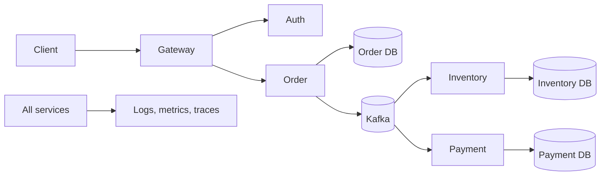

---
title: HLD Fundamentals
---

# HLD Fundamentals

HLD versus LLD, HLD contents, and an HLD example.

Back to [HLD And LLD](../HLD-LLD.md).

## HLD Versus LLD

| Concern | HLD | LLD |
|---|---|---|
| Audience | architects, leads, product, operations | developers and reviewers |
| Scope | whole system or major domain | one service, component, or use case |
| Focus | boundaries and trade-offs | implementation contracts |
| Diagrams | context, container, deployment, data flow | class, sequence, state, schema |
| Decisions | protocols, stores, scaling, security | methods, models, validation, algorithms |

## HLD Contents

A useful HLD normally covers:

1. goals, non-goals, assumptions, and constraints;
2. functional and non-functional requirements;
3. capacity estimates;
4. system context and service boundaries;
5. synchronous and asynchronous communication;
6. data ownership and consistency;
7. availability, scaling, and failure handling;
8. security and trust boundaries;
9. observability and operations;
10. deployment, recovery, and major trade-offs.

## HLD Example

Questions answered:

- Why is Kafka used instead of a synchronous chain?
- Which service owns each database?
- What happens when Payment is unavailable?
- How are duplicate events handled?
- How is the system scaled and monitored?

