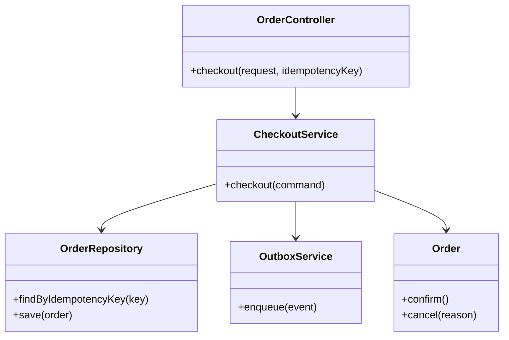
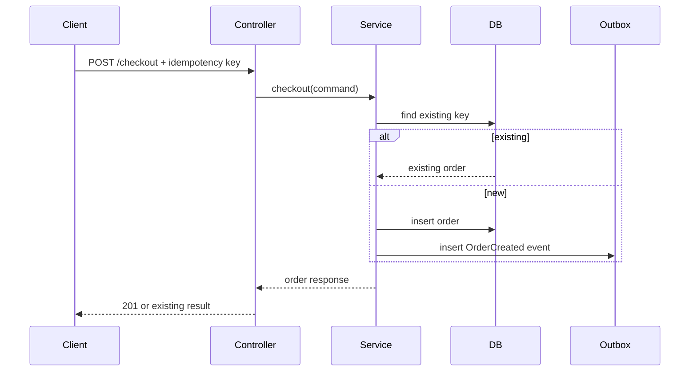
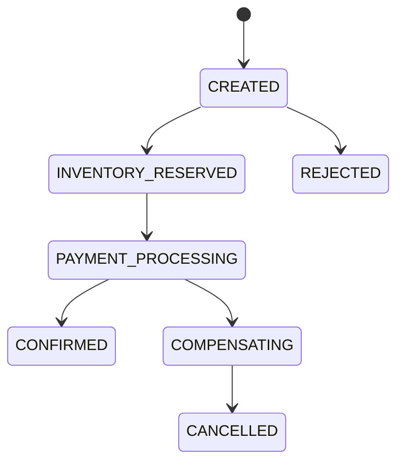

---
title: LLD Examples And Diagrams
---

# LLD Examples And Diagrams

LLD contents, class example, sequence example, and state diagram example.

Back to [HLD And LLD](../HLD-LLD.md).

## LLD Contents

LLD commonly covers:

1. API request and response contracts;
2. class and interface responsibilities;
3. database tables, keys, indexes, and constraints;
4. event schemas;
5. sequence and state diagrams;
6. validation and error handling;
7. transaction and locking boundaries;
8. algorithms and data structures;
9. test cases and extension points.

## LLD Class Example

## LLD Sequence Example

## State Diagram Example

State transitions should identify:

- allowed source and target state;
- triggering command/event;
- transaction boundary;
- idempotent duplicate behavior;
- failure and compensation.

