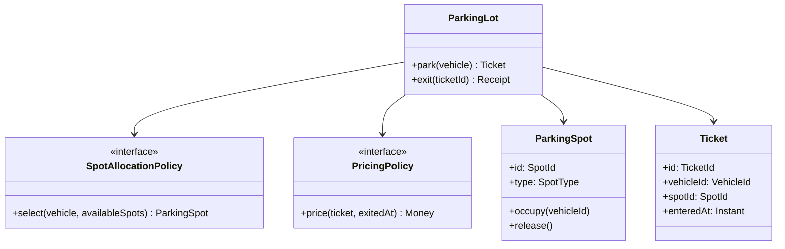

# Low-Level Design Interview Workbook

Low-level design turns an architectural boundary into implementation-ready
contracts, objects, state transitions, persistence rules, and tests. A good LLD
answer shows behavior and invariants; a class diagram alone is not enough.

## Repeatable LLD Method

1. Clarify actors, commands, queries, constraints, and out-of-scope behavior.
2. State the invariants and the component that owns each invariant.
3. Identify entities, values, policies, repositories, and external ports.
4. Assign responsibilities; avoid domain-anemic god services.
5. Define APIs and error contracts before implementation details.
6. Draw the most important class, sequence, and state diagrams.
7. Define transaction, locking, idempotency, and retry boundaries.
8. Walk through success, duplicate, invalid, concurrent, and dependency-failure cases.
9. Explain one likely change and show how the design absorbs it.

## 1. LLD And Object Design Foundations

| # | Question | Strong answer checkpoints |
|---:|---|---|
| 1 | What does LLD produce? | implementable modules, contracts, classes, schemas, flows, state rules, error behavior, and tests |
| 2 | How does LLD differ from HLD? | HLD selects system boundaries and infrastructure; LLD defines behavior inside a boundary; decisions must remain consistent across both |
| 3 | What makes a class cohesive? | one focused reason to change, related state and behavior, explicit invariant ownership |
| 4 | Composition or inheritance? | prefer composition for independent behavior and runtime variation; inherit only for a true substitutable relationship |
| 5 | Explain encapsulation. | protect invariants behind behavior; do not merely make fields private and expose every setter |
| 6 | Explain abstraction. | expose essential capability while hiding replaceable mechanics; abstraction must have more than one credible implementation or boundary value |
| 7 | Explain polymorphism. | callers depend on a contract and implementations remain substitutable without type checks |
| 8 | Association, aggregation, or composition? | association is a relationship; aggregation is independently lived part-whole; composition gives the whole lifecycle ownership |
| 9 | Entity versus value object? | entity has continuity and identity; value object is immutable and equal by value |
| 10 | What is an aggregate? | consistency boundary with one entry root; internal updates preserve invariants atomically |

## 2. SOLID, Modularity, And Contracts

| # | Question | Strong answer checkpoints |
|---:|---|---|
| 11 | Apply single responsibility. | separate independent reasons to change, not every method into a new class |
| 12 | Apply open/closed. | stable contract plus replaceable strategies; avoid speculative extension points |
| 13 | Apply Liskov substitution. | preserve preconditions, postconditions, invariants, and failure semantics |
| 14 | Apply interface segregation. | capability-focused ports prevent clients from depending on unused operations |
| 15 | Apply dependency inversion. | policy owns an inward-facing port; infrastructure implements it at the edge |
| 16 | What is high cohesion and low coupling? | related behavior stays together; dependencies are few, intentional, and contract-based |
| 17 | How should modules communicate? | narrow public API, hidden internals, no cyclic dependencies, explicit sync/event semantics |
| 18 | What belongs in an interface? | stable behavior required by clients, not every public method of an implementation |
| 19 | How do you evolve an API safely? | additive compatibility, defaults/versioning where necessary, consumer tests, planned removal |
| 20 | DTO, domain object, and persistence entity? | transport, business behavior, and storage mapping have different change pressures; map at boundaries when coupling would leak |

## 3. Patterns And Extensibility

| # | Question | Strong answer checkpoints |
|---:|---|---|
| 21 | When should Factory be used? | creation or implementation choice is variable and callers should not know concrete types |
| 22 | When should Builder be used? | complex immutable construction, optional fields, readable validation; avoid for simple records |
| 23 | Strategy versus State? | strategy is selected policy; state is lifecycle-dependent behavior with legal transitions |
| 24 | Decorator versus Proxy? | decorator stacks responsibility; proxy controls access/lifecycle while preserving the target contract |
| 25 | Observer versus durable messaging? | observer is usually in-process and ephemeral; broker adds durability, replay, and distributed failure semantics |
| 26 | When does Chain of Responsibility fit? | ordered, independently extensible handlers with explicit continuation and terminal behavior |
| 27 | When does Command fit? | actions need queuing, audit, retry, composition, or undo metadata |
| 28 | What is pattern overuse? | adding indirection without a demonstrated variation, invariant, or coupling problem |

See the [Pattern Selection Cheat Sheet](../../development/design-patterns/DESIGN-PATTERN-SELECTION-CHEATSHEET.md)
for the complete GoF comparison.

## 4. Data Structures, Persistence, And APIs

| # | Question | Strong answer checkpoints |
|---:|---|---|
| 29 | How do you select a data structure? | start from lookup, insertion, deletion, ordering, traversal, memory, and concurrency requirements |
| 30 | Why and when does an index help? | it avoids scans for matching access paths but adds storage, write amplification, and maintenance cost |
| 31 | What makes a good relational model? | keys, normalized ownership, constraints, appropriate types, access-path indexes, intentional denormalization |
| 32 | How do you model many-to-many relationships? | association table/entity, unique constraints, ownership, lifecycle, and query indexes |
| 33 | Repository versus DAO? | repository exposes domain collection semantics; DAO is persistence-oriented data access; avoid redundant layers without distinct roles |
| 34 | How do you design a REST contract? | resource-oriented URI, HTTP semantics, validation, error model, idempotency, pagination, versioning |
| 35 | How do you design pagination? | offset for small/stable traversal; keyset for deep, mutable, ordered data; define cursor and consistency semantics |
| 36 | How do you prevent duplicate commands? | idempotency key, unique constraint, stored outcome, atomic claim, deterministic retry response |
| 37 | How do you design caching in LLD? | key, ownership, TTL, invalidation, stampede control, consistency, failure fallback, observability |

## 5. Concurrency, Reliability, And Security

| # | Question | Strong answer checkpoints |
|---:|---|---|
| 38 | Why is concurrency control needed? | protect invariants from lost updates, races, dirty decisions, duplicate ownership, and visibility problems |
| 39 | Optimistic or pessimistic locking? | optimistic for low contention with retry; pessimistic for short, highly contended critical sections; measure lock cost |
| 40 | How do you avoid deadlock? | consistent lock order, short transactions, bounded waits, no remote calls while holding locks, retry aborted work |
| 41 | Thread safety of a service? | identify shared mutable state, publication/visibility, atomic compound actions, confinement or synchronization |
| 42 | How should errors be modeled? | distinguish validation, conflict, not-found, dependency, timeout, and internal failures; preserve stable client semantics |
| 43 | Retry design? | retry only transient and idempotent work, use backoff/jitter, deadlines, attempt limits, and retry metrics |
| 44 | Authentication versus authorization? | identity proof versus permission decision; enforce authorization at the owning resource boundary |
| 45 | How do you protect sensitive data? | minimize collection, classify, encrypt in transit/at rest, restrict access, redact logs, rotate secrets, audit |
| 46 | How do you design audit history? | actor, action, resource, outcome, time, correlation; append-only/tamper evidence; retention and privacy controls |

## 6. Testing And Review

| # | Question | Strong answer checkpoints |
|---:|---|---|
| 47 | What should unit tests prove? | domain invariants, state transitions, policy branches, boundary errors; deterministic and implementation-insensitive |
| 48 | What should integration tests prove? | mapping, constraints, transactions, serialization, external adapters, and real concurrency behavior |
| 49 | How do you test extensibility? | contract tests across implementations and one change scenario that does not modify stable callers |
| 50 | What should an LLD review check? | responsibility, invariant ownership, coupling, APIs, data, concurrency, failure, security, operability, and testability |

## Applied Design Exercises

Each exercise must produce requirements, invariants, a class diagram, one critical
sequence, a state model where applicable, APIs, concurrency decisions, and tests.

| Exercise | Core design pressures | Required failure/concurrency discussion |
|---|---|---|
| Parking lot | spot allocation, vehicle types, ticket, pricing, payment | simultaneous allocation, lost ticket, payment failure |
| Vending machine | inventory, denominations, selection, dispense state | exact change, jam, concurrent maintenance |
| Elevator controller | requests, scheduling, car state, safety | conflicting requests, overload, door/sensor fault |
| ATM | authentication, withdrawal, dispenser chain, ledger | insufficient cash, partial dispense, duplicate debit |
| Library | copies, loans, holds, fines | competing holds, overdue return, lost copy |
| Meeting scheduler | calendars, recurrence, rooms, invitations | concurrent booking, time zones, update fan-out |
| Notification library | templates, channels, routing, provider adapters | retries, deduplication, provider outage |
| In-memory cache | eviction, expiration, concurrency, statistics | race on load, stampede, capacity pressure |
| Rate limiter | policy, key, algorithm, clock, storage port | concurrent admission, distributed state, fail-open/closed |
| Checkout | order state, inventory, payment, idempotency, outbox | duplicate command, timeout, compensation, reconciliation |

## Worked Exercise: Parking Allocation Core

The key invariant is that one spot has at most one active ticket. Enforce it at
the authoritative storage boundary with an atomic claim or unique active-spot
constraint; an in-memory `isAvailable` check is insufficient under concurrency.

## Interview Scoring Rubric

| Area | Weight | Evidence |
|---|---:|---|
| requirements and invariants | 20 | ambiguity resolved; invariant owner named |
| responsibility and object model | 20 | cohesive types and explicit relationships |
| contracts and flows | 15 | clear API, errors, and critical sequence |
| data and concurrency | 15 | keys, constraints, transactions, locking/idempotency |
| extensibility and patterns | 10 | justified variation points without pattern inflation |
| failures and security | 10 | unhappy paths, authorization, sensitive data |
| tests and communication | 10 | useful cases and coherent trade-off explanation |

## Related Guides

- [LLD Examples And Diagrams](./LLD-EXAMPLES-DIAGRAMS.md)
- [UML Diagrams](./UML-DIAGRAMS.md)
- [Database LLD Design Process](./DATABASE-LLD-DESIGN-PROCESS.md)
- [ERD Diagrams](./ERD-DIAGRAMS.md)
- [HLD Fundamentals](./HLD-FUNDAMENTALS.md)

## References

- [System Design Interview Questions And Answers - GeeksforGeeks](https://www.geeksforgeeks.org/system-design/top-low-level-system-designlld-interview-questions-2024/)
- [UML Diagrams - GeeksforGeeks](https://www.geeksforgeeks.org/system-design/unified-modeling-language-uml-introduction/)
- [Design Patterns Cheat Sheet - GeeksforGeeks](https://www.geeksforgeeks.org/system-design/design-patterns-cheat-sheet-when-to-use-which-design-pattern/)
