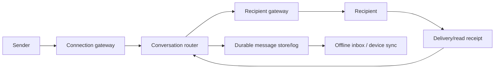
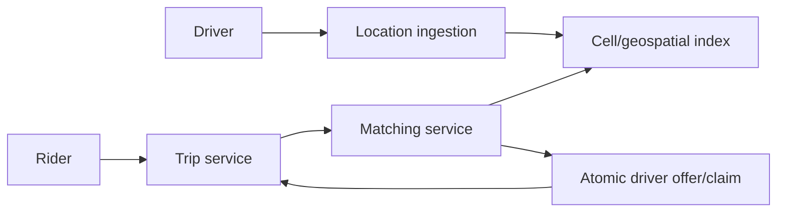
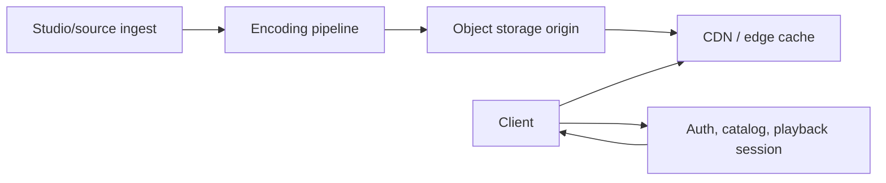

# Sixteen HLD Case Studies

These are educational reference architectures, not claims about each company's
private current implementation. Start from the product behavior and constraints;
multiple valid designs exist.


*Study map supplied by the project owner. Source:
[LinkedIn 16-system-design lessons post](https://www.linkedin.com/posts/thriverashish_16-%F0%9D%90%9C%F0%9D%90%A8%F0%9D%90%A6%F0%9D%90%A9%F0%9D%90%9A%F0%9D%90%A7%F0%9D%90%A2%F0%9D%90%9E%F0%9D%90%AC-16-%F0%9D%90%AC%F0%9D%90%B2%F0%9D%90%AC%F0%9D%90%AD%F0%9D%90%9E%F0%9D%90%A6-%F0%9D%90%9D-activity-7481208038855704576-AxgU/).*

## Case-Study Matrix

| Product archetype | Dominant problem | Key components | Deep question |
|---|---|---|---|
| WhatsApp | real-time messaging | persistent connections, conversation partitioning, durable inbox, presence | how are ordering, offline delivery, and multi-device state handled? |
| Netflix | video streaming | object storage, transcoding, metadata, CDN, adaptive bitrate | how does playback survive network variation and regional failure? |
| Uber | ride matching | geospatial index, driver location stream, matching, trip state | how are rapidly changing nearby drivers assigned without double matching? |
| Amazon | commerce | catalog/search, cart, order, inventory, payment, recommendation | where are transaction boundaries and how is overselling prevented? |
| Instagram | home feed | media storage/CDN, social graph, fan-out, ranking | fan-out on write, read, or hybrid for celebrity accounts? |
| YouTube | upload and processing | multipart upload, object storage, workflow, transcode, CDN | how are resumability, processing state, and derived renditions modeled? |
| Spotify | music streaming | catalog, playlists, rights, CDN, recommendations, offline sync | how are playlist conflicts and regional entitlements reconciled? |
| Stripe | payment infrastructure | idempotent API, ledger, provider adapters, webhooks, reconciliation | what is the authoritative financial state after an ambiguous timeout? |
| Google Maps | geospatial search/navigation | tiles, spatial index, routing graph, traffic stream | how are route computation and continuously changing traffic combined? |
| food delivery | dispatch | restaurant/catalog, order state, courier location, assignment | how are ETA, batching, fairness, and reassignment handled? |
| Google Search | web search | crawl frontier, deduplication, inverted index, ranking, serving | how do fresh documents reach shards without destabilizing latency? |
| Dropbox | file sync | chunking, content hashes, object storage, metadata, change log | how are conflicts, versioning, deduplication, and large syncs handled? |
| Gmail | email | SMTP ingress/egress, mailbox store, threading, search, spam pipeline | how are delivery, deduplication, quotas, and searchable indexing separated? |
| X/Twitter | timeline | post store, social graph, fan-out, ranking, cache | how is high-fan-out traffic isolated from ordinary accounts? |
| Discord | chat and voice | gateway connections, channel partitioning, durable messages, media plane | how are presence, permissions, ordered chat, and low-latency voice separated? |
| Zoom | video conferencing | signaling, media relays/SFU, regional placement, recording | how does the control plane place sessions while the media plane scales? |

## One Reusable HLD Template

For every case:

```text
1. Functional requirements and exclusions
2. Scale estimates and traffic shape
3. Consistency, latency, availability, RTO/RPO, security
4. APIs/events and identifiers
5. Data model and ownership
6. High-level components and critical paths
7. Partition key, cache, replication, and async processing
8. Failure handling, retries, idempotency, and reconciliation
9. Hotspot and bottleneck analysis
10. Alternatives, trade-offs, and evolution triggers
```

## Worked Example: WhatsApp-Like Messaging



Partition by a stable conversation identifier to preserve per-conversation
ordering while scaling different conversations independently. Assign a message
ID before retry, persist before acknowledging according to the durability SLO,
and make device delivery/receipts idempotent. Presence can be soft state with
TTL; message history cannot. End-to-end encryption changes server capabilities,
search, moderation, device-key management, and recovery.

## Worked Example: Uber-Like Matching



Location is high-volume and short-lived; trip and payment state is durable.
Nearby search returns candidates, but an atomic claim/state transition decides
the winner. The system needs expiring offers, retries with stable trip IDs,
reassignment, location privacy, regional isolation, and surge/fairness policy.

## Worked Example: Netflix-Like Streaming



Separate control-plane metadata, authorization, and recommendations from the
high-throughput media data plane. Precompute multiple bitrates/codecs, cache at
the edge, use manifests for adaptive playback, and protect signed playback
authorization. Design origin shielding, regional failover, cache misses, and
content-rights enforcement.

## What To Learn Across All Sixteen

- strong consistency belongs at scarce allocation, money, identity, and permission boundaries;
- feeds, search, analytics, presence, and recommendations commonly use derived eventual views;
- partition keys encode the scaling model and can create catastrophic hot spots;
- a CDN/object store handles bytes differently from transactional metadata;
- retries require idempotency and ambiguous external outcomes require reconciliation;
- real-time products separate connection/signaling state from durable business state;
- the best design states its assumptions and failure behavior, not only components.
