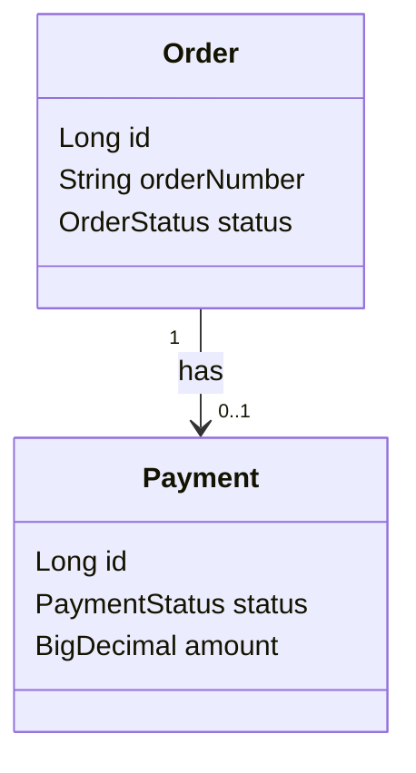
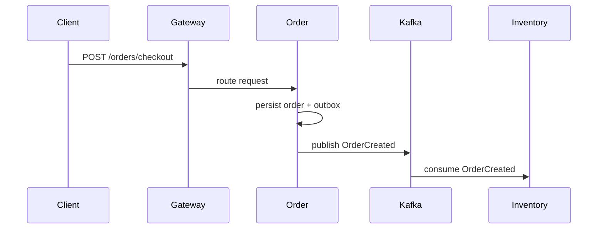
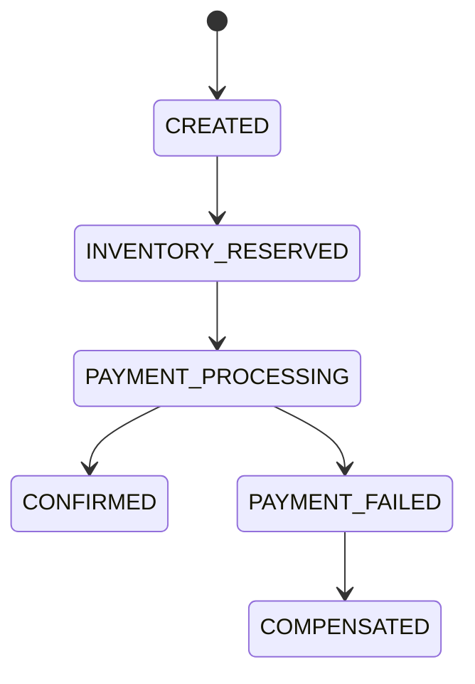

# UML Diagrams

UML diagrams describe structure and behavior at a level that implementation
teams can discuss before code exists.

## Common UML Diagram Types

| Diagram | Use it for |
|---|---|
| Class diagram | classes, fields, methods, inheritance, associations |
| Sequence diagram | request flow over time |
| State diagram | lifecycle transitions |
| Activity diagram | workflow and decisions |
| Component diagram | high-level modules and dependencies |

## When To Use Which UML Diagram

| Situation | Better diagram |
|---|---|
| explaining classes and relationships | class diagram |
| explaining API/event flow | sequence diagram |
| explaining order/payment lifecycle | state diagram |
| explaining business workflow decisions | activity diagram |
| explaining deployable modules | component diagram |
| explaining runtime nodes | deployment diagram |

UML is useful only when the diagram answers a question. Do not draw every
possible relationship. Draw the relationships that affect implementation or
review decisions.

## Class Diagram Example

Use class diagrams for LLD discussion. Keep them smaller than the whole
application; large class diagrams become unreadable quickly.

## Sequence Diagram Example

Use sequence diagrams when the order of calls, retries, or events matters.

## State Diagram Example

Use state diagrams for SAGA, payment, inventory reservation, ticketing,
workflow, and approval problems.

## Practical Rules

| Do | Avoid |
|---|---|
| Draw one flow or bounded context per diagram | Put the entire system into one diagram |
| Name important messages and states | Draw unlabeled arrows |
| Keep diagrams versioned with code/docs | Keep stale diagrams as authority |
| Use diagrams to explain trade-offs | Use diagrams as decoration |

## UML In LLD Interviews

<ExpandableAnswer title="What should an architect explain about UML Diagrams?">

For **UML Diagrams**, a strong answer starts with the runtime responsibility and the invariant that must remain true. It then walks through one Shopverse request or event, names the important boundary, and explains the failure behavior rather than describing only the happy path. Close with the trade-off, the production signal that verifies the design, and the condition that would justify a different approach. This structure demonstrates practical judgment without memorizing isolated definitions.

</ExpandableAnswer>

For LLD, a strong answer usually includes:

1. core classes and interfaces;
2. important relationships;
3. method signatures for key behavior;
4. state transitions if lifecycle matters;
5. sequence diagram for one important operation;
6. extension points and design patterns used;
7. edge cases and concurrency concerns.

Example prompts:

| Prompt | Useful diagrams |
|---|---|
| parking lot | class, sequence, state |
| ATM | class, chain-of-responsibility sequence, state |
| elevator | class, state, sequence |
| rate limiter | class, sequence, component |
| notification system | class, sequence, component |

## References

- [Unified Modeling Language Introduction - GeeksforGeeks](https://www.geeksforgeeks.org/system-design/unified-modeling-language-uml-introduction/)
