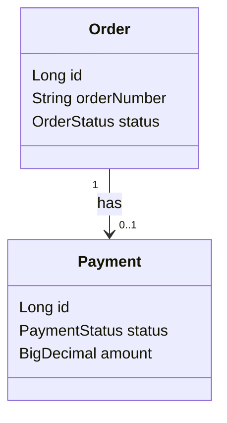
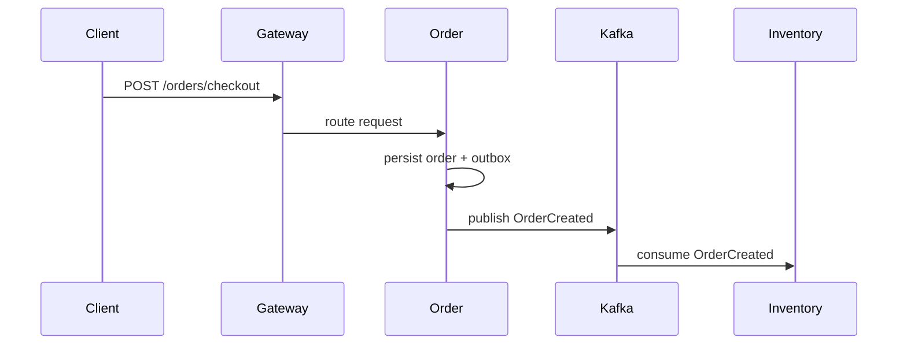
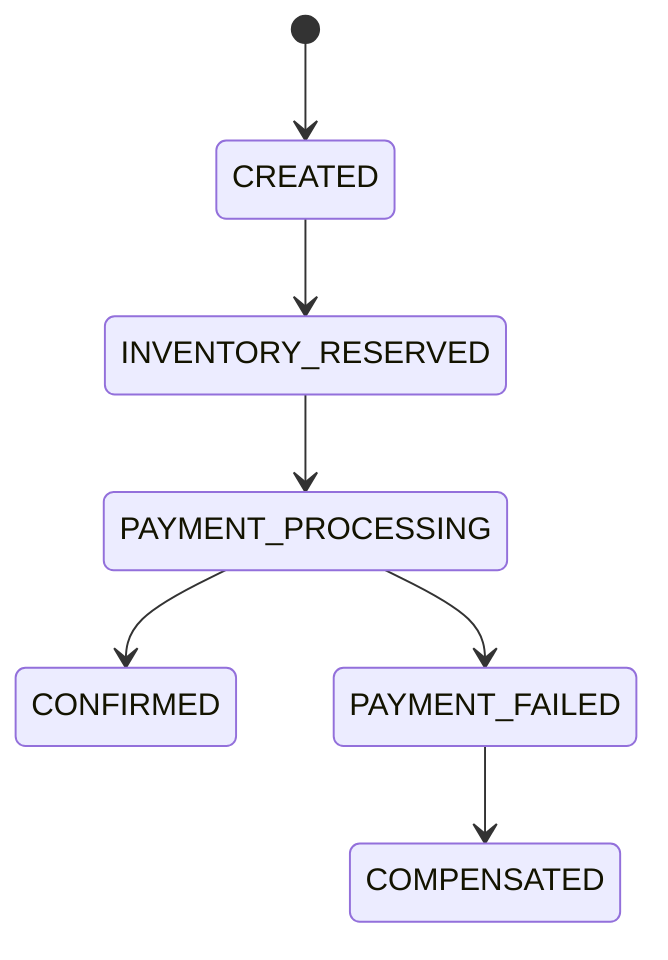
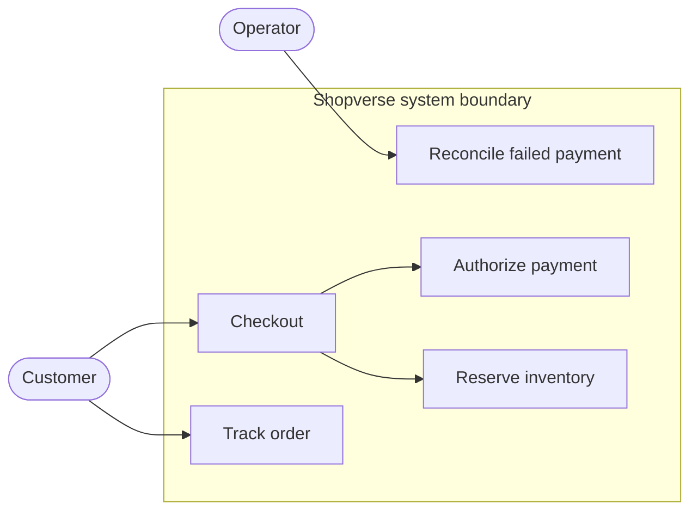
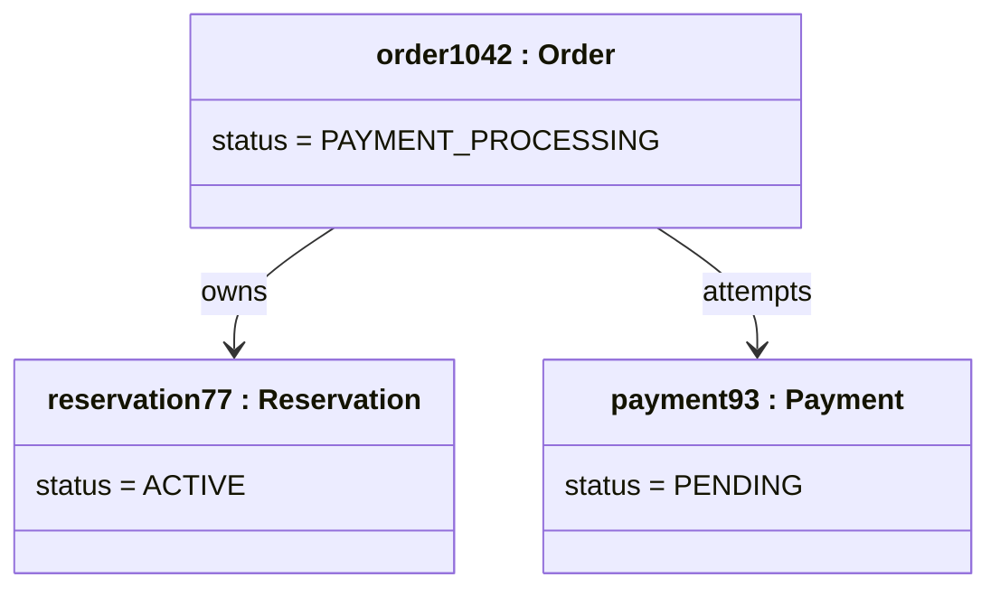
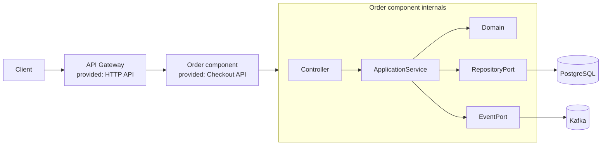
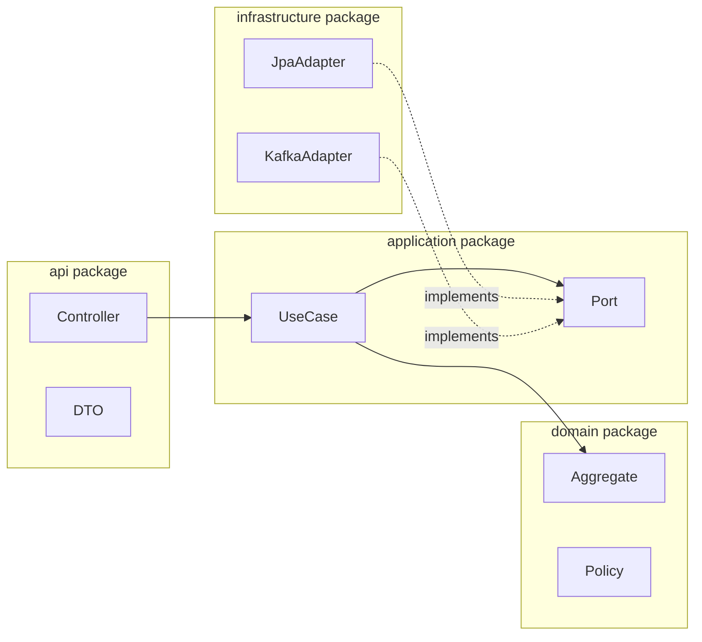
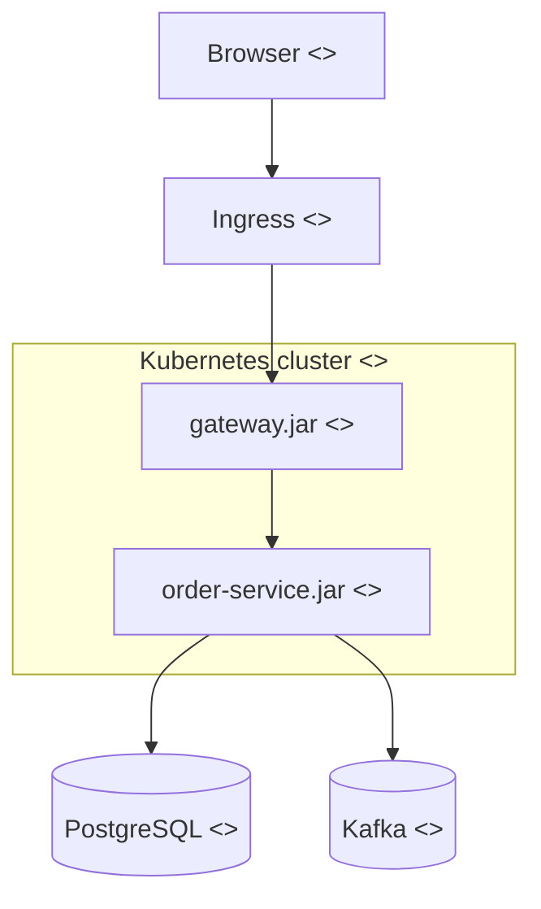

# UML Diagrams

UML diagrams describe structure and behavior at a level that implementation
teams can discuss before code exists.

## UML Diagram Taxonomy

UML 2 groups diagrams into **structure diagrams**, which describe the static
shape of a system, and **behavior diagrams**, which describe behavior over time.
Sequence, communication, timing, and interaction-overview diagrams are the four
specialized interaction diagrams within the behavior group.

### Structure Diagrams

| Diagram | Use it for | Shopverse example |
|---|---|---|
| Class | types, attributes, operations, inheritance, and associations | checkout domain model |
| Object | concrete instances and links at one moment | one order, payment, and reservation snapshot |
| Component | replaceable modules, provided/required interfaces, dependencies | gateway, services, Kafka, and platform starters |
| Composite structure | parts, ports, and connectors inside one classifier | internals of the order component |
| Package | namespaces, layers, and dependency direction | domain, application, adapter, and configuration packages |
| Deployment | runtime nodes, artifacts, networks, and placement | containers, Kubernetes nodes, databases, and brokers |
| Profile | domain-specific stereotypes and tagged values extending UML | `service`, `pii`, or `critical` modeling conventions |

### Behavior Diagrams

| Diagram | Use it for | Shopverse example |
|---|---|---|
| Use case | actor goals and the system boundary | customer checkout and operator recovery |
| Activity | workflow, branching, parallel work, and responsibility lanes | checkout or refund workflow |
| State machine | legal states, events, guards, and transitions | order, payment, or reservation lifecycle |
| Sequence | time-ordered messages between lifelines | synchronous request plus asynchronous SAGA events |
| Communication | object links and numbered messages, emphasizing topology | collaborators participating in checkout |
| Timing | state/value changes against precise time constraints | reservation TTL and payment deadline |
| Interaction overview | high-level control flow coordinating other interactions | checkout success, rejection, and compensation sequences |

## When To Use Which UML Diagram

| Situation | Better diagram |
|---|---|
| explaining classes and relationships | class diagram |
| explaining API/event flow | sequence diagram |
| explaining order/payment lifecycle | state diagram |
| explaining business workflow decisions | activity diagram |
| explaining deployable modules | component diagram |
| explaining runtime nodes | deployment diagram |
| showing one concrete runtime snapshot | object diagram |
| showing package/layer dependency rules | package diagram |
| showing actors and system goals | use-case diagram |
| emphasizing collaborator topology | communication diagram |
| showing deadlines or value changes against time | timing diagram |
| composing several complex sequences | interaction-overview diagram |

UML is useful only when the diagram answers a question. Do not draw every
possible relationship. Draw the relationships that affect implementation or
review decisions.

## Class Diagram Example

Use class diagrams for LLD discussion. Keep them smaller than the whole
application; large class diagrams become unreadable quickly.

## Sequence Diagram Example

Use sequence diagrams when the order of calls, retries, or events matters.

## State Diagram Example

Use state diagrams for SAGA, payment, inventory reservation, ticketing,
workflow, and approval problems.

## Use-Case Diagram Example

Use-case diagrams define actor goals and scope. They do not describe internal
classes or the precise ordering of messages. Record preconditions, success
outcome, alternate flows, and authorization outside the picture when necessary.

## Object Diagram Example

An object diagram is a concrete snapshot of class instances. It is particularly
useful for testing multiplicity and explaining a defect involving actual state.

## Component And Composite-Structure Diagrams

A component diagram treats the component as a replaceable unit and emphasizes
interfaces. A composite-structure diagram opens one classifier and shows its
parts, ports, and connectors. Do not use either as an informal cloud inventory.

## Package Diagram Example

Use package diagrams to expose cycles and enforce dependency direction. A clean
or hexagonal design keeps the domain independent of framework adapters.

## Deployment Diagram Example

Deployment diagrams answer where artifacts run and how nodes communicate. Label
trust boundaries, protocols, zones, replicas, and stateful dependencies when
those details affect availability or security.

## Communication, Timing, And Interaction Overview

| Diagram | Notation focus | When it is better than a sequence diagram |
|---|---|---|
| Communication | linked objects with numbered messages such as `1`, `1.1`, `2` | object topology matters more than vertical time |
| Timing | lifelines plotted against a time axis with duration constraints | deadlines, TTLs, polling, or signal transitions are the subject |
| Interaction overview | activity-style decisions whose nodes invoke interactions | several sequences must be composed into one end-to-end control flow |

For a reservation, a timing diagram should show `ACTIVE` from creation until
`expiresAt`, a guarded transition to `CLAIMED`, and the late-payment condition.
An interaction overview can route among `CheckoutSuccess`, `InventoryRejected`,
`PaymentFailed`, and `Compensation` sequences without crowding one diagram.

## UML Relationship And Message Notation

| Notation | Meaning | Review question |
|---|---|---|
| solid association | objects know or reference one another | is direction/navigability necessary? |
| hollow diamond aggregation | weak whole-part relationship | do parts actually live independently? |
| filled diamond composition | whole owns part lifecycle | is deletion/lifecycle ownership true? |
| hollow triangle generalization | subtype inherits from base type | is the subtype substitutable? |
| dashed hollow triangle realization | class implements an interface | does the interface belong to its clients? |
| solid sequence arrow | synchronous call | what is the deadline and failure result? |
| open/dashed sequence arrow | asynchronous message or return | are delivery and ordering semantics explicit? |

## Profile Diagrams

A UML profile adapts UML without changing its metamodel. Define stereotypes only
when a team needs repeatable modeling semantics, for example:

| Stereotype | Applies to | Tagged values |
|---|---|---|
| `service` | component | owner, SLO, data classification |
| `critical` | component or interaction | RTO, RPO, fallback |
| `pii` | class, attribute, or datastore | retention, encryption, access policy |

Profiles are governance tools, not a substitute for architecture decisions or
machine-enforced policy.

## Practical Rules

| Do | Avoid |
|---|---|
| Draw one flow or bounded context per diagram | Put the entire system into one diagram |
| Name important messages and states | Draw unlabeled arrows |
| Keep diagrams versioned with code/docs | Keep stale diagrams as authority |
| Use diagrams to explain trade-offs | Use diagrams as decoration |

## UML In LLD Interviews

<ExpandableAnswer title="What should an architect explain about UML Diagrams?">

For **UML Diagrams**, a strong answer starts with the runtime responsibility and the invariant that must remain true. It then walks through one Shopverse request or event, names the important boundary, and explains the failure behavior rather than describing only the happy path. Close with the trade-off, the production signal that verifies the design, and the condition that would justify a different approach. This structure demonstrates practical judgment without memorizing isolated definitions.

</ExpandableAnswer>

For LLD, a strong answer usually includes:

1. core classes and interfaces;
2. important relationships;
3. method signatures for key behavior;
4. state transitions if lifecycle matters;
5. sequence diagram for one important operation;
6. extension points and design patterns used;
7. edge cases and concurrency concerns.

Example prompts:

| Prompt | Useful diagrams |
|---|---|
| parking lot | class, sequence, state |
| ATM | class, chain-of-responsibility sequence, state |
| elevator | class, state, sequence |
| rate limiter | class, sequence, component |
| notification system | class, sequence, component |

## References

- [Unified Modeling Language Introduction - GeeksforGeeks](https://www.geeksforgeeks.org/system-design/unified-modeling-language-uml-introduction/)
