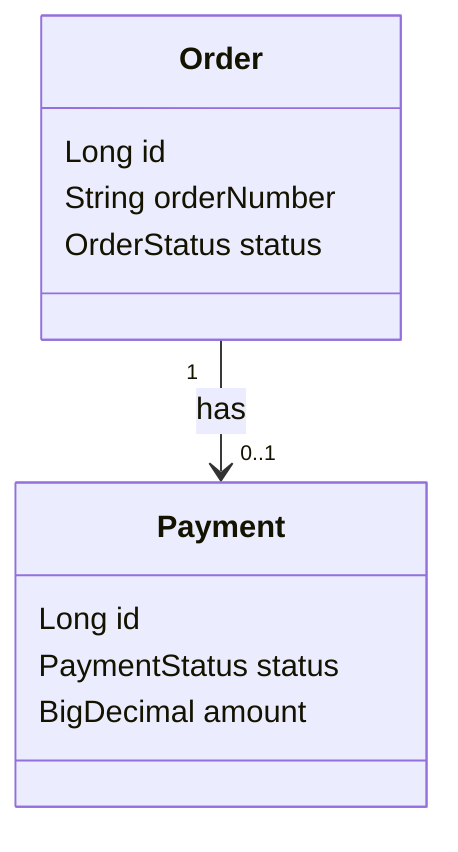
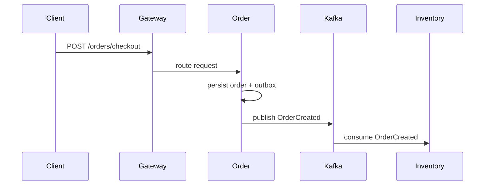
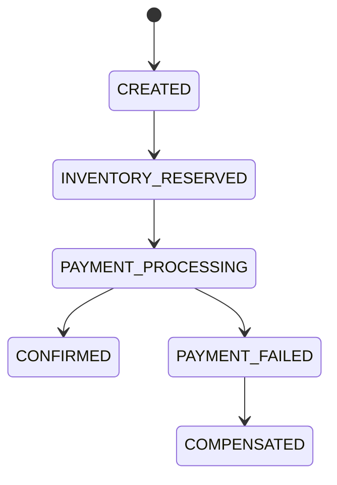

# UML Diagrams

UML diagrams describe structure and behavior at a level that implementation
teams can discuss before code exists.

## Common UML Diagram Types

| Diagram | Use it for |
|---|---|
| Class diagram | classes, fields, methods, inheritance, associations |
| Sequence diagram | request flow over time |
| State diagram | lifecycle transitions |
| Activity diagram | workflow and decisions |
| Component diagram | high-level modules and dependencies |

## Class Diagram Example

Use class diagrams for LLD discussion. Keep them smaller than the whole
application; large class diagrams become unreadable quickly.

## Sequence Diagram Example

Use sequence diagrams when the order of calls, retries, or events matters.

## State Diagram Example

Use state diagrams for SAGA, payment, inventory reservation, ticketing,
workflow, and approval problems.

## Practical Rules

| Do | Avoid |
|---|---|
| Draw one flow or bounded context per diagram | Put the entire system into one diagram |
| Name important messages and states | Draw unlabeled arrows |
| Keep diagrams versioned with code/docs | Keep stale diagrams as authority |
| Use diagrams to explain trade-offs | Use diagrams as decoration |
