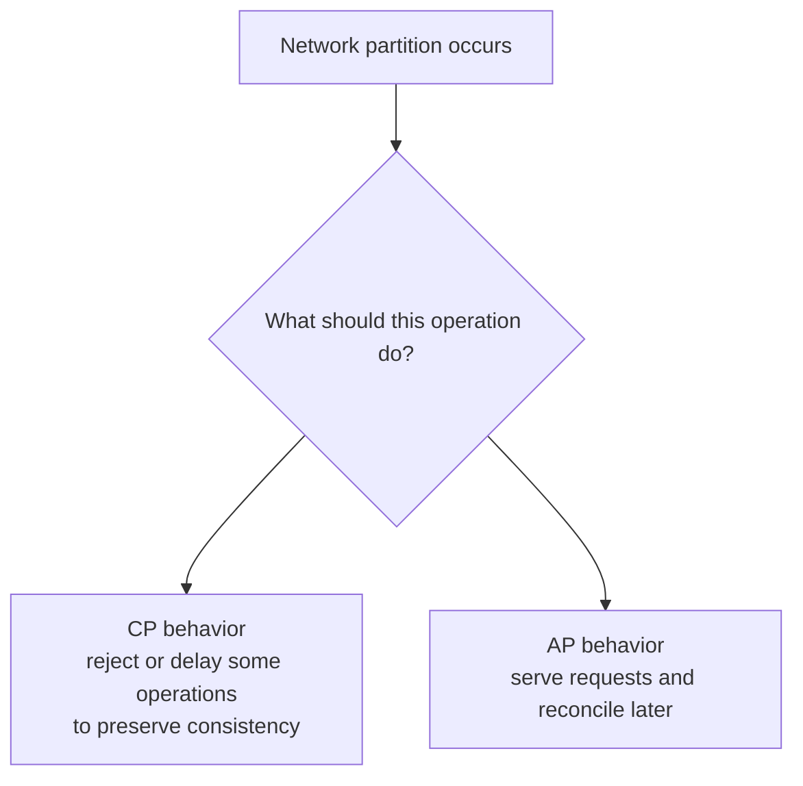

# CAP Theorem

CAP explains a core trade-off in distributed data systems during a network
partition.

During a partition, a distributed system must choose between:

- **Consistency:** return the latest correct value or fail the operation;
- **Availability:** return a response from a non-failed node, even if stale;
- **Partition tolerance:** continue operating despite network communication
  delays or failures.

In real distributed systems, partitions can happen. So the practical choice is
usually **Consistency versus Availability during a partition**.

## CAP Diagram



## CP Behavior

CP systems prioritize correctness during a partition. They may reject or delay
requests when they cannot prove a safe answer.

Use CP behavior for:

- bank balance updates;
- inventory reservation for the last item;
- unique username creation;
- payment ledger writes;
- distributed lock ownership.

Shopverse example:

```text
Only one customer can reserve the last available product unit.
If consistency cannot be guaranteed, reject/retry rather than oversell.
```

## AP Behavior

AP systems prioritize responding during a partition and reconcile later.

Use AP behavior for:

- shopping cart notes;
- product recommendations;
- analytics;
- search index updates;
- cache values;
- social feed counters.

Shopverse example:

```text
Order search/read projections can lag behind the write model.
The system can update them asynchronously.
```

## Common CAP Mistakes

| Mistake | Correction |
|---|---|
| "This system is CA" | partitions cannot be ignored in a distributed system |
| "CAP means choose only two forever" | choices are often operation-specific |
| "Availability means no errors ever" | CAP availability means non-failed node returns a response |
| "Eventual consistency means no consistency" | it means replicas converge later under defined rules |

## CAP And PACELC

PACELC extends CAP:

```text
if Partition:
    choose Availability or Consistency
Else:
    choose Latency or Consistency
```

Even without a partition, synchronous replication may improve consistency but
increase latency. Asynchronous replication may improve latency but allow stale
reads.

## Shopverse Decision Table

| Use case | CAP-style decision |
|---|---|
| inventory reservation | prefer consistency |
| idempotent checkout key | prefer consistency through unique constraint |
| order timeline projection | eventual consistency acceptable |
| product image delivery | availability and cacheability more important |
| metrics/dashboard | eventual consistency acceptable |
| payment ledger | strong local consistency plus reconciliation |

## Interview Answer Pattern

<ExpandableAnswer title="What should an architect explain about CAP Theorem?">

For **CAP Theorem**, a strong answer starts with the runtime responsibility and the invariant that must remain true. It then walks through one Shopverse request or event, names the important boundary, and explains the failure behavior rather than describing only the happy path. Close with the trade-off, the production signal that verifies the design, and the condition that would justify a different approach. This structure demonstrates practical judgment without memorizing isolated definitions.

</ExpandableAnswer>

When asked about CAP:

1. Define C, A, and P clearly.
2. State that partitions are unavoidable.
3. Explain the operation-specific tradeoff.
4. Give one CP and one AP example.
5. Mention PACELC for latency/consistency tradeoff without partition.

## References

- [CAP Theorem in System Design - GeeksforGeeks](https://www.geeksforgeeks.org/system-design/cap-theorem-in-system-design/)
