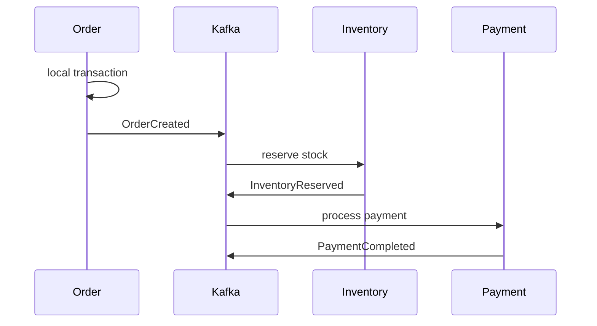

# Consistency In System Design

Consistency defines what values users and services are allowed to observe after
data changes.

In distributed systems, consistency is not one setting. Different operations
can require different guarantees.

## Strong Consistency

After a write succeeds, later reads observe that write or a newer value.

```text
write stock = 4 succeeds
later read returns 4 or newer
```

Use strong consistency for:

- account balances;
- payment ledger;
- inventory reservation;
- uniqueness constraints;
- lock ownership;
- authorization-critical data.

Cost:

- higher latency;
- coordination;
- reduced availability during partition;
- possible leader/quorum dependency.

## Eventual Consistency

Replicas or projections may temporarily differ, but converge if updates stop.

```text
t0: order created
t1: order projection not updated yet
t2: consumer processes event
t3: projection shows order
```

Use eventual consistency for:

- search indexes;
- analytics;
- dashboards;
- read models;
- notifications;
- cache copies.

## Strong Eventual Consistency

Strong eventual consistency means replicas that receive the same updates reach
the same state, regardless of update order, usually through deterministic merge
rules.

CRDT-based systems use this idea.

## Read-Your-Writes

Read-your-writes means a user sees their own completed write.

Example:

```text
User updates profile.
Next profile page load shows the new value.
```

This can be achieved by reading from the leader, sticky routing, session
tokens, or waiting for projection catch-up.

## Monotonic Reads

Monotonic reads mean a user does not go backward in time.

```text
First read shows order status CONFIRMED.
Later read should not show CREATED.
```

This matters when reads may hit different replicas.

## Consistency In Shopverse

| Use case | Consistency requirement | Implementation idea |
|---|---|---|
| checkout idempotency key | strong local uniqueness | unique DB constraint |
| inventory reservation | strong per-product invariant | optimistic/pessimistic locking or conditional update |
| payment state | strong local transaction | Payment DB transaction and reconciliation |
| order timeline | eventual consistency | Kafka events update timeline |
| metrics | eventual consistency | Prometheus scrape interval |
| logs | eventual consistency | Promtail ships logs to Loki |

## Consistency And SAGA

SAGA does not provide one global ACID transaction. It provides eventual
business consistency through local transactions and compensating actions.



If a later step fails, compensation is required:

```text
payment failed -> release inventory -> mark order failed/compensated
```

## Choosing Consistency

| Question | If yes |
|---|---|
| Can stale data cause money loss? | use strong consistency |
| Can stale data oversell inventory? | use strong consistency |
| Is this a search/read projection? | eventual consistency may be fine |
| Can user tolerate delay? | eventual consistency may be fine |
| Is user expecting immediate own update? | provide read-your-writes |

## Interview Questions

<ExpandableAnswer title="Strong Versus Eventual Consistency?">

Strong consistency makes successful writes immediately visible to later reads.
Eventual consistency allows temporary stale reads but promises convergence.

</ExpandableAnswer>
<ExpandableAnswer title="Is Eventual Consistency Bad?">

No. It is appropriate for many read models, caches, analytics, feeds, and
search. It is dangerous only when used for invariants that require immediate
correctness.

</ExpandableAnswer>
<ExpandableAnswer title="How Do You Handle Stale Reads?">

Use leader reads, version tokens, read-your-writes guarantees, cache
invalidation, projection lag monitoring, or show pending states in the UI.

</ExpandableAnswer>
## References

- [Consistency in System Design - GeeksforGeeks](https://www.geeksforgeeks.org/system-design/consistency-in-system-design/)
